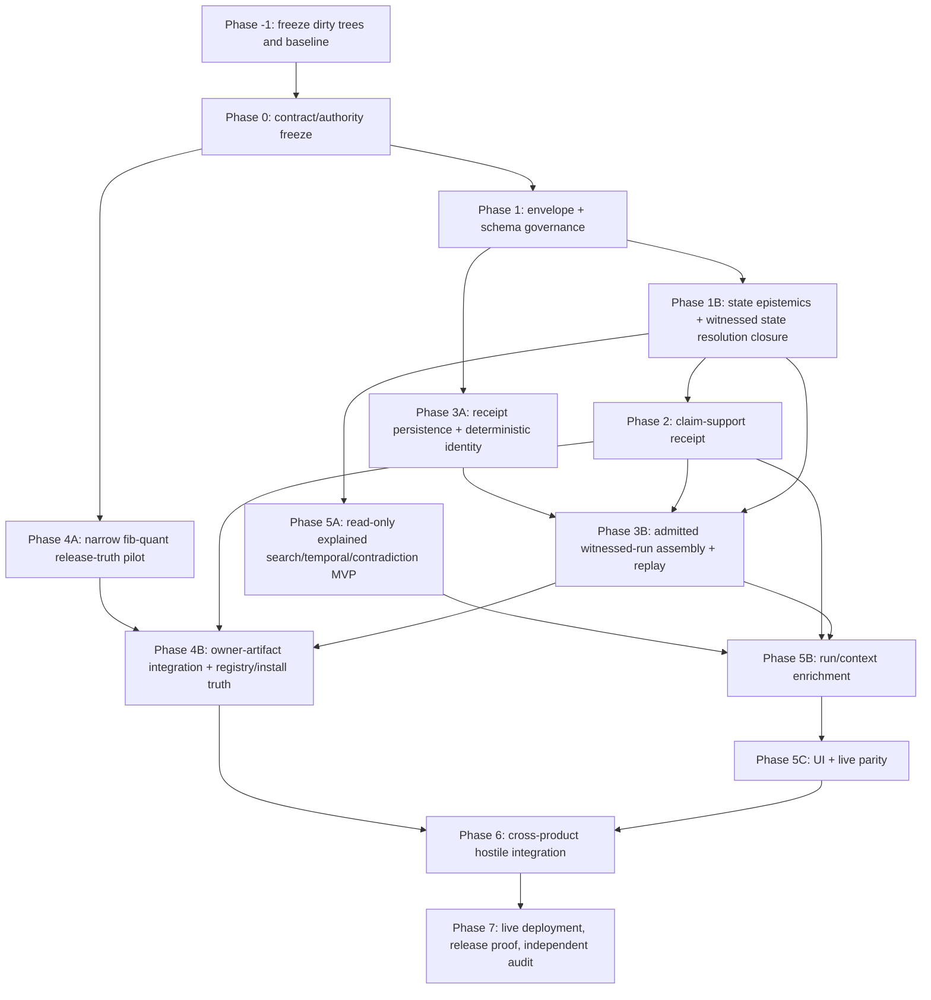

# Integrated Trust Products Implementation Plan

> **For Hermes:** Execute with `subagent-driven-development`, strict RED/GREEN TDD, isolated worktrees, and controller-owned integration, release, deployment, and live receipts. Do not implement from this plan until Phase -1 has reconciled all dirty worktrees and the contract freeze has an independent review verdict.

**Goal:** Turn three research recommendations into an executable, receipt-backed implementation program—and ultimately working products—without implying they are complete before their separate source, build, install, fresh-process, deployed/current-live, and operator-behavior gates pass: (1) a witnessed coding-agent substrate, (2) a release truth gate, and (3) an operator memory OS.

**Architecture:** Build one thin local-first accountability layer over the existing `semantic-memory-mcp`, `semantic-memory`, `context-governor`, `claim-ledger`, AiDENs, and verification crates. Do not build another memory server or another truth store. Ratify the existing Forge `ExportEnvelopeV3` as the canonical source/export envelope instead of inventing a generic AiDENs-owned wrapper; evolve the existing AiDENs run bundle into the single witnessed run artifact; and add one claim-ledger-owned claim-support receipt. Compose those owner artifacts into all three products without moving domain authority out of owner crates.

**Tech stack:** Rust, SQLite/rusqlite, serde/schemars, `stack-ids`, `boundary-compiler`, `semantic-memory`, `semantic-memory-mcp`, `claim-ledger`, AiDENs, `verification-*`, `assurance-runtime`, Python release tooling, static HTML/CSS/JS operator UI, JSON Schema/OpenAPI, pytest, Cargo.

---

## 1. Executive verdict

The three recommendations should be implemented as one product family, not three disconnected rewrites, while preserving three independently closable vertical slices. The release-truth pilot and the read-only operator-memory MVP must not wait for the entire witnessed-run program when existing owner receipts can prove their narrower boundaries.

1. **Witnessed coding-agent substrate** — one real coding-agent run links retrieval witnesses, tool receipts, permits, assertion/action authority, final claims, context-loss receipts, and deterministic replay.
2. **Release truth gate** — release and benchmark claims are extracted from source-bound artifacts and fail closed unless current claim-support receipts, gate receipts, policy, and adjudication authorize them.
3. **Operator memory OS** — an authenticated operator surface explains ranking, provenance, support/proof debt, contradiction/supersession, valid time, recorded time, degradation, and replay.

The three shared artifacts are enabling contracts, not the products themselves:

| Shared artifact | Authoritative owner | Product role |
|---|---|---|
| `semantic-memory-forge::ExportEnvelopeV3` (canonical source/export envelope) | `semantic-memory-forge`; identity/digest primitives remain owned by `stack-ids` and canonicalization by `boundary-compiler` | Existing typed Forge export identity carried through `forge-memory-bridge::transform_envelope_v3()` into `ProjectionImportBatchV3`; it is not replaced by a generic wrapper |
| `AiDENsRunBundleV4` (successor to V3, publicly documented as the witnessed run receipt) | `aidens-runner` composes/finalizes, `aidens-contracts` owns the wire type, and `aidens-receipts` owns append-only persistence | V3 already carries most of the run tree, so a mandatory field-level gap matrix limits V4 to demonstrated witnessed-run gaps. V4 binds owner-native refs without becoming tool, memory, or verification truth. |
| `ClaimSupportReceiptV1` | `claim-ledger` | Binds a claim version to admitted evidence/support, proof debt, contradictions, supersession, authority, and ledger head |

**Non-negotiable boundary:** SQLite/raw evidence remain canonical where they already are. Candidate discovery, summaries, UI projections, and AiDENs display reports do not become truth.

### Council convergence and controller decisions

| Lane | Agreement | Dissent / conflict | Controller decision | Plan amendment |
|---|---|---|---|---|
| Canonical envelope | Reuse owner-native envelopes; no AiDENs truth takeover | The witnessed-agent memorandum proposed an AiDENs `ArtifactEnvelopeV2` composition wrapper | The later field-level envelope audit controls: ratify `semantic-memory-forge::ExportEnvelopeV3` for Forge source/export truth and keep AiDENs/claim-ledger envelopes owner-native. No new generic or AiDENs composition envelope is admitted without a new owner decision. | Phase 1 is boundary validation, Forge V3 hardening, schema execution, and migration proof—not envelope proliferation. |
| Witnessed run | `aidens-runner` composes, `aidens-contracts` defines the wire type, `aidens-receipts` persists; owner receipts remain authoritative | The council named V4, while the run audit found V3 already contains most required fields and warned against speculative schema growth | Preserve V4 as the single successor, but begin with a V3 field-by-field gap/compatibility matrix and admit only demonstrated fields. The version name alone cannot license completion. | Phase 3 begins with receipt-store integrity and a gap-matrix scope decision before V4 implementation/activation. |
| Claim support | `claim-ledger` owns support, proof debt, contradiction, and supersession | None on owner; the live MCP projection currently risks candidate-to-confirmed contradiction promotion | Add one claim-ledger receipt and fix candidate non-promotion before MCP/product wiring. | Phase 2 retains four independent axes: receipt lifecycle, support state, proof-debt gate, public boundary. |
| Release truth | Recorder/verifier separation, fail-closed claims, fib-quant first, turbo-quant second | Council objected to making the narrow pilot wait for all shared contracts and identified missing package/registry/install truth | Accept dissent. Deliver a narrow source/package/CI vertical slice from existing receipts first, then compose claim/run receipts when available. | Phase 4 adds a release-state machine, package archive, registry, fresh-install, and live-state separation. |
| Operator memory OS | Existing full-profile daemon, read-only typed views, no shadow store | Council objected to blocking explained search/temporal/contradiction MVP on witnessed-run V4 | Accept dissent. Phase 5A ships read-only owner-backed views independently; Phase 5B adds run/context enrichment; Phase 5C adds UI/live parity. | Dependency graph and operator gates are split accordingly. |

All council reports are advisory self-reports. The controller adopts only claims reconciled against live source; later owner-specific audits supersede speculative type proposals.

A later three-lane audit batch was prompt-mislabeled as Recommendations 1–3 = Agent Evidence Workbench, Memory Epistemics Control Plane, and Next-Level Context Governor. The primary report controls the recommendation identity: the ranked products are witnessed coding-agent substrate, release truth gate, and Operator Memory OS. The epistemics and context-governor findings from that batch are retained as dependency audits, not substituted for the release-truth recommendation; release-truth decisions remain grounded in the dedicated release council and live release tooling.

---

## 2. Research and source inventory checked

### Primary research

- `/home/sikmindz/Downloads/deep-research-report (2).md`
  - SHA-256: `31f5a05e2e1c438b00bed16c3e9c6c153b635b97bd8408b9c7bebd25d4368927`; 258 lines, reverified locally.
  - Exact recommendation source: composition table at lines 57–68; ranked top three at lines 70–76; architectures at lines 114–161; minimal experiments and shared-artifact recommendation at lines 241–251.
  - The three recommendations are **witnessed coding-agent substrate**, **release truth gate**, and **operator memory OS**. Memory-epistemics and context-governor work are dependencies/supporting programs, not substitutes for recommendations 2 or 3.
  - Prior ingestion receipt reported document `8153b321-ea07-47c6-b491-ce36c38278e3`, 42 chunks. Current stats (21 documents/515 chunks) and witnessed retrieval corroborate availability of the synthesized research fact, but the current bounded MCP tool profile does not expose a direct document-by-ID recheck. Witness receipt: `mcp-witness-1784189152362947-25`.
- `/home/sikmindz/.hermes/skills/research/research-synthesis/references/agent-evidence-workbench-product-spec-2026-07-02.md`
  - Supporting product boundary: do not build a new memory server; make claim-level proof and context-loss accountability the wedge.
- `/home/sikmindz/Coding/Libraries/semantic-memory/docs/plans/2026-07-10-memory-epistemics-control-plane-implementation.md`
  - Supporting strict RED/GREEN program for transition verification, state epistemics, witnessed state resolution, causal influence, origin authority, evidence gaps, forgetting, and multi-principal policy. Reuse only the tasks required by the operator memory OS and shared authority model; do not silently expand this product plan to every research-atlas item.
- `/home/sikmindz/Coding/Libraries-context-governor-fix/context-governor/docs/plans/2026-07-01-implement-next-level-context-governor.md`
  - Supporting certification/integration program for same-transcript comparisons, bounded historical replay, reducer/token/store/archive truth, exact fallback, and host claim boundaries. It is evidence infrastructure for the witnessed substrate, not a fourth product.

### Hostile-remediation control structure reused

- `/home/sikmindz/Downloads/libraries_hostile_remediation_pack/libraries_hostile_remediation_hermes_pack_20260715/04_EXECUTION_PLAN.md`
- `09_BRANCH_AND_WORKTREE_PROTOCOL.md`
- `16_EVIDENCE_REQUIREMENTS.md`
- `17_VALIDATION_PROTOCOL.md`
- `18_ROLLBACK_PLAYBOOK.md`
- `19_FINAL_STATE_CONTRACT.md`

The implementation must reuse its control model: immutable baseline, non-overlapping worktrees, post-merge reruns, source/environment-bound receipts, read/write separation, append-plus-supersession rollback, and a final independent hostile audit.

### Existing contract and product surfaces inspected

- `AiDENs/crates/aidens-contracts/src/execution.rs`
  - `ExecutionContextEnvelopeV1`, `ToolCallReceiptV1`, `OperatorInvocationReceiptV1`.
- `AiDENs/crates/aidens-contracts/src/agent_bundle.rs`
  - `AiDENsRunBundleV2`, `AiDENsRunBundleV3`, canonical owner backpointers.
- `AiDENs/crates/aidens-contracts/src/capability_turn.rs`
  - `RunReportV1`, run event-log digest, budget/deadline, replay normalization, failure taxonomy.
- `AiDENs/crates/aidens-contracts/src/view_runtime.rs`
  - `RuntimeTimeScopeV1`, `RetrievalPolicyV1`, `RuntimeViewRequestV1`, widening/degradation disclosures.
- `AiDENs/crates/aidens-contracts/src/release_completion.rs`
  - Existing `ReleaseReadinessReportV1`, gate-command results, completion audit and release artifact manifests.
- `AiDENs/crates/aidens-contracts/src/schema_catalog.rs`
  - Existing generated schema registry and compatibility governance.
- `AiDENs/crates/aidens-memory-kit/src/lib.rs`
  - `MemoryGroundingEvidenceV1`, explicitly display/local and non-authoritative.
- `AiDENs/crates/aidens-cli/src/agent.rs`
  - Existing local coding-agent vertical slice already writes `AiDENsRunBundleV3`, event logs, receipts, replay instructions, permits, and grounding refs.
- `AiDENs/crates/aidens-cli/src/lib.rs`
  - Existing `agent`, `memory`, `view`, `receipts`, `package`, `run`, and `inspect-run` commands.
- `claim-ledger/src/receipt.rs`
  - `ExportReceipt`, `SupportAdmissionReceipt`, `LedgerAppendReceipt`, `ContradictionResolutionReceipt`, `SupersessionReceipt`.
- `claim-ledger/src/candidate.rs`
  - Candidate discovery is explicitly non-authoritative and cannot mutate verification state.
- `verification-control/src/lib.rs`
  - Existing `ReleaseGateCaseV1`, control receipts, cases/plans/ledger.
- `verification-policy/src/lib.rs`
  - Existing `ReleasePolicyProfileV1`, policy snapshots, promotion/degradation rules.
- `verification-calibration/`
  - Existing abstention/advisory behavior under drift, missing comparability, and risk thresholds.
- `verification-adjudication/`
  - Existing promotion, refutation, rollback, and disposition paths.
- `assurance-runtime/`
  - Existing `AssuranceCaseV1`, `ReleaseReadinessDecisionV1`, certification and recertification.
- `semantic-memory-mcp/src/server_stable.rs`
  - Mandatory witnessed retrieval, durable receipt verification, replay inputs, fixed-purpose assertion/action authority decisions.
- `semantic-memory-mcp/src/http_server.rs`
  - Existing authenticated `/search`, `/stats`, `/add`, `/health`; authenticated probes showed `/openapi.json` and `/` are currently 404.
- `semantic-memory-mcp/src/tools.rs`, `src/profile.rs`, `tests/integration.rs`
  - Existing claim tools, search-receipt tools, and four-tool autonomous lean profile.
- `scripts/release_gate_set.py`
  - Existing 16-command release gate set.
- `scripts/record_release_evidence.py`
  - Explicit clean-tree writer, content-addressed logs, failed-command retention.
- `scripts/run_release_gates.py`
  - Deliberately read-only verifier.
- `schemas/release-gate-case-v1.schema.json`
  - Existing generated release gate case schema.
- `contract-schema-gen/src/lib.rs`
  - Existing root schema generator, including release/verification/assurance artifacts.

### Witnessed-substrate source limitations verified during exact-recommendation review

- `AiDENsRunBundleV3::new` currently assigns `bundle_id` with `display_only_unstable_id("aidens-run-bundle-v3")` (`AiDENs/crates/aidens-contracts/src/agent_bundle.rs:430-509`); it is a partial operator artifact, not durable material identity.
- `RunBundleStore::write_bundle_value` currently rejects every schema other than `AiDENsRunBundleV3` (`AiDENs/crates/aidens-receipts/src/lib.rs:139-149`), so V4 requires an explicit version-aware dual-read/single-write migration rather than a type rename.
- The local `aidens agent run` path defaults to a provider mock and labels the provider route `mock` (`AiDENs/crates/aidens-cli/src/agent.rs:185-213,243-253`); the generated local coding spec has memory disabled (`agent.rs:453-501`). These fixtures prove scaffolding only and must never satisfy the real-host acceptance gate.
- `PermitGrantV1::new` currently creates a display-only permit ID, wildcard `tool_id="*"`, no expiry, and no run/attempt binding until later composition (`AiDENs/crates/aidens-contracts/src/capability_turn.rs:192-230`). Capability exposure, permit construction, assertion authority, action authority, and execution outcome therefore require separate fail-closed evidence.
- `aidens-receipts` supplies persistence and integrity mechanics; it does not become the authority for memory, tool, permit, support, verification, or action semantics merely because it stores their references.

### Related repositories/worktrees that must be integrated, not copied blindly

- `/home/sikmindz/Coding/Libraries-context-governor-fix/context-governor`
  - Branch: `fix/context-governor-diminishing-returns-20260716`; currently dirty after advancing beyond the earlier clean pin, with the exact refreshed state recorded below.
  - Owns deterministic compaction, exact fallback, context-loss and archive receipts; source cleanliness does not prove installed/live parity.
- `/home/sikmindz/Coding/agent-memory-kits`
  - `main...origin/main [ahead 2]` and dirty across Hermes/Codex/Claude adapters.
  - Owns host hooks/wrappers; must not become a canonical memory or claim store.

---

## 3. Verified current state and blockers

### Live state observed during planning

- Main repository: `/home/sikmindz/Coding/Libraries`.
- Branch: `fix/hostile-remediation-20260715...origin/fix/hostile-remediation-20260715`.
- Working tree is heavily dirty, including root/AiDENs lockfiles, semantic-memory source/tests, semantic-memory-mcp nested state, turbo-quant, llm-pipeline, and untracked plans/evidence.
- `AiDENs/Cargo.toml` currently reports 34 packages.
- The semantic-memory warm daemon is healthy when authenticated:
  - unauthenticated `GET /health`, `/openapi.json`, and `/` -> HTTP 401;
  - authenticated `GET http://127.0.0.1:1738/health` -> HTTP 200, `{"ok":true,"service":"semantic-memory-mcp"}`;
  - authenticated `GET /openapi.json` -> HTTP 404;
  - authenticated `GET /` -> HTTP 404.
- Semantic-memory MCP initialized as version `0.5.4` during ingestion.
- Latest research ingestion increased semantic-memory document count from 20 to 21 and chunks from 473 to 515.

### Source snapshot refreshed before council synthesis

Observed checkpoint: `2026-07-16T03:53:05-05:00`. These values are planning inputs, not completion receipts. Re-capture them through the hostile pack's `tools/run_with_receipt.py` before implementation because any later source change invalidates this snapshot.

| Repository | Branch / HEAD | Dirty-state evidence | Lockfile evidence | Planning consequence |
|---|---|---|---|---|
| `/home/sikmindz/Coding/Libraries` | `fix/hostile-remediation-20260715` / `03ca7e9911a3d2b30437092403cd55c262e33b2a` | 142 porcelain entries; status SHA-256 `e611372c036c76b6fa5e4b695ea14b9de59ea1697a14e6fe0263fd84a726e073` | root `Cargo.lock` SHA-256 `f9f8f950e8d07b03b2d7cad14185a9ad9e7c69b32e825c913b1916e3c848c71c`; AiDENs lock SHA-256 `506d753218bfc2baca64ce09fc708f8aba5cdeda2f07dc23085f1482d727de53` | No implementation here until every overlapping path is attributed and a fixed integration base is selected. |
| `/home/sikmindz/Coding/Libraries/semantic-memory-mcp` | `feat/full-integration` / `4bdaccaf08fa28331d9e6987ce4030ff8bf63239` | clean; 0 porcelain entries; empty-status SHA-256 `e3b0c44298fc1c149afbf4c8996fb92427ae41e4649b934ca495991b7852b855` | `Cargo.lock` SHA-256 `891ed6676299b571abe416127b66e7ac4cfdc5ab24c74369d0fcfa7e080b94a8` | Preserve this separate clean repository as an independently bound owner source; do not infer its installed/live activation from cleanliness. |
| `/home/sikmindz/Coding/Libraries-context-governor-fix` | `fix/context-governor-diminishing-returns-20260716` / `b5e475674a034b60273c9bf0f9e8151375746d39` | 9 porcelain entries; status SHA-256 `daad8bf02a6d6cbdabdf92aaae1179ecaf3b9d7facaccc6a1c0992b7e8923216` (`Cargo.toml`, `src/lib.rs`, `src/llm_summary.rs`, `src/main.rs`, `src/sqlite_store.rs`, `tests/cli.rs`, `tests/compaction.rs`, `tests/store.rs`, and untracked `src/receipt_index.rs`) | `context-governor/Cargo.lock` SHA-256 `4d5bfef775e4fa05366ce3d24ef179f91f9d906320347a8719aed4bc789dc6d4` | Preserve and attribute the active context-governor work before edits. Earlier clean pin `35ef085f…` is historical evidence only; neither source state proves installed Hermes adapter parity. |
| `/home/sikmindz/Coding/agent-memory-kits` | `main` / `313a56029e492f27303d2d4c4abb60a635bb775e` (local branch was observed ahead of upstream) | 17 porcelain entries; status SHA-256 `19dd3b4aefa3eb3f970eb0bd5e9d8743c12f2b3546349a0dd2735f172c3fdbc3` | no root `Cargo.lock` | Preserve the 11 tracked host/plugin edits and 6 untracked paths; classify benchmark data, backup config, OpenAPI dump, and remediation documents before staging anything. |

Workspace discovery via `cargo metadata --no-deps --format-version 1` found 59 root-workspace packages, 34 AiDENs packages, and one context-governor package. Validation must therefore treat root, AiDENs, and context-governor as separate Cargo workspaces rather than assuming one root command covers all crates.

### Blocking constraints

1. **No implementation in the current dirty trees.** First identify ownership of every dirty path and preserve unrelated user changes.
2. **No new memory server.** New operator routes and UI are served by the existing authenticated `semantic-memory-mcp` process.
3. **No duplicate authority.** AiDENs may compose/display owner artifacts; it may not redefine memory truth, claim truth, verification truth, IDs, digests, or action authority.
4. **No false release success.** A skipped, blocked, stale, degraded, dirty, or source-mismatched required gate blocks closure unless an explicit bounded waiver is admitted and remains visible.
5. **No final claims from this planning pass.** The three products remain recommendations until implemented and verified.
6. **Missing prior live path:** `/home/sikmindz/Coding/Libraries/docs/plans/2026-07-02-agent-evidence-workbench-product-spec.md` does not exist. The skill reference is the available source; implementation must either restore a canonical repo document or cite the skill artifact as external planning evidence.

---

## 4. Authority and ownership map

| Concern | Canonical owner | Composition/product role | Forbidden shortcut |
|---|---|---|---|
| IDs, trace, attempt/trial/scope primitives | `stack-ids` | Reuse typed IDs in all new artifacts | Random UUID, wall-clock-only material IDs, generic string IDs for canonical artifacts |
| Canonical JSON/boundary digest | `boundary-compiler` | Strict parse, duplicate-key rejection, JCS/domain-separated digest | `serde_json::Value` as the final typed contract; display-only digest used as identity |
| Memory storage/current/historical truth | `semantic-memory` | Query and mutation authority | AiDENs/UI shadow DB or alternate state semantics |
| MCP/HTTP operator composition | `semantic-memory-mcp` | Authenticated read/write/query adapter | New independent memory daemon |
| Context compaction/exact fallback | `context-governor` | Emit context-loss and rehydration receipts | Claiming hosted API KV-cache extension or unrecoverable summaries as recoverable |
| Claims, evidence, support, proof debt, contradictions, supersession | `claim-ledger` | Claim-support receipt and lifecycle | Retrieval similarity promoted directly to supported claim |
| Tool execution receipt semantics | `llm-tool-runtime` | Referenced by run receipt | AiDENs-local duplicate tool truth |
| Run orchestration evidence | `aidens-runner` composition + `aidens-contracts` wire type + `aidens-receipts` persistence | One witnessed run artifact containing owner-native refs | Run summary/store treated as canonical tool, memory, or verification truth; second persisted run aggregate |
| Runtime query plan/view explanation | `knowledge-runtime` + `semantic-memory` | Operator explanations and query trace | UI invents ranking rationale or silently widens query |
| Verification case/control ledger | `verification-control` | Release claim cases and gate state | Recorder self-verifies or verifier writes evidence |
| Policy/waiver requirements | `verification-policy` | Fail-closed release policy | Score-only approval or hidden waiver |
| Calibration/abstention | `verification-calibration` | Uncertainty and stale/comparability handling | Unknown mapped to pass |
| Promotion/refutation/rollback | `verification-adjudication` | Release and claim adjudication | Destructive rewrite of prior decision |
| Release assurance decision | `assurance-runtime` | Final readiness/certification artifacts | Operator display report treated as canonical decision |
| Host adapters | `agent-memory-kits` | Hermes/Codex/Claude capture and display | Host plugin becomes canonical store |

---

## 5. Contract freeze

### 5.1 Canonical envelope decision: ratify the existing owner

The canonical source/export envelope is `semantic-memory-forge::ExportEnvelopeV3` (`semantic-memory-forge/src/envelope.rs:322-431`), already generated through `contract-schema-gen` and transformed by `forge-memory-bridge::transform_envelope_v3()` into `ProjectionImportBatchV3`. Do **not** create `ArtifactEnvelopeV2`, `AccountabilityEnvelopeV1`, or a generic `CanonicalEnvelopeV1` in AiDENs. `aidens-contracts::ArtifactEnvelopeV1` remains an AiDENs-local lifecycle/display envelope with canonical-owner backpointers; `claim-ledger::ArtifactEnvelopeV1` remains a distinct signing/admission artifact; neither replaces Forge export identity.

Ratified invariants:

- `semantic-memory-forge` owns Forge source/export identity, schema version, authority, scope, trace, evidence/support refs, export metadata, records, and content digest;
- `stack-ids` owns shared opaque IDs and digest primitives but no business-envelope semantics;
- `boundary-compiler` owns duplicate-key rejection and RFC 8785/JCS canonicalization; its currently documented always-pass schema-validation stub in `boundary-compiler/src/schema.rs` is a **pre-flight blocker** before the envelope can be used as an admission boundary;
- `forge-memory-bridge` transforms and preserves provenance but does not own source truth, promotion, or authoritative import time;
- legacy `ExportEnvelopeV1/V2` and `semantic_memory::projection_import::ImportEnvelope` remain migration-only readers;
- run receipts and claim-support receipts retain their owner-native wire types and bind the canonical source/export envelope by typed ref plus digest where applicable; there is no universal payload bag;
- valid time, recorded time, source export time, transformation time, and importer commit time remain separate;
- missing owner/scope/version/digest, duplicate keys, unsupported versions, lossy conversion, invented lineage, or schema-validation uncertainty fails closed or emits an explicit degraded migration receipt.

A broader common transport envelope may be proposed only by a new field-level owner decision proving `ExportEnvelopeV3` cannot represent the required Forge/source/export truth. Product implementation must not assume such a proposal will be admitted.

### 5.2 Witnessed run receipt

Evolve `AiDENsRunBundleV3` into its single successor `AiDENsRunBundleV4`, documented as the **Witnessed Run Receipt V1** product surface, without creating a parallel Rust/schema family. Begin with a field-level gap and compatibility matrix against V3 (`AiDENs/crates/aidens-contracts/src/agent_bundle.rs:381-510`). V3 already carries run/attempt/trial identity, execution context, trace, event-log digest, provider/tool/permit/memory/verification/abstention/repair refs, budgets, replay metadata, failure taxonomy, outputs, backpointers, and blocked checks; therefore V4 may add or harden only fields and invariants demonstrated missing by RED tests. Do not create a parallel generic `RunReceiptV1` or persist a second aggregate beside `RunReportV1` and the run bundle.

Current V3 construction, persistence, digest inspection, and CLI tests prove a partial substrate only. They do not prove deterministic material bundle identity, complete source binding, executable replay, final-answer claim admission, installed host traversal, or the Agent Evidence Workbench acceptance contract.

`aidens-runner::PlanActVerifyLoopV1` and its `receipts.rs` finalization path own composition; `aidens-contracts` owns the wire type; `aidens-receipts` owns the append-only `CanonicalEventLog` and atomic `RunBundleStore`. Owner receipts remain authoritative for their own semantics. Before any schema activation, harden receipt persistence for single-writer/duplicate-ID behavior, corruption quarantine, append-before-index publication, crash/orphan recovery, and typed digest-computation versus digest-mismatch failure.

The admitted witnessed schema adds or hardens only demonstrated gaps:

- canonical `ExportEnvelopeV3` source/export refs and digests where the run consumed Forge-originated material; owner-native envelope refs for non-Forge artifacts;
- source binding: repo root, branch, commit, tree/dirty digest, lockfile digest, toolchain/environment digest;
- ordered event refs and canonical event-log digest;
- retrieval witness/search receipt refs and replay-input availability;
- tool receipt refs with registry snapshot digest;
- context-governor compaction/context-loss/exact-fallback refs;
- fixed-purpose recall/assertion/action authority decision refs;
- final-answer claim refs and `ClaimSupportReceiptV1` refs;
- gate/check receipts after final material change;
- deterministic replay class: exact, normalized-equivalent, degraded, impossible-with-reason;
- completion state that cannot be `succeeded` while required refs/checks are missing;
- explicit partial, blocked, abstained, cancelled, timed-out, stale-evidence, and replay-mismatch states;
- content-addressed raw evidence store refs and retention/redaction policy.
- explicit replay retention mode: `no_replay`, `store_inputs`, or `replay_from_inputs`; privacy defaults to no input retention;
- typed/fallibly validated child refs rather than unchecked duplicate-prone `Vec<String>` semantics;
- material tool calls cannot silently remain `Ephemeral`; intentional ephemeral operation is explicit degraded evidence, and receipt-sink failure is terminal/degraded rather than omitted.

Compatibility:

- keep V2/V3 readers;
- retain V3 bytes, schemas, readers, and legacy fixtures without reinterpretation;
- dual-read V2/V3/V4 and single-write V4 only after the V3 gap matrix plus migration, persistence, replay, and integration gates pass;
- any version transition uses a deterministic migration adapter that emits a migration/degradation receipt;
- absent historical evidence remains absent/unknown, never synthesized;
- V3 display-only IDs/digests are never silently promoted into material witnessed identity.

### 5.3 Claim-support receipt

Add `ClaimSupportReceiptV1` to `claim-ledger` as the canonical composition receipt for support state. It references existing owner receipts rather than replacing them.

Required fields:

- claim ID and claim-version ID;
- claim-source envelope/span refs and source digest;
- evidence bundle ref and ordered evidence refs/digests;
- retrieval witness refs, tool receipt refs, and memory-grounding display refs;
- support judgment and `SupportAdmissionReceipt` refs;
- `SupportState`, method, rationale, evidence sufficiency, and exactness;
- proof-debt budget/summary/waiver refs and remaining debt;
- contradiction and supersession refs/state;
- valid time and recorded time;
- assertion/action authority decision refs when the claim is used beyond recall;
- ledger append receipt, sequence, previous digest, and anchored head;
- degradation/redaction/retention state;
- separate receipt lifecycle, support judgment, proof-debt gate, and public-claim boundary (`public`, `internal_only`, `advisory_only`, `blocked`);
- final disposition: supported, partially supported, unsupported, contradicted, stale, waived, abstained, or blocked.

Rules:

- candidate retrieval cannot admit support;
- `ContradictionCandidate` cannot become `Contradicted` until confirmed adjudication; correct the current direct promotion in `semantic-memory-mcp/src/server.rs:122-126` before product wiring;
- `Unsupported` is scoped to the referenced evidence bundle and is not universal claim negation;
- `MemoryGroundingEvidenceV1` remains an AiDENs-local display artifact;
- unsupported/unknown/stale/contradicted are distinct;
- waiver permits bounded proceeding but does not erase debt;
- compaction must preserve the receipt, contradiction, supersession, and ledger chain;
- receipt verification is deterministic and append-only.

---

## 6. Dependency graph



Shared-contract order is identity/digest/canonicalization -> executable envelope admission -> deterministic state epistemics/witnessed state resolution -> claim support plus receipt persistence/deterministic identity -> admitted run composition/replay. Receipt persistence closes before V4 activation; claim support closes before a final-answer-success state, while the narrow release pilot may prove source/package/CI truth after Phase 0. The read-only operator MVP may proceed after Phase 1B without waiting for the run product, but cannot claim temporal/current-state correctness from UI wiring alone. Deeper run/claim integrations serialize only after the corresponding owner contracts close.

### Hostile-remediation phase reconciliation

The product phases below do not replace the hostile pack. Every implementation task inherits the corresponding pack control and cannot close while an earlier pack dependency remains open.

| Hostile phase | Required invariant | Product-plan location | Blocking rule |
|---|---|---|---|
| `P-1` run control | Immutable baseline, worktree locks, complete command receipts | Phase -1 | No edit begins without dirty-path ownership, source binding, and rollback checkpoint. |
| `P0` false-success blockers | Error/absence/corruption/skip cannot become success; recorder and verifier are separate | Phases -1 and 0, then every product gate | Any required `fail`, `blocked`, or `skipped` result blocks closure; `record_release_evidence.py` records but **is never used by verification**. |
| `P1` ID authority | `stack-ids` remains the sole cross-crate ID authority | Phases 0 and 1 | No generic string, UUID, process-order, or wall-clock-only canonical ID is admitted. |
| `P2` digest/scope/ledger | Domain/version-separated canonical digests, exact scope, strict append-only ledger | Phases 1 and 2 | Display-only digests, collapsed scope/time, incomplete ledger heads, or candidate-as-support block integration. |
| `P3` codec contracts | One strict versioned wire contract with historical readers and unknown-field policy | Phases 1–3 plus migration rehearsal | No single-write activation until generated-schema drift, malformed corpus, golden round-trip, and dual-read tests pass. |
| `P4` runtime state machines | Atomic, observable transitions; degradation and cancellation are explicit | Phases 3 and 5 | Run, context, search, authority, and operator-view state machines cannot report success from partial/uncertain terminal state. |
| `P5` release proof | Read-only verification, source/environment binding, clean-tree proof, truthful claims | Phases 4, 6, and 7 | Task-branch evidence is rerun after integration; final evidence is recorded only after source fixation and then verified read-only. |
| `P6` performance | Source-independent before/after measurement after correctness closes | Phases -1, 6, and 7 | No optimization merges while a `P0`/`P1` issue is open; unratified or non-comparable thresholds cannot license a claim. |

### Gate behavior vocabulary

- **Pre-flight gate:** blocks entry before edits when baseline, ownership, source binding, environment, or migration prerequisites are missing. The controller fixes the prerequisite and retries from the phase checkpoint.
- **Revision gate:** routes a contract, implementation, or plan artifact back to its producer with specific findings; maximum three cycles with stall detection. The controller re-runs the same evidence gate after each revision.
- **Escalation gate:** pauses only for a genuine authority/ownership/compatibility decision that source cannot resolve; no agent guesses the answer.
- **Abort gate:** stops immediately and preserves all work when a destructive-scope violation, unrecoverable storage/source state, or safety invariant breach is observed.

---

## 7. Phase -1 — Run control, dirty-tree reconciliation, and baseline

### Task -1.1: Freeze source and worktree inventory

**Files/artifacts:**

- Create outside Git first: `<run-root>/baseline/repository-inventory.json`.
- Create: `<run-root>/baseline/dirty-path-ownership.tsv`.
- Create: `<run-root>/baseline/source-binding.json`.
- Create: `<run-root>/DECISION_LOG.md`, `RISK_REGISTER.md`, `BASELINE_RECONCILIATION.md` from hostile-pack templates.

**Steps:**

1. Record Git root, branch, HEAD, upstream, worktree list, status, diff stats, nested repo roots, remotes, lockfile digests, and untracked paths for:
   - `/home/sikmindz/Coding/Libraries`;
   - `/home/sikmindz/Coding/Libraries/AiDENs`;
   - `/home/sikmindz/Coding/Libraries/semantic-memory-mcp`;
   - `/home/sikmindz/Coding/Libraries-context-governor-fix/context-governor`;
   - `/home/sikmindz/Coding/agent-memory-kits`.
2. Assign every dirty path to: current hostile remediation, context-governor work, adapter work, unrelated user work, generated evidence, or unknown.
3. Stop if any path remains unknown and overlaps planned files.
4. Snapshot diffs/bundles without modifying source.
5. Do not stash, reset, rebase, or clean automatically.

**Gate:** Inventory covers every dirty path and every planned owner repo; unknown overlapping paths count is zero.

### Task -1.2: Establish isolated implementation worktrees

**Files/artifacts:** `<run-root>/worktree-locks.json`.

**Steps:**

1. Select a fixed clean base commit after reconciling current work.
2. Create an integration branch and non-overlapping worktrees:
   - `trust-contracts`;
   - `claim-support`;
   - `witnessed-run`;
   - `release-truth`;
   - `operator-memory`;
   - `host-adapters`.
3. Serialize ownership of root `Cargo.toml`, root/AiDENs `Cargo.lock`, schema catalogs, shared manifests, and release scripts through the controller.
4. Agents do not pull/rebase/merge/push.

**Gate:** Worktree-lock validator rejects overlapping file scopes.

### Task -1.3: Capture baseline commands with receipts

Run in the correct workspace roots; record pass/fail/blocked/skipped without repair:

```bash
# Libraries
cargo fmt --all -- --check
cargo check --all-features
cargo test --features full
python3 scripts/run_release_gates.py --repo .

# AiDENs
cargo fmt --all -- --check
cargo check --workspace --all-targets --all-features
cargo test --workspace --all-targets --all-features
cargo clippy --workspace --all-targets --all-features -- -D warnings

# claim-ledger / verification / semantic-memory-mcp targeted baselines
cargo test -p claim-ledger
cargo test -p verification-control -p verification-policy -p verification-calibration -p verification-adjudication -p assurance-runtime
cd semantic-memory-mcp && cargo test --features full

# context-governor
cargo fmt --check
cargo test --all-targets
python3 -m pytest tests_py -q

# agent-memory-kits
python3 -m pytest -q
```

If the root workspace cannot accept a mandated command, record the exact parser/feature error, identify the correct canonical workspace command, and treat the mismatch as a release-gate defect to resolve rather than silently substituting.

### Task -1.4: Ratify measured performance/storage budgets

1. Measure current p50/p95 for witnessed search, one local AiDENs coding run, release gate evaluation, and explained temporal query.
2. Measure artifact bytes/run and memory DB growth excluding raw cold blobs.
3. Write `performance-budgets-v1.json` with environment/source binding and explicit thresholds approved before optimization.
4. No performance claim or regression gate uses invented thresholds.

**Phase -1 exit:** Clean fixed base selected; baseline receipts retained; dirty work preserved; worktrees isolated; performance budgets ratified; no semantic code change yet.

---

## 8. Phase 0 — Authority, schema, and product acceptance freeze

### Task 0.1: Write owner map and field-level schema decision record

**Create:** `docs/architecture/trust-product-authority-map.md`.

Include every field of the three shared artifacts, canonical owner, writer, reader, lifecycle, privacy class, valid/recorded-time semantics, canonicalization profile, and failure behavior.

### Task 0.2: Freeze three product acceptance manifests

**Create:**

- `docs/product/witnessed-coding-agent-acceptance-v1.yaml`;
- `docs/product/release-truth-gate-acceptance-v1.yaml`;
- `docs/product/operator-memory-os-acceptance-v1.yaml`.

Each gate is binary and names required artifacts, tests, demo fixture, failure injection, live receipt, non-claims, and rollback.

### Task 0.3: Freeze compatibility and migration policy

**Create:** `docs/migrations/trust-artifacts-v1-migration.md`.

Specify expand -> backfill/derive where possible -> dual-read -> single-write -> flip-read -> contract. Historical missing evidence remains explicitly unavailable. No destructive migration of raw evidence, exact vectors, event logs, ledger entries, or exact fallback blobs.

### Task 0.4: Independent architecture review

Reviewer must answer:

- Does any new type duplicate an owner type?
- Are IDs and digests canonical or display-only?
- Are valid and recorded time distinct?
- Can retrieval similarity become support or action authority?
- Can a recorder self-verify?
- Can any required missing/stale/degraded state become pass?
- Does any route bypass scope/audience checks?

**Phase 0 exit:** Signed approve/block verdict; blocked findings resolved before code.

---

## 9. Phase 1 — Canonical envelope ratification and executable boundary governance

### Task 1.1: Freeze envelope ownership and duplicate-family scan

**Owner:** controller plus `semantic-memory-forge` maintainer.

**Files:**

- Modify/create ADR: `docs/architecture/trust-product-authority-map.md`.
- Test inventory against `semantic-memory-forge/src/envelope.rs`, `semantic-memory/src/projection_import.rs`, `forge-memory-bridge/src/legacy.rs`, `claim-ledger/src/envelope.rs`, and `AiDENs/crates/aidens-contracts/src/artifact.rs`.

**Pre-flight gate:** record every live envelope family and prove `ExportEnvelopeV3` is the single Forge source/export owner. Failure blocks all schema work; recovery is an owner decision, not a code workaround.

### Task 1.2: RED tests for real boundary admission

**Owner:** `boundary-compiler`.

**Files:**

- Modify: `boundary-compiler/src/schema.rs`.
- Extend: `boundary-compiler/tests/jcs_tests.rs` or create `boundary-compiler/tests/schema_admission.rs`.
- Extend: `semantic-memory-forge/src/envelope_tests.rs`.

Write failing tests for the documented always-pass schema-validation stub, missing/unknown schema versions, duplicate keys, wrong digest domain, Unicode/NUL/numeric canonicalization vectors, scope/authority mutation, unknown treatment-critical fields, and resource-limit exhaustion.

**RED command:** `cargo test -p boundary-compiler --test schema_admission -- --nocapture`; expected failure: invalid schema instances are currently accepted or the executable validator is absent. Preserve this receipt before GREEN.

**GREEN command:** `cargo test -p boundary-compiler --all-targets && cargo test -p semantic-memory-forge envelope -- --nocapture`; expected: malformed or unverifiable envelopes fail closed and canonical vectors are deterministic.

### Task 1.3: Ratify `ExportEnvelopeV3` and harden the canonical bridge

**Owner:** `semantic-memory-forge` for export truth; `forge-memory-bridge` for transformation only.

**Files:**

- Modify only if RED proves a real gap: `semantic-memory-forge/src/envelope.rs` and `semantic-memory-forge/src/envelope_tests.rs`.
- Modify only for provenance-preserving transformation gaps: `forge-memory-bridge/src/transform.rs`, `src/transform_tests.rs`, and `tests/forge_bridge_memory_proof.rs`.

Minimal GREEN behavior: exact version/authority/scope/digest validation; distinct source export, transform, and importer commit times; preserved envelope ID/source digest; no synthesized lineage; no authoritative `recorded_at` stamping by the bridge. Do not add a generic wrapper or dynamic payload bag.

**Focused command:** `cargo test -p semantic-memory-forge -p forge-memory-bridge --all-targets`; expected: V3 round-trip and bridge proof pass, while lossy or invented-lineage fixtures fail.

### Task 1.4: Register generated schema and drift gates

**Owner:** `contract-schema-gen`; source type remains owned by `semantic-memory-forge`.

**Files:**

- Modify only if owner schema changed: `contract-schema-gen/src/lib.rs`.
- Regenerate through the canonical generator; never hand-edit `schemas/`.

**Revision gate:** generated schema equals checked-in schema, no duplicate family/path exists under AiDENs, salvage, or archives, and executable validation rejects malformed fixtures. Failure loops to the owner type or generator, maximum three revisions; non-convergence escalates.

**Command:** `cargo test -p contract-schema-gen && cargo run -p contract-schema-gen -- --check`; if the live CLI differs, Phase -1 records the discovered canonical command before execution rather than guessing.

### Task 1.5: Legacy migration and rollback proof

**Owner:** `semantic-memory-forge` plus `forge-memory-bridge`.

Keep `ExportEnvelopeV1/V2`, `semantic_memory::projection_import::ImportEnvelope`, and bridge legacy upgrade functions read-only/migration-only. Conversion preserves original digest/provenance and emits explicit degradation for absent fields; it never invents episode, claim, supersession, or authority lineage.

**Migration command:** focused legacy-to-V3 fixture tests followed by `cargo test -p semantic-memory -p semantic-memory-forge -p forge-memory-bridge --all-targets`.

**Rollback:** disable new admission/bridge behavior behind its activation flag, retain V3 and legacy bytes unchanged, and return to the previously verified transform path. Any emitted migration record is superseded, never deleted.

**Phase 1 evidence artifact:** one receipt bundle containing ownership inventory, RED failure, GREEN boundary tests, V3/bridge fixtures, generated-schema drift result, migration/rollback rehearsal, exact source binding, and explicit nonclaim that envelope validity does not prove payload truth, successful execution, support sufficiency, or action authority.

**Phase 1 abort gate:** stop immediately if executable schema validation remains a stub, canonicalization diverges between crates, or the proposed change creates another envelope owner.

---

## 9A. Phase 1B — State epistemics and witnessed state-resolution closure

### Task 1.6: Prove deterministic state policy and final-response provenance

**Owners:** `semantic-memory` owns state/transition/forgetting truth; `semantic-memory-mcp` owns authenticated MCP/HTTP composition only.

**Files:**

- Verify/modify: `semantic-memory/src/state_epistemics.rs`, `src/transition_contracts.rs`, `src/transition_verifier.rs`, `src/authority.rs`, and `src/forgetting.rs`.
- Extend: `semantic-memory/tests/state_epistemics.rs`, `tests/transition_compiler.rs`, and `tests/forgetting_closure.rs`.
- Verify/modify adapter behavior: `semantic-memory-mcp/src/server.rs`, `src/server_stable.rs`, `src/http_server.rs`, and `tests/integration.rs`.

Treat the existing authority, transition compiler, quarantine, witnessed retrieval, replay, and `StateView` surfaces as **implemented source seams**, not product certification. Add RED fixtures proving deterministic Current/HistoricalAt/Transition/Trajectory resolution, no future-state leakage, contradiction/supersession preservation, authority-snapshot and retrieval-generation binding, cross-principal denial across search/get/graph/cache/export/replay, and forgetting closure across canonical and derived surfaces.

The response witness is finalized only after post-filtering, reranking, ordering, authorization redaction, and serialization. Its digest binds the exact returned result IDs/digests, state-resolution receipt, principal/audience/scope, degradation, and output bytes. A candidate-retrieval receipt or pre-rerank list cannot certify the final operator response.

**RED commands:** `cargo test -p semantic-memory --test state_epistemics --test transition_compiler --test forgetting_closure -- --nocapture` plus focused MCP HTTP/MCP authorization and final-response-witness tests; expected failure is any unresolved final-response provenance, principal-path bypass, future leakage, or incomplete forgetting closure.

**GREEN gate:** run the focused tests, then `cargo test -p semantic-memory --all-targets --all-features` and `cargo test --manifest-path semantic-memory-mcp/Cargo.toml --features full --all-targets`. Preserve separate outcomes for source-implemented, test-verified, installed, fresh-process, and current-live states. Phase 1B closes only source/test state-resolution truth; installation and live parity remain Phase 7 evidence.

**Rollback:** disable new state-resolution/response-witness projections without rewriting facts, authority journals, transition records, retrieval receipts, forgetting receipts, or historical views; rebuild only derived indexes from canonical stores.

---

## 10. Phase 2 — Claim-support receipt and proof-debt lifecycle

### Task 2.1: RED tests for claim-support admission

**Owner:** `claim-ledger`.

**Files:**

- Create: `claim-ledger/tests/claim_support_receipt.rs`.
- Extend: `claim-ledger/tests/ledger_tests.rs`.
- Extend: `claim-ledger/tests/compaction.rs`.
- Extend: `claim-ledger/tests/audit_hardening.rs`.

Tests:

- candidate-only retrieval cannot create supported state;
- supported requires admitted evidence and ledger append/head refs;
- stale, unsupported, contradicted, unknown, waived, and abstained remain distinct;
- `Unsupported` remains scoped to the referenced evidence bundle and is not universal claim negation;
- `ContradictionCandidate` remains candidate/unresolved until confirmed adjudication;
- waiver does not erase proof debt;
- contradiction/supersession survives compaction;
- valid/recorded times round-trip and as-of evaluation is stable;
- receipt bytes/digest are deterministic under explicit time;
- missing authority blocks assertion/action use but not permitted recall;
- unauthorized principal/audience refs are rejected.

**RED command:** `cargo test -p claim-ledger --test claim_support_receipt -- --nocapture`; expected failure is absence of `ClaimSupportReceiptV1` or acceptance of at least one forbidden strong/candidate/waiver fixture. Preserve the RED receipt.

### Task 2.2: Implement `ClaimSupportReceiptV1`

**Owner:** `claim-ledger`; MCP and verification crates consume/reference it.

**Files:**

- Modify: `claim-ledger/src/receipt.rs`.
- Modify: `claim-ledger/src/types.rs`.
- Modify: `claim-ledger/src/ids.rs` only for a lifecycle-specific stable ID.
- Modify: `claim-ledger/src/lib.rs`.

Do not merge candidate provenance, memory grounding, support admission, proof-debt gate, or public-claim boundary into one mutable state. The receipt binds their owner refs after authoritative admission. Prefer existing opaque refs where shared typed IDs do not yet exist; add `stack-ids` newtypes only for genuinely cross-crate primitives.

**GREEN command:** `cargo test -p claim-ledger --test claim_support_receipt && cargo test -p claim-ledger --test proof_debt_budget`; expected: deterministic digest, admissible strong states, scoped unsupported state, confirmed contradiction, waiver/debt preservation, and append-only supersession pass.

### Task 2.3: Add verification and compaction projection

**Owner:** `claim-ledger`.

**Files:**

- Modify: `claim-ledger/src/ledger.rs`.
- Modify compaction code in the owning claim-ledger module.
- Test: `claim-ledger/tests/compaction.rs`.

Verifier checks canonical digest, ledger chain/head, referenced support admission, debt/waiver, contradiction/supersession, and temporal consistency. Keep four independent axes in the wire contract and projection: receipt lifecycle, support judgment, proof-debt gate, and public-claim boundary. Reference existing proof-debt budget/gate artifacts; do not recompute weights outside `claim-ledger`.

### Task 2.4: Add composition adapter in `semantic-memory-mcp`

**Owner:** `semantic-memory-mcp` as adapter; `claim-ledger` remains receipt/support authority.

**Files:**

- Modify: `semantic-memory-mcp/src/tools.rs`.
- Modify: `semantic-memory-mcp/src/server_stable.rs` and composition wiring in `src/server.rs` as required.
- Extend: `semantic-memory-mcp/tests/integration.rs`.

Add a read-only `sm_get_claim_support_receipt` and an authority-backed full-profile admission path that uses existing `sm_create_claim`, `sm_add_evidence`, and `sm_judge_support` ownership. The `LEAN` profile remains exactly its current four governed tools (`sm_search_witnessed`, `sm_replay_search`, and purpose-separated assertion/action decisions); the broader `AGENT` profile remains its current admitted set. Neither profile gains a tool without a separate profile-version and threat-model decision.

Correct `semantic-memory-mcp/src/server.rs:122-126`: `LedgerEvent::ContradictionCandidate` must not directly project to `SupportState::Contradicted`. Update the derived `ClaimTrustIndex` only after canonical ledger append succeeds; ledger verification failure disables claim enrichment/receipt writes while ordinary retrieval remains available.

**Integration commands:** `cargo test --manifest-path semantic-memory-mcp/Cargo.toml --features claim-integration --all-targets` and the corresponding no-`claim-integration` profile check. Expected: canonical receipt/ref is exposed only through admitted surfaces, derived trust updates only after append, ordinary search survives disabled integration, and claim tools are not falsely advertised.

### Task 2.5: Add schema, examples, and focused gate

**Owner:** `claim-ledger` type plus `contract-schema-gen`; root scripts only verify.

**Files:**

- Extend root schema generator with the owner type.
- Generate `schemas/claim-support-receipt-v1.schema.json`.
- Add `examples/claim-support-receipt-v1.example.json`.
- Add drift/round-trip tests.
- Create `scripts/check_claim_support_receipt.py` and add it to `scripts/release_gate_set.py` only after focused Rust/MCP/schema tests pass.

The focused gate verifies schema uniqueness, canonical digest reproducibility, malformed/unknown-field behavior, strong-state evidence requirements, candidate non-promotion, proof-debt retract/degrade blocking, waiver debt preservation, append/supersede semantics, public boundary enforcement, and feature-gated MCP registration. Script presence is not hosted-CI execution proof.

**Phase 2 revision gate:** claim-ledger tests, compaction/replay, semantic-memory-mcp integration/no-feature tests, schema drift, malformed refs, stale evidence, candidate contradiction, and cross-principal adversarial fixtures all pass. Failure returns to the owning task for at most three revisions; stalled issue count escalates.

**Phase 2 rollback:** disable new receipt writes/tool exposure, retain old `SupportAdmissionReceipt` and ledger readers, rebuild `ClaimTrustIndex` from the verified ledger, preserve emitted receipts as superseded history, and never rewrite prior ledger bytes.

---

## 11. Phase 3 — Witnessed coding-agent substrate

Phase 3 has two non-collapsible activation boundaries: **3A** hardens receipt persistence and deterministic material identity while retaining historical readers; **3B** activates the admitted witnessed-run schema only after 3A, the V3 gap decision, and required claim/state-owner contracts close. A generated V4 schema cannot bypass 3A.

### Task 3.1: Freeze the V3 gap matrix and write witnessed-run RED tests

**Owner:** `aidens-contracts` for wire invariants, exercised through `aidens-runner` composition and `aidens-receipts` persistence.

**Files:**

- Create: `AiDENs/crates/aidens-contracts/tests/run_bundle_witnessed.rs`.
- Add migration fixtures under `AiDENs/tests/fixtures/trust-products/run-bundle/`.
- Create: `<run-root>/decisions/run-bundle-v3-successor-decision.md` with field-by-field V3 coverage, demonstrated omissions, additive/breaking classification, exact V4 scope, and migration implications.

Tests:

- success is rejected without source binding, ordered event digest, required tool/retrieval/authority refs, final check receipts, and final claim-support refs;
- failure/abstention/timeout/partial/degraded states preserve available evidence;
- replay mismatch blocks exact replay claim;
- context loss without exact fallback blocks recoverability claim;
- assertion and action decisions cannot reuse recall authority;
- post-check source mutation invalidates completion;
- a final-answer claim candidate cannot satisfy V4 success until claim-ledger admission and `ClaimSupportReceiptV1` verification complete;
- replay metadata or `deterministic_compare=true` cannot satisfy replay without an executable replay attempt plus comparison receipt;
- V2/V3 remain readable without invented evidence;
- malformed/duplicate child refs, material `Ephemeral` tool receipts, sink failures, digest-computation failures, and unsupported replay cannot appear as success.

**RED command:** `cargo test -p aidens-contracts --test run_bundle_witnessed -- --nocapture`; expected failure is acceptance of at least one forbidden incomplete/malformed fixture or a demonstrated field gap—not merely absence of a type named V4. Preserve the exact RED receipt.

**Scope gate:** V4 is the ratified successor, but it is admitted only after the decision record and architecture reviewer prove every new or hardened field from a V3 gap. Speculative fields are removed. A new version name by itself is not an implementation result.

### Task 3.2: Harden receipt persistence, then implement the admitted run schema

**Owners:** `aidens-runner` composes/finalizes; `aidens-contracts` defines the admitted wire schema; `aidens-receipts` persists and verifies it without owning child semantics.

**Files:**

- Modify: `AiDENs/crates/aidens-contracts/src/agent_bundle.rs`.
- Modify: `AiDENs/crates/aidens-contracts/src/capability_turn.rs` if failure/replay taxonomy needs additive states.
- Modify: `AiDENs/crates/aidens-receipts/src/lib.rs` and tests.
- Modify schema catalog and generated fixtures.

Before changing the run schema, add RED/GREEN receipt-store tests for concurrent append, duplicate receipt IDs, corrupted trailing NDJSON, index-write failure, orphan bundle, crash before index publication, single-writer locking, quarantine, and read-only chain verification. Append all child owner receipts to `CanonicalEventLog` before atomically writing and indexing the final bundle. Integrity APIs return typed failure for invalid digest versus digest-computation failure. Stable content identity derives from domain/version and canonical run/attempt material; wall-clock/display IDs are never material identity.

The same RED corpus must bind the verified current seams: the V3-only store rejects V4 until the version-aware reader/writer migration is enabled; a V3 `display_only_unstable_id` cannot be promoted into V4 material identity; wildcard/unexpired/unbound permits cannot authorize a material tool call; and mock-provider or memory-disabled fixtures cannot satisfy a `real` execution mode. Preserve legacy IDs and broad permits as historical input evidence, not upgraded authority.

Existing `RunReportV1` remains an in-memory/detailed operator input to composition, not a second persisted truth. The version-aware store dual-reads V2/V3/V4 and single-writes V4 only after the gap-matrix, compatibility, migration, persistence, replay, and integration gates pass.

**GREEN commands:** `cargo test -p aidens-contracts --test run_bundle_witnessed && cargo test -p aidens-receipts --all-targets && cargo test -p aidens-runner --all-targets`; expected: deterministic identity, chain continuity, duplicate/corruption/crash handling, atomic publication, compatibility, and all terminal/degraded fixtures pass.

### Task 3.3: Wire witnessed retrieval and fixed-purpose authority

**Owner:** `aidens-runner::PlanActVerifyLoopV1`; memory/tool/authority owner crates supply receipts and decisions.

**Files:**

- Modify: `AiDENs/crates/aidens-memory-kit/src/lib.rs` only as a consumer adapter.
- Modify: `AiDENs/crates/aidens-runner/src/*` at the existing Plan-Act-Verify seam.
- Modify: `AiDENs/crates/aidens-cli/src/agent.rs`.
- Extend: `AiDENs/crates/aidens-cli/src/tests.rs`.

Run sequence:

1. build source binding and owner-native canonical source/export refs;
2. declare execution mode (`fixture`, `mock`, `local`, or `real`) and reject mode ambiguity;
3. call mandatory witnessed retrieval;
4. persist and verify retrieval receipt;
5. execute tool through canonical tool runtime and capture registry digest;
6. request fixed-purpose assertion/action authority when needed;
7. extract final-answer claims as candidates;
8. admit evidence/support through claim-ledger;
9. run required checks after the last material change;
10. write the admitted bundle only if completion invariants pass; otherwise write blocked/degraded evidence;
11. implement explicit `no_replay`, `store_inputs`, and `replay_from_inputs` retention modes and emit replay-attempt/mismatch receipts rather than a boolean;
12. reject the existing unsupported `run.replay` alias until the real replay path passes its integration gate.

**Integration command:** `cargo test -p aidens-runner -p aidens-receipts -p aidens-integration-tests --all-targets`; expected: one explicitly labeled real Plan-Act-Verify loop produces chained owner events and one admitted run bundle, while mock/fixture mode, provider failure, tool denial/failure, retry/budget exhaustion, verification unavailability, replay mismatch, and receipt-sink failure never yield false real success.

### Task 3.4: Reconcile and finish context-governor evidence surfaces

**Owner repo:** `/home/sikmindz/Coding/Libraries-context-governor-fix/context-governor`.

**Pre-flight gate:** the repository advanced from historical clean pin `35ef085fc32d92e95cab5f91d6a0baa5bc9d3992` to `b5e475674a034b60273c9bf0f9e8151375746d39` and was observed with 9 dirty entries at `2026-07-16T03:53:03-05:00`. Preserve and attribute `Cargo.toml`, `src/lib.rs`, `src/llm_summary.rs`, `src/main.rs`, `src/sqlite_store.rs`, `src/receipt_index.rs`, `tests/cli.rs`, `tests/compaction.rs`, and `tests/store.rs`; re-capture status/diff/lock receipts before ownership or edits. Treat evaluation scripts and Rust receipt/recovery tests as existing source implementation to validate and finish, not certified host behavior. Source presence or cleanliness proves neither installed adapter activation nor live Hermes parity.

**Files:**

- Reconcile before edit: `Cargo.toml`, `src/lib.rs`, `src/llm_summary.rs`, `src/main.rs`, `src/sqlite_store.rs`, `src/receipt_index.rs`, `tests/cli.rs`, `tests/compaction.rs`, `tests/store.rs`.
- Verify/modify only on demonstrated RED gaps: `scripts/compare_context_engines_live.py`, `scripts/hermes_task_replay_eval.py`, `scripts/certify_all.py`, `tests_py/test_benchmark_tooling.py`, `tests_py/test_certification_tooling.py`.
- Verify and update claim-boundary docs: `README.md`, `docs/integrations/hermes.md`, `docs/integrations/host-adapters.md`, `CHANGELOG.md` where present.

Required behavior and proof:

1. **Receipt integrity:** compaction receipts classify summarized/omitted/quarantined/receipt-only/archived items; exact fallback refs are durable and rehydratable; final compacted-message hash/token count matches the adapter-emitted transcript; the latest user task and acceptance gates remain active; unavailable fallback is explicit and blocks recoverability.
2. **Same-transcript comparison:** identical synthetic coding-log, tool/file-search, and plan/acceptance-gate fixtures compare full, head/tail, context-governor, and any actually callable external engines. Missing competitors are `unsupported` with reasons. Reports separate visible anchors, recoverable anchors, latency, token reduction, answerability proxy, and incorrect-action risk; they contain no raw private transcript text.
3. **Historical Hermes replay:** bounded local replay over `~/.hermes/state.db` compares full/head-tail/governed strategies and emits aggregate-only public output. A temporary SQLite fixture proves behavior; absent local DB is explicit skipped/not-required, never pass. Anchor recoverability is not mislabeled as downstream LLM task success.
4. **Reducer/token/store/archive truth:** reducers cover Cargo logs, diffs, JSON, search/read output, Rust/code/Markdown anchors; token counters disclose exact vs approximate mode truthfully; store status reports receipt count/bytes/index state and passes a declared local 1,000-receipt search threshold; absent semantic-memory sink emits warning and empty IDs; hearsay is not promoted to a confident durable fact.
5. **Host/documentation boundary:** core remains deterministic and host-agnostic; host transcript harvesting stays in adapters/scripts; hosted prompt compaction is never described as KV-cache extension; competitor superiority is not claimed without identical-input receipts.
6. **Monotonic authority:** exact evidence, active-task/acceptance-gate anchors, verified receipts, and explicit authority-floor items cannot be downgraded to summary/archive/omission/quarantine because of token pressure, lexical heuristics, or LLM output. Promotion requires explicit evidence; unknown classification fails conservative.
7. **Adapter finalization:** add a regression that mutates the adapter-emitted compacted transcript after the Rust response and proves the adapter finalizes the actual emitted bytes before store. `finalize` must precede `store`; persisted payload/hash/token count must equal the host-visible output, not an earlier core response.
8. **Diminishing-returns gate:** deterministic reducers run first. A typed receipt records deterministic savings, fixed-point/diminishing-return decision, whether LLM summarization was invoked, and why. Malformed/unsafe LLM output leaves the deterministic result intact.
9. **Certification semantics:** a required missing historical database is `blocked` or `skipped_not_certified`, never `ok: true`; only an explicitly optional profile may record a non-blocking skip. Exact fallback recoverability is not visible answerability, term presence is not coding-task success, and a synthetic policy comparison is not model quality.

**RED/GREEN sequence:** run focused existing tests first and retain their actual status; for each missing behavior add one failing Rust/pytest regression, verify expected RED, implement the minimum change, verify focused GREEN, then run `cargo fmt --check`, `cargo test --all-targets`, `cargo clippy --all-targets -- -D warnings`, `python3 -m pytest tests_py -q`, a quick synthetic comparison, and bounded historical replay. Existing passing behavior is not rewritten merely to manufacture a RED test.

### Task 3.5: Reconcile and activate the Hermes host adapter

**Owner repo:** `/home/sikmindz/Coding/agent-memory-kits`.

**Pre-flight gate:** preserve the current `main` branch (observed ahead of upstream), 11 tracked edits, and 6 untracked paths. Classify `.bench-data/`, the backup `.mcp.json`, `openapi_letta.json`, and remediation/research documents as retained evidence, intended source, or disposable generated input before any implementation branch is cut. Never reset or overwrite the current Claude/Codex work while establishing the Hermes lane.

**Existing surfaces to inspect before deciding edits:**

- Hermes MCP setup plugin: `hermes/__init__.py`, `hermes/schemas.py`, `hermes/tools.py`.
- Host-neutral governor/retrieval scripts under `shared/scripts/`.
- Hermes context-governor scripts under `hermes/scripts/`.
- Existing witnessed/provenance and path-contract tests under `tests/`, including `test_codex_memory_recall.py`, `test_injection_framing.py`, `test_context_governor_compact.py`, `test_claude_durable_store_paths.py`, `test_tool_receipt_spine.py`, and `test_trace_ids.py`.

**Required implementation:**

1. Select Hermes as the only v1 external execution host; the AiDENs CLI is the canonical local reference runner/test harness, not a second host. Claude/Codex wrappers remain compatibility consumers until their separate parity gates pass.
2. Use one host-neutral capture/normalization module under `shared/scripts/`; host wrappers may translate transport events but cannot reimplement witness admission, canonical store paths, IDs, support state, or authority.
3. Resolve the canonical semantic-memory/context-governor store paths from live server/config source and test every launcher, manifest, doctor, hook, and install script against that decision. The current shared adapter default `~/.local/share/context-governor/receipts` is an observed candidate, not ratified truth. Inventory legacy unique receipt IDs before migration and make source/install/fresh-process path parity blocking. Do not trust prior remediation prose or hard-coded path assumptions.
4. Emit canonical retrieval/tool/permit/context-loss/authority/claim-support references into the admitted run bundle and content-addressed cold blob store. The adapter never writes claim support directly and never promotes assistant summaries, recalled text, or route scores to proof.
5. Preserve provider-native tool-call/result linkage and final adapter-emitted transcript binding. Require the finalize-before-store regression from Task 3.4 at the Hermes boundary. Missing receipt persistence, missing exact fallback, unknown host event, or source/runtime mismatch yields explicit blocked/degraded evidence.
6. Add an install/doctor/discovery/runtime parity test proving the installed Hermes plugin invokes the freshly built canonical binaries/config, exposes the intended bounded tool profile, and can load its durable receipts after a fresh process start.
7. Add one host-neutral migration utility at `shared/scripts/context-governor-store-migrate.py` with `snapshot`, `inventory`, `migrate`, `verify`, and `rollback` subcommands plus tests. It copies before switching writes, verifies a deterministic receipt subset and all unique legacy IDs, records supersession, supports disabling new writes, and rebuilds derived indexes without deleting canonical receipt/exact-fallback history.

**RED/GREEN gate:** add focused host-contract regressions only for observed gaps, verify expected RED, implement minimum shared/core or Hermes wrapper change, verify focused GREEN, then run the complete `python3 -m pytest tests -q` suite and one fresh-process Hermes integration smoke. Do not expand to every host before the single-host v1 gate closes.

### Task 3.6: Add operator commands and reports

Extend AiDENs CLI:

```text
aidens agent run ...
aidens agent inspect --run <dir>
aidens agent verify --run <dir>
aidens agent replay --run <dir>
aidens agent claims --run <dir>
```

The v1 Agent Evidence Workbench surface is the existing `aidens agent` command family. The older `ri-agent-audit` name is documentation/product language only; do not create a second truth pipeline. If compatibility demand is proven, it may be a thin alias that invokes the same command and receipt store.

Outputs: JSON plus human-readable Markdown showing goal, source state, changed files, tool/check receipts, retrieval witnesses, authority decisions, claims/support/debt, context-loss status, replay status, degradations, and public-safe summary. `aidens agent replay` must execute a replay attempt and emit a comparison receipt; stored replay metadata alone is insufficient.

### Task 3.7: End-to-end reference workflow

Fixture performs a real bounded local coding task that reads/searches a repo, proposes/applies a permitted patch, runs checks, and emits the admitted witnessed run bundle. Add injected cases for mock/real mode confusion, contradictory evidence, stale evidence, missing action authority, partial tool output, timeout, source mutation after checks, context fallback loss, and replay mismatch.

**Witnessed product completion gate:**

- one AiDENs reference run and one Hermes-captured run;
- deterministic/normalized replay with stable receipt tree;
- tool registry and source binding captured;
- witnessed retrieval durable;
- assertion/action authority purpose-separated;
- final claims checked through claim-ledger;
- context-loss exact fallback demonstrated;
- failure injection never yields false success;
- Markdown/JSON report is independently understandable.

---

## 12. Phase 4 — Release truth gate

Phase 4 has two activation boundaries:

- **Phase 4A — narrow fib-quant pilot:** prove deterministic claim extraction, source/package/workflow binding, complete command inventory, recorder/verifier separation, and truthful pass/block behavior using existing receipts. It may begin after Phase 0 and does not claim owner-artifact integration, publication, installation, or live behavior.
- **Phase 4B — integrated release truth:** compose `ClaimSupportReceiptV1`, verification/policy/adjudication/assurance artifacts, package/archive/registry/install evidence, and then generalize to turbo-quant. It depends on the relevant owner contracts but reuses—not rewrites—the 4A pilot.

### Task 4.0: Freeze release-truth state machine and transition proof

**Owner:** `verification-control` for case/decision lifecycle, `verification-policy` for transition requirements, and controller for publication/install/live evidence adapters.

Use a release-specific typed decision (`ReleaseTruthDecisionV1` or an admitted equivalent) with append-only transitions:

```text
candidate -> recording -> blocked | failed | passed
passed -> publish_authorized -> published -> install_verified -> live_verified
any nonterminal/ready state -> superseded | rolled_back
```

- `blocked`: prerequisite/evidence is missing, skipped, stale, unauthorized, dirty, mismatched, or incomplete.
- `failed`: a required command or verification executed and failed.
- `passed`: all required pre-publication source/package claims pass; publication has not occurred.
- `publish_authorized`: an explicit policy/adjudication decision permits publication from the exact bound source/package.
- `published`: registry evidence confirms the expected name/version/archive identity.
- `install_verified`: a fresh consumer/install resolves and verifies that exact registry artifact.
- `live_verified`: separately authorized deployment/runtime parity evidence exists.
- `superseded`/`rolled_back`: a later append-only decision invalidates prior readiness without deleting it.

**RED gate:** dry-run evidence cannot transition to `published`; registry evidence cannot transition to `install_verified`; source tests cannot transition to `live_verified`; required blocked/skipped evidence cannot transition to `passed`.

### Task 4.1: Define source-bound release claim manifest

**Owner:** `verification-control` for release case/control; claim content/support remains in `claim-ledger`.

**Files:**

- Create an owner module or extend `verification-control/src/lib.rs` with `ReleaseClaimManifestV1` and `ReleaseGateCaseV2`.
- Extend `verification-control/tests/v25_review_case_roundtrip.rs` or add focused V2 tests.
- Add examples and root schemas through `contract-schema-gen`.

Claim classes include: implementation/completion, tests/build, package/source parity, publication, benchmark performance/quality, regression absence, compatibility, security/compliance, and production readiness. Every claim retains exact source path/span/digest.

### Task 4.2: Extend fail-closed release policy

**Files:**

- Add `ReleasePolicyProfileV2` or a narrowly versioned extension in `verification-policy/src/lib.rs`.
- Add tests in `verification-policy/tests/`.

Policy fields:

- required claim classes and evidence kinds;
- evidence freshness/source-binding rules;
- maximum proof debt by claim class;
- block on unresolved contradiction, stale evidence, dirty tree, source/package mismatch, missing required command, or score-only gate;
- waiver scope, issuer, expiry, reason, and non-erasure of debt;
- required independent verifier/recorder separation.

### Task 4.3: Build deterministic claim extractor

**Files:**

- Create: `scripts/extract_release_claims.py`.
- Create: `scripts/tests/test_extract_release_claims.py`.

**Live-state note:** both this extractor and `scripts/evaluate_release_truth.py` are absent in the inspected tree. They are genuine new files; absence is the expected initial RED state, not pre-existing implementation.

Inputs: README, CHANGELOG, release notes, package metadata, benchmark summaries, manifests, docs, and optional explicitly named files. Output is candidate claims with source spans; extraction is deterministic and cannot admit support.

Tests include negation, quoted historical claims, examples, aspirational language, version scopes, benchmark units, unsupported “no regressions,” and malicious Markdown/JSON.

### Task 4.4: Extend the sole writer

**Files:**

- Modify: `scripts/record_release_evidence.py`.
- Modify: `scripts/evidence_common.py` if required.
- Add focused Python tests.

The explicit writer records command receipts, source binding, extracted candidate claim manifest, content-addressed logs, workflow/gate-definition digests, package-list/archive hashes, source-change detection, timing/runtime versions, and owner artifact refs. Failed commands remain recorded. Dirty mode remains forensic/non-releasable; release mode forbids `--allow-dirty`. Required missing tools, hidden `|| true`, and skipped harnesses become `blocked`/`failed` according to the bound claim policy.

### Task 4.5: Build read-only truth evaluator

**Files:**

- Keep `scripts/run_release_gates.py` read-only.
- Create: `scripts/evaluate_release_truth.py`.
- Add tests under `scripts/tests/`.

Evaluator verifies source binding, command/evidence freshness/completeness, workflow and package identity, candidate claims, and the release-state transition. In Phase 4A it consumes the best existing owner receipts and can prove only the narrow source/package/CI decision. In Phase 4B it additionally requires `ClaimSupportReceiptV1`, release policy, calibration, adjudication, assurance, registry, and install evidence for the corresponding stronger states. It writes nothing; JSON/Markdown go to stdout or caller-selected non-authoritative output.

### Task 4.6: Compose existing canonical release objects

Use rather than replace:

- `ReleaseGateCaseV1/V2` — verification case;
- `ReleasePolicyProfileV1/V2` — policy;
- `CalibrationSnapshot` — advisory/abstention under uncertainty;
- `VerificationDisposition`, promotion/refutation/rollback — adjudication;
- `AssuranceCaseV1`, `ReleaseReadinessDecisionV1`, `CertificationBundleV1` — assurance;
- AiDENs `ReleaseReadinessReportV1` / completion audit — operator display only.
- `attestation-exchange::AttestationEnvelopeV1` — signer/trust-root/provenance metadata for the decision digest, but not by itself proof that cryptographic signature bytes were verified.

Add explicit backpointers so the AiDENs report cannot self-certify. For the research report's signed-report gate, define two explicit profiles:

1. **Local draft profile:** unsigned is allowed only with `signature_state=not_required_local_draft`; it cannot license publish or an externally verifiable release claim.
2. **Release profile:** canonical decision/report digest is wrapped in a real DSSE/Sigstore-compatible signed statement (or a separately approved equivalent), signature bytes and certificate/transparency evidence are verified read-only, and the resulting attestation refs are bound into the owner-native signed artifact envelope plus the canonical source/export, claim-support, and assurance refs. Missing, expired, revoked, wrong-subject, wrong-digest, or untrusted-root evidence blocks release.

Do not represent the current `AttestationEnvelopeV1` metadata fields alone as a verified signature. Add RED fixtures for a forged signer label, digest substitution, expired/revoked trust root, and a valid signature over the wrong source-bound report.

### Task 4.7: CLI and CI/publish integration — fib-quant pilot, then turbo-quant

Extend AiDENs package commands or add a thin root CLI wrapper:

```text
aidens package truth-record --root <repo> ...   # explicit writer
aidens package truth-verify --root <repo>       # read-only
aidens package truth-report --root <repo>       # read-only report
aidens package truth-claims --root <repo>       # candidate/source view
```

Apply first to `fib-quant`, because the research report's minimal experiment names its existing CI/publish workflow as the fastest controlled proving surface (`deep-research-report (2).md:74,247`). Preserve and receipt its existing gate set from `.github/workflows/ci.yml:29-54` / `publish.yml:31-50`: `python3 scripts/publish_preflight.py`, format, all-feature tests, examples, clippy, docs, `cargo package --list`, `cargo publish --dry-run`, and `python3 scripts/publish_final_assert.py`. Remove release-path dirty packaging; classify missing `cargo-deny` and benchmark failures as required/optional per claim class rather than allowing pass-shaped nonfatal output.

Only after the fib-quant pilot closes, apply the adapter to `turbo-quant` by composing—not replacing—`.github/workflows/turbo-quant-release-gate.yml:25-34` and `python3 scripts/tq_release_gate.py --version <bound-version>`. The version comes from the source-bound manifest rather than hard-coded `0.2.0`; `--skip-harness` is forbidden for claim classes that require the harness and otherwise remains an explicit nonclaim. Do not start a third integration until both produce source-bound pass-or-truthful-block receipts. CI order:

1. checkout fixed source;
2. run explicit recorder;
3. verify receipts read-only;
4. evaluate claim support/policy;
5. block publish/release-note promotion on non-approved state;
6. upload evidence artifacts;
7. publish only from the same bound source.

Publication, registry mutation, deployment, and live verification are controller-only side effects and require explicit user authorization. Task agents may implement and test adapters but cannot perform those side effects.

### Task 4.8: Package archive, registry, fresh-install, and live-state proof

**Files:** create focused release adapter modules/scripts and tests only after repository-native naming/location is confirmed in Phase -1; do not guess a registry helper path during planning.

Required bindings include repository/commit/tree/dirty digest, version/package name, `Cargo.toml`/`Cargo.lock`, workflow and gate-definition digests, `cargo package --list` digest, package archive SHA-256, CI run/artifact identity, registry index/version/download metadata, installed package/artifact digest, toolchain/runtime, claims-manifest digest, prior decision/head, and supersession link.

**RED/GREEN cases:**

- `cargo publish --dry-run` remains `passed`/pre-publication and can never produce `published`;
- a registry version with wrong archive bytes fails publication identity;
- network/API unavailability is `blocked`, not pass;
- a fresh temporary consumer must resolve the exact registry version and lockfile before `install_verified`;
- deployed/current-process behavior remains unverified until controller-owned source/build/install/service/live parity receipts exist.

**Rollback:** append a superseding decision, preserve prior package/registry/install evidence, and block further promotion. Do not delete registry or audit history.

### Task 4.9: Adversarial release cases

Required RED/GREEN fixtures:

- tests passed before final code change;
- package uses registry dependency while benchmark used path dependency;
- dirty tree;
- stale benchmark receipt;
- missing/failed/skipped command omitted from summary;
- forged digest/log;
- source/package version drift;
- dry-run represented as publication;
- registry artifact substitution or wrong archive digest;
- publication represented as fresh-install or live verification;
- unsupported speed/quality/security/compliance claim;
- waiver expired/out of scope;
- recorder attempts to self-verify;
- contradiction or supersession after gate run;
- release rollback supersedes prior readiness.

**Release product completion gate:** unsupported or stale claims block; writer/reader separation is proven; waivers remain visible; one real release candidate passes or is truthfully blocked; package/archive identity is bound; publication/install/live states remain separate; publish integration consumes the same source-bound decision; rollback supersedes readiness without deleting history. A completed Phase 4A licenses only the fib-quant pilot claim. Full Phase 4 completion requires Phase 4B owner-artifact integration and registry/install truth, while `published`/`live_verified` still require the corresponding controller-owned side effects and receipts.

---

## 13. Phase 5 — Operator memory OS

### Phase 5A — Independently deliverable read-only operator MVP

Phase 5A depends on executable boundary governance, Phase 1B state-epistemics/witnessed-resolution closure, and existing owner APIs—not on completion of the witnessed-run or release-truth products. It closes only explained search, temporal lineage, contradiction/supersession, integrity, and read-only client behavior. Missing later run/context/claim-support enrichment is explicit `unavailable`, never fabricated.

### Task 5.1: Freeze authenticated operator API

**Files:**

- Add typed request/response DTOs in owner/composition modules.
- Modify: `semantic-memory-mcp/src/profile.rs`.
- Modify: `semantic-memory-mcp/src/tools.rs`.
- Modify: `semantic-memory-mcp/src/server.rs`.
- Modify: `semantic-memory-mcp/src/http_server.rs`.
- Extend: `semantic-memory-mcp/tests/integration.rs`.
- Test `semantic-memory-mcp/src/server_stable.rs` only as a negative compile-time boundary; operator tools remain absent there unless a separate versioned stable-profile decision is approved.

MCP/read-only tools (full operator profile only; do not widen stable/lean/standard/agent profiles):

- `sm_operator_search_explained`;
- `sm_operator_fact_timeline`;
- `sm_operator_claim_support`;
- `sm_operator_graph_path` (or a thin explanation wrapper over `sm_graph_path`);
- `sm_operator_replay_receipt`;
- `sm_operator_integrity`;
- `sm_operator_run` only after Phase 5B.

HTTP routes served by the existing process, full profile only:

- `POST /operator/search-explained`;
- `POST /operator/fact-timeline`;
- `POST /operator/claim-support`;
- `POST /operator/graph-path`;
- `POST /operator/replay`;
- `GET /operator/integrity`;
- `GET /operator/runs/{id}` only after Phase 5B;
- `GET /openapi.json`;
- `GET /operator/`.

All routes use existing authentication, loopback Host/Origin policy, scope/audience authorization, current/historical state semantics, and explicit degradation. HTTP is a separate protocol surface and does not inherit MCP profile filtering automatically: add route-by-route principal/scope/audience and response-witness tests. Negative tests prove operator surfaces are absent under stable/lean/standard/agent MCP profiles and unauthorized HTTP callers. `/openapi.json` is generated from the actually registered typed routes and its digest is tested; it is not handwritten prose. Authority-decision routes continue to return decisions without leaking memory content. V1 remains read/explain-first: ingestion and mutation use the existing full-profile governed write path. Do not add a second UI-owned mutation pipeline merely to satisfy the demo.

### Task 5.2: Ranking explanation composition

Return:

- query/filter/config/model digests;
- candidate backend and generation;
- lexical/vector/graph/late-interaction stage outcomes where present;
- BM25/vector/native ranks and fused score components that actually exist;
- exact rerank status;
- widening/fallback/degradation events;
- ordered result IDs/digests and provenance refs;
- retrieval witness/receipt and replay availability.
- final-response witness computed after filtering, reranking, ordering, authorization redaction, and serialization, binding the exact returned bytes and state-resolution receipt.

Never invent an explanation field for uninstrumented ranking. Mark unavailable components explicitly.

### Task 5.3: Claim/proof-debt/contradiction view

Compose existing `claim-ledger` support, admission, debt, contradiction, supersession, and ledger head with semantic-memory source refs. After Phase 2 closes, enrich this projection with `ClaimSupportReceiptV1`; before then, missing receipt fields remain explicit `unavailable`. Expose cold evidence only on explicit authorized drill-down. Retrieval similarity stays separate from support state.

### Task 5.4: Bitemporal timeline and as-of view

Use existing `StateView`, semantic-memory authority, `bitemporal-runtime`, and `RuntimeTimeScopeV1`. Required query modes:

- Current;
- valid at T;
- recorded at T;
- valid-at/recorded-at pair;
- transition trajectory;
- contradiction/supersession lineage.

No silent timeless fallback. Any widening/fallback emits a receipt/degradation.

### Task 5.5: AiDENs operator CLI

Extend existing `memory` and `view` commands instead of creating a second CLI:

```text
aidens memory explain --query ...
aidens memory claim --claim-id ...
aidens memory timeline --subject ... --valid-at ... --recorded-at ...
aidens memory contradictions --claim-id ...
aidens memory run --run-id ...
aidens memory replay --receipt-id ...
```

CLI supports JSON and Markdown; non-zero exit for authorization, integrity, missing receipt, or invalid time-scope failures.

**Phase 5A completion gate:** full-profile MCP/HTTP/CLI explained search, deterministic state resolution, fact timeline, contradiction/supersession, graph path, replay availability, final-response witness, forgetting closure, and integrity views pass typed golden fixtures; stable/lean/standard/agent MCP and unauthorized HTTP negative tests pass; no-shadow-store scan passes. This licenses only a source-tested read-only operator MVP.

### Phase 5B — Witnessed-run and context-governor enrichment

### Task 5.6: Add run/context evidence without moving authority

Compose admitted run-bundle references and context-governor compaction/context-loss/exact-fallback receipts into read-only operator projections. `context-governor`, `agent-memory-kits`, and AiDENs memory-kit remain evidence/client/display providers, not memory or claim authorities. Missing retained replay inputs, exact fallback, installed adapter parity, or run receipts are `unavailable`/`degraded` and cannot be rendered as complete replay or support.

**RED/GREEN gate:** one operator run view links source, retrieval, tool, permit, authority, claim-support, and context receipts; missing or mismatched refs fail closed; host adapters cannot append canonical facts/support. Run context-governor and adapter suites in their own workspaces, then one controller-owned host -> MCP -> operator API transaction with receipt lineage.

**Phase 5B completion gate:** run/context enrichment works for the admitted run schema and exact covered host/profile; Phase 5A remains functional when enrichment is disabled.

### Phase 5C — Local UI, corpus, hostile tests, and live parity

### Task 5.7: Minimal local operator UI

**Files:**

- Create static assets under `semantic-memory-mcp/operator-ui/` or a crate-owned equivalent.
- Add an embedded/static asset module and route tests.

Three panes are required:

1. Search/ranking explanation.
2. Claim support/proof debt/contradiction/supersession.
3. Bitemporal timeline/run-replay drill-down.

Security:

- same-origin authenticated API;
- no token in URL/local storage/logs;
- HTML escaping and strict CSP;
- no remote CDN/assets;
- explicit raw-evidence reveal;
- privacy/scope indicators always visible;
- UI status derives from typed API state, never optimistic local state.

### Task 5.8: Product demo corpus

Use one bounded private/local workspace companion corpus: selected source/docs from `/home/sikmindz/Coding/Libraries`, the hostile-audit report set under `/home/sikmindz/Downloads/libraries_hostile_remediation_pack/libraries_hostile_remediation_hermes_pack_20260715/audit/`, and an explicitly enumerated changelog/commit stream. Record file manifests, hashes, namespaces, principals/audiences, and retention rules before ingestion; do not expose private raw corpus text in public artifacts. Golden questions:

- direct lookup;
- why this result ranked here;
- what changed between two dates;
- what was believed at valid/recorded time pair;
- which claims are weak/stale/contradicted;
- what evidence and authority supported a final run action.

### Task 5.9: Adversarial operator cases

- cross-principal/audience leakage through search, direct get, graph, cache, export, replay, or UI;
- future-state leakage;
- stale index/generation mismatch;
- contradiction hidden by dedup;
- superseded claim shown as current;
- unauthorized raw-evidence drill-down;
- XSS/HTML injection in memory content;
- query widening without receipt;
- rank explanation mismatch;
- missing replay inputs represented as replayable.

**Operator product completion gate:** authenticated CLI/API/UI all work against the live existing daemon; ranking explanations are exact to available instrumentation; contradiction/supersession and proof debt are visible; bitemporal as-of queries pass golden fixtures; stable/lean/standard/agent profiles remain negative; no authority/scope bypass or shadow store exists; `/openapi.json` and `/operator/` return 200 under correct auth; generated OpenAPI matches route schemas; built/installed/current-process hashes and provenance match; the UI renders blocked/degraded/stale states without optimistic local success.

---

## 14. Phase 6 — Cross-product integration, migration, and hostile testing

### Task 6.1: Cross-product conformance crate/tests

**Files:**

- Create a narrowly scoped integration test package/crate under the existing canonical integration-test workspace; do not create a new domain owner.
- Add fixtures under `tests/fixtures/trust-products/`.

Prove one source event can be traced:

`ExportEnvelopeV3`/owner-native source artifact -> witnessed retrieval/tool/context receipts -> `AiDENsRunBundleV4` -> final claim -> `ClaimSupportReceiptV1` -> release gate/operator view.

### Task 6.2: Migration rehearsal

- V2/V3 run bundles remain readable; migration to V4 preserves explicit gaps and original bytes/digests.
- Existing claim-ledger entries remain byte-verifiable.
- Existing semantic-memory database opens without destructive migration.
- HTTP/MCP old routes remain compatible.
- Derived indexes/UI projections rebuild from canonical stores.
- Migration rerun is idempotent.
- Reverse/rollback commands are tested.

### Task 6.3: Failure and degradation matrix

Inject:

- DB transaction fault;
- receipt persistence failure;
- index corruption/stale generation;
- tool timeout/partial output;
- permit denial/revocation;
- assertion/action authority denial;
- claim contradiction/supersession;
- proof-debt exhaustion;
- context exact-fallback loss;
- replay mismatch;
- release gate command fail/skip/block;
- verifier unavailable;
- source mutation during command;
- auth/scope denial.

Every case yields one explicit blocked/degraded/abstained receipt and never false success.

### Task 6.4: Privacy/security hostile review

Review raw blob retention, secrets, paths, environment values, command lines, provider traffic, prompt injection, cross-audience leakage, direct-ID bypass, cache/export/replay bypass, UI injection, and forged/duplicate-key wire inputs. Add redaction manifests and retention deletion/forgetting closure without deleting canonical audit history that policy requires.

### Task 6.5: Performance and storage regression

Run the ratified Phase -1 budgets on identical fixtures and source-independent workloads. Separate instrumentation overhead, DB growth, cold blob growth, retrieval latency, UI/API latency, and replay time. A regression blocks release unless a bounded explicit waiver is admitted.

**Phase 6 gate:** full cross-product conformance, migration, hostile, privacy, and performance matrices pass with complete receipts.

---

## 15. Phase 7 — Final validation, deployment, release, and audit

### Task 7.1: Source fixation and integration order

1. Verify every task branch and handoff.
2. Integrate contracts first, then claim support, run receipt, release gate, operator surfaces, adapters.
3. Resolve semantic conflicts by owner law, not smallest textual diff.
4. Run post-merge gates after each integration; do not reuse task-branch evidence as integration proof.
5. Commit source before recording final evidence.

### Task 7.2: Mandatory final validation baseline

At minimum:

```bash
cargo fmt --all -- --check
cargo check --all-features
cargo test --features full
```

Supplement with workspace-specific commands:

```bash
# Libraries/root
cargo test -p claim-ledger
cargo test -p verification-control -p verification-policy -p verification-calibration -p verification-adjudication -p assurance-runtime
cargo test -p contract-schema-gen
python3 -m pytest scripts/tests -q
python3 scripts/run_release_gates.py --repo .

# AiDENs
cargo fmt --all -- --check
cargo check --workspace --all-targets --all-features
cargo test --workspace --all-targets --all-features
cargo clippy --workspace --all-targets --all-features -- -D warnings
cargo run -p aidens-cli -- schemas check --root schemas

# semantic-memory / MCP
cargo test --all-targets --all-features
cd semantic-memory-mcp
cargo test --features full
cargo check --no-default-features --features search

# context-governor
cargo fmt --check
cargo test --all-targets
cargo clippy --all-targets -- -D warnings
python3 -m pytest tests_py -q

# host adapters
python3 -m pytest -q
```

Required test families: unit, schema/golden round-trip, generated-schema drift, property/determinism, migration/idempotency, integration, replay, release gate, adversarial/security/privacy, degradation/failure injection, performance/storage.

### Task 7.3: Explicit final evidence recording

On a clean fixed tree:

1. Run `scripts/record_release_evidence.py` as the writer.
2. Run read-only evidence verification.
3. Run read-only release truth evaluation.
4. Generate V4 witnessed run receipts for final demos.
5. Generate operator memory OS demo receipts.
6. Record all stdout/stderr as content-addressed logs with source/environment binding.

### Task 7.4: Build/install/restart/live parity

Controller-only, and only after explicit user authorization for installation/restart/deployment/live side effects:

1. Build release binaries from the fixed source.
2. Record binary hashes.
3. Install semantic-memory MCP/AiDENs binaries through the existing operational path.
4. Restart the user services.
5. Verify installed binary hash/version equals built source artifact.
6. Probe authenticated health, MCP tool discovery, `/openapi.json`, operator API, and `/operator/`.
7. Run one live witnessed coding-agent workflow, one release-truth evaluation, and one operator as-of/contradiction query.
8. Verify durable receipts can be loaded and replayed.

### Task 7.5: Independent hostile audit

Independent reviewer receives source binding, workspace inventory, claims manifest, migration/rollback index, validation matrix, live receipts, and known limitations. Any P0/P1 or required blocked/skipped command blocks release.

---

## 16. Evidence requirements

Every command receipt must include:

- stable command/receipt name;
- full argv and cwd;
- start/end/duration/exit code;
- branch, commit, tree, dirty-state digest, lockfile digest;
- OS/arch/toolchain/runtime versions;
- stdout/stderr refs, bytes, and SHA-256;
- issue/task/stage;
- input/source binding and whether source changed during execution.

Every phase receipt must include input/output commits, task heads, review verdicts, post-merge commands, issue states, blockers, rollback ref, and pass/fail/blocked verdict.

### Proof ladder — never collapse these stages

For binaries, adapters, MCP tools, HTTP routes, schemas, hooks, and configuration, evidence must name and independently verify all applicable stages:

1. **Source proof:** exact file/line, branch, commit/tree, dirty digest, lockfiles, and source tests.
2. **Built-artifact proof:** build command/receipt, artifact path, version, digest, and linkage to source proof.
3. **Installed proof:** installed path/config/manifest/service definition and digest match to the built artifact.
4. **Fresh-process proof:** a newly started isolated process discovers the expected tools/routes/schema and persists/reloads one bounded receipt.
5. **Current-live-process proof:** the already active operator process is separately identified and probed; if it predates installation or has a mismatched binary/config digest, status is `stale`/`blocked`, not inferred from fresh-process success.
6. **MCP/HTTP registration proof:** authenticated discovery and negative-profile probes prove the intended tools/routes are registered only in the approved profile; source declarations or route availability alone are insufficient.
7. **Client/UI behavior proof:** the actual CLI/UI consumes typed blocked, degraded, stale, unauthorized, and unavailable states without inventing optimistic status; API success does not imply client correctness.

Source proof does not prove installation; installation does not prove fresh activation; fresh-process proof does not prove the current live process; a healthy current process does not prove it runs the inspected source.

No receipt proves more than its command, source, environment, inputs, policy, and covered fixture classes.

No product may be called complete unless every applicable proof-ladder stage is evidenced separately. A schema, passing crate suite, generated bundle, successful route, or healthy daemon is never a substitute for the later stages.

---

## 17. Rollback

### Contracts and schemas

- Retain old readers and schemas through the migration window.
- Stop V4/new-receipt writes behind a feature/config activation flag.
- Never reinterpret old bytes as the new schema.
- Supersede bad manifests/receipts; do not overwrite them.

### Witnessed substrate

- Disable V4 write path and return to V3 while retaining V4 receipts and migration records.
- Fall back to exact raw event/blob evidence; do not claim deterministic replay if inputs are incomplete.
- Disable host adapters independently without disabling canonical memory.

### Release truth gate

- Reverting a gate revokes/supersedes release-ready state.
- Preserve failed and prior receipts for audit.
- Publish remains blocked until a new source-bound decision exists.

### Operator memory OS

- Disable `/operator/` and v1 operator routes while retaining core MCP/HTTP health/search behavior.
- Rebuild derived explanations/indexes from canonical stores.
- Preserve claims, contradictions, supersessions, receipts, and exact fallback blobs according to retention policy.

### Context-governor/host adapter

- Use `shared/scripts/context-governor-store-migrate.py snapshot` before activation and `inventory` to bind every legacy unique receipt ID.
- On rollback, disable new adapter writes, run `rollback` to restore the prior reader/store selection, verify the preserved receipt subset and exact fallback, append supersession/degradation records, and rebuild derived indexes. Never delete canonical receipts or exact bytes.

### Data

- No destructive migration of SQLite/raw evidence, exact vectors, claim ledger, event logs, or context exact-fallback artifacts.
- Logical forgetting and access revocation are distinct from physical deletion.

---

## 18. Product release criteria

### Witnessed coding-agent substrate is complete only when

- a real bounded coding-agent run emits V4;
- retrieval, tool, permit, context-loss, authority, claim-support, and final-check evidence are linked;
- deterministic/normalized replay and a deliberate mismatch are demonstrated;
- source mutation, stale evidence, denied authority, timeout, and lost fallback cannot look successful;
- reports are usable from CLI and independently understandable.

### Release truth gate is complete only when

- source-bound release/benchmark claims are extracted;
- each claim maps to current `ClaimSupportReceiptV1` or a visible unsupported/debt state;
- policy, calibration, adjudication, and assurance compose without self-attestation;
- writer/verifier separation is tested;
- CI/publish flow blocks unsupported/stale/dirty/mismatched claims;
- waiver, supersession, and rollback work;
- at least one real candidate is truthfully approved or blocked from the exact fixed source.

### Operator memory OS is complete only when

- authenticated CLI, MCP, HTTP/OpenAPI, and local UI work against the existing daemon;
- ranking explanation, provenance, proof debt, contradiction/supersession, and bitemporal views are live;
- scope/audience/privacy enforcement is uniform across all paths;
- one code/audit/changelog corpus passes direct, explained, temporal, contradiction, and run-evidence golden questions;
- live source/binary/runtime parity and receipts are verified.

### Shared release bar

- all mandated cargo and targeted tests pass on the integrated fixed source;
- generated schemas and examples are drift-free;
- migration and rollback rehearsals pass;
- hostile/security/privacy/performance gates pass;
- final tree is clean;
- independent audit approves;
- claims manifest contains only receipt-supported claims.

---

## 19. Safe claims and non-claims

### Safe only after full release criteria

- The local tested implementation links witnessed retrieval, tool execution, authority decisions, final claims, and replay for the covered coding-agent workflows.
- The release gate blocks the covered unsupported/stale/source-mismatched claim classes under the tested policy.
- The operator surface exposes the implemented ranking, provenance, contradiction/supersession, proof-debt, and bitemporal views under tested authorization rules.

### Not safe without separate direct evidence

- Production-wide reliability, security, compliance, certification, or enterprise readiness.
- Superiority over named agent, memory, CI, RAG, or observability products.
- Cross-engine/model answerability or coding success superiority.
- Real-corpus PPL, production KV-cache quality, GPU latency, or compression superiority.
- Context-governor transcript reduction represented as transformer KV-cache reuse; exact-fallback recoverability represented as visible answerability; term/probe presence represented as downstream coding success; synthetic policy comparisons represented as model quality.
- Every possible release claim class is detected.
- Deterministic replay where provider/network/nondeterministic inputs were not retained.
- Public/private monorepo or external CI/PR state not directly observed.

---

## 20. Hard no list

- No new memory server or shadow truth database.
- No final assistant summary as proof.
- No retrieval similarity as claim support or action authorization.
- No reuse of recall authority for assertion/action.
- No random, process-order, or wall-clock-only canonical material IDs.
- No display-only digest promoted to canonical identity.
- No collapsed valid/recorded time.
- No silent query widening, timeless fallback, repair, degradation, or replay normalization.
- No omitted failed/skipped/blocked required gate.
- No recorder that verifies its own evidence.
- No destructive rewrite of raw evidence, ledger history, supersession, receipts, or exact fallback.
- No raw private transcript/tool output embedded wholesale in semantic memory.
- No independent UI status model disconnected from typed API truth.
- No commits/pushes/deployments from delegated agent self-report; controller verifies all side effects.
- No public completion claim before current build, tests, proof profile, degradation-mode, migration, live parity, and receipt evidence exist.

---

## 21. Implementation handoff order

1. Controller completes Phase -1 and freezes ownership.
2. Contract agent implements Phase 1.
3. Independent spec reviewer, then code-quality reviewer.
4. Claim-ledger agent implements Phase 2.
5. Independent reviews and controller integration tests.
6. Witnessed-run/AiDENs agent implements Phase 3 while host-adapter work remains isolated.
7. Phase 4A release-truth and Phase 5A operator-memory work may proceed at their earlier independent gates with non-overlapping files; Phase 4B/5B integration waits for the corresponding owner contracts to merge and freeze.
8. Controller owns all cross-cutting fixes, Cargo/schema catalogs, final builds/tests, evidence recording, installation, service restart, live probes, and release claims.
9. Independent hostile auditor gets the final fixed-source evidence packet.

This plan is complete when it can be executed without guessing owner, file scope, dependency order, evidence gate, compatibility behavior, rollback, or claim boundary—and when every product has a live operator-facing completion test rather than only an underlying schema.