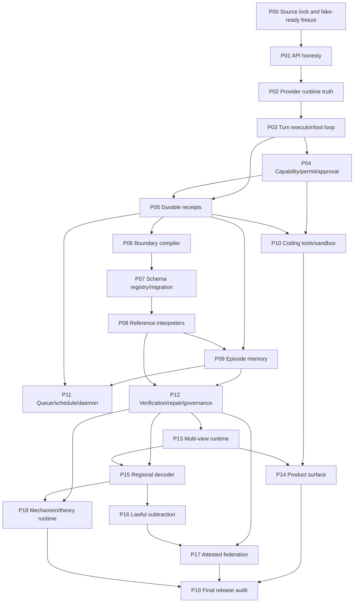

# Build Order DAG

## Critical path

P00 -> P01 -> P02 -> P03 -> P05 -> P06 -> P07 -> P08 -> P09 -> P12 -> P13 -> P14 -> P19

## Parallelizable after gates

- P04 can partially proceed after P02 but must integrate with P03/P05.
- P10 can proceed after P04/P05.
- P11 can proceed after P05/P09.
- P15-P18 are deliberately late.
