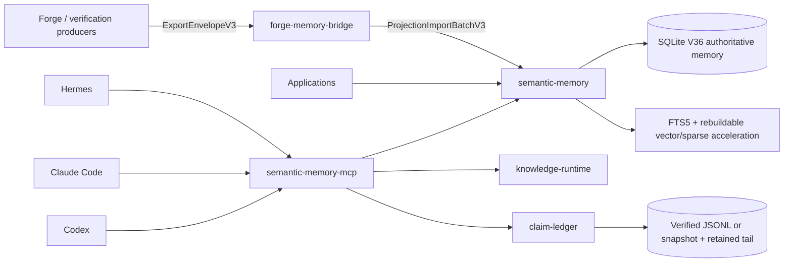

# RecursiveIntell Libraries

A Rust workspace for local-first AI memory, evidence, retrieval, quantization, and runtime governance. The repository contains active libraries, integration crates, experiments, historical plans, and benchmark assets. A crate README and its source are authoritative for that crate; dated plans and archived Codex packets are historical evidence, not current runtime contracts.

## Semantic-memory stack



Authority boundaries:

- Forge producers own raw verification/export truth.
- `forge-memory-bridge` performs explicit projection transformation; it does not become the authority for source evidence.
- `semantic-memory` owns searchable memory, governed memory state, retrieval evidence, and schema migrations through V36.
- `claim-ledger` defines hash-chained claim/evidence/support authority, proof debt, verification, snapshots, and compaction. Persistence publication is caller-owned.
- `semantic-memory-mcp` exposes bounded MCP profiles and combines witnessed retrieval with optional verified claim trust.
- `knowledge-runtime` owns orchestration policy, not stored memory or claim truth.

See [`docs/semantic-memory-ecosystem.md`](docs/semantic-memory-ecosystem.md) for the detailed state, replay, trust, and integration diagrams.

## Primary crates

| Crate | Role |
| --- | --- |
| [`semantic-memory`](semantic-memory/) | Durable hybrid retrieval, governed memory state, receipts, replay, graph/projection/procedural APIs |
| [`semantic-memory-mcp`](semantic-memory-mcp/) | MCP server, runtime profiles, witnessed retrieval, authority decisions, agent integrations |
| [`claim-ledger`](claim-ledger/) | Claim/evidence domain, hash-chain verification, proof debt, snapshots and compaction |
| [`semantic-memory-forge`](semantic-memory-forge/) | Forge export envelope production |
| [`forge-memory-bridge`](forge-memory-bridge/) | Forge export to semantic-memory projection transformation |
| [`knowledge-runtime`](knowledge-runtime/) | Runtime orchestration and policy integration |
| [`turbo-quant`](turbo-quant/) | Vector quantization and candidate-generation research/implementation |
| [`fib-quant`](fib-quant/) | Fibonacci quantization research crate; already part of this workspace |

The workspace contains additional crates. Inspect root `Cargo.toml` for the exact current member/default-member set rather than relying on a copied list.

## Build and test

From the repository root:

```bash
cargo check --workspace
cargo test --workspace
cargo fmt --all -- --check
```

Targeted semantic-memory verification:

```bash
cargo test -p semantic-memory
cargo test -p semantic-memory --no-default-features --features brute-force
cargo test -p claim-ledger
cargo check -p semantic-memory-mcp --all-features
cargo test -p semantic-memory-mcp --features full
```

Some all-workspace or all-feature jobs require local model services, optional system libraries, GPUs, or substantial runtime. A passing targeted command is evidence only for the exact feature set and environment that command exercised.

## Documentation

- [`docs/README.md`](docs/README.md) — active documentation index
- [`docs/semantic-memory-ecosystem.md`](docs/semantic-memory-ecosystem.md) — semantic-memory authority and data-flow map
- [`semantic-memory/docs/evaluation/scifact/README.md`](semantic-memory/docs/evaluation/scifact/README.md) — official BEIR SciFact retrieval evaluation protocol
- [`docs/plans/`](docs/plans/) — dated implementation plans; source may have superseded them
- [`docs/archive/`](docs/archive/) — explicitly historical material

## Repository rules

- SQLite/governed state and verified ledgers are authoritative; sidecars and compressed pools are rebuildable candidate accelerators.
- Candidate discovery never mutates verification state by itself.
- Recall authority does not imply assertion or action authority.
- Benchmark claims must name the corpus, feature set, executable/configuration, and receipt basis.
- Do not infer current behavior from archived plans, static tool counts, or old release packets.

## License

Individual crates declare their licenses in their manifests and crate-local license files. Do not assume one workspace-wide license where a crate states otherwise.
