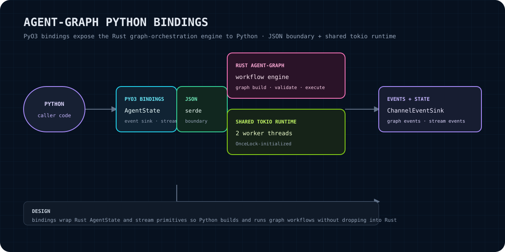

# agent-graph-python

PyO3 bindings for the Rust `agent-graph` workflow engine. This crate provides a Python-facing `AgentState` plus a small synchronous `StateGraph` execution surface, with Rust-backed state storage and graph callbacks.

> **No cloud dependencies.** This binding does not call OpenAI, Anthropic, Pinecone, Weaviate, Supabase, or any hosted service. It is a local Python extension around the sibling Rust `agent-graph` crate.

<p align="center"></p>

The diagram summarizes the current boundary: Python objects are converted to JSON-compatible values, PyO3 invokes the Rust binding, and a shared multi-threaded Tokio runtime drives the underlying asynchronous state operations.

## What this gives you

- A Python class named `AgentState` backed by the Rust `agent_graph::AgentState`.
- `START` and `END` graph markers exported from the Rust crate.
- A `StateGraph` class for registering Python node callbacks, ordinary edges, conditional routers, and invoking a bounded synchronous execution loop.
- JSON-oriented state exchange: Python values are serialized with Python's `json.dumps` and decoded with `serde_json`; returned Rust values are serialized and loaded with Python's `json.loads`.
- A `stream` entry point that runs the graph through the binding's event-sink bridge and returns the resulting state in the current API shape.

## Scope and claim boundary

This is a **0.1.0 private monorepo binding**, not a standalone replacement for the Rust engine. The public Python surface in this repository is the surface implemented in `src/lib.rs`; it should not be assumed to expose every Rust `agent-graph` capability.

In particular:

- `StateGraph.compile()` currently returns successfully without performing visible validation.
- `StateGraph.stream()` preserves its existing one-element `AgentState` return. `StateGraph.stream_events()` exposes the bounded drained event dictionaries as a separate explicit API.
- Graph execution is bounded by a maximum of 100 loop iterations.
- Python callbacks are invoked synchronously during `invoke`/the underlying stream execution.
- The binding depends on the sibling path crate `../agent-graph`; this repository does not provide an independently published engine package.

These are implementation facts, not promises about future behavior.

## Install and build

### Prerequisites

- Python 3.9 or newer, as declared in `pyproject.toml`.
- Rust and Cargo.
- `maturin` 1.7 or newer. The project declares `maturin>=1.7` as its build backend.
- A checkout of the Libraries monorepo containing the sibling `agent-graph` crate at `../agent-graph`.

From this directory, install the build tool if needed and build the extension into the active Python environment:

```bash
python -m pip install --upgrade maturin
maturin develop
```

`maturin develop` uses the current `pyproject.toml`, which places the native module under the `agent_graph` Python package as `agent_graph._native`.

## Quick start

After `maturin develop`, the following exercises the state binding and the exported graph markers:

```python
from agent_graph import AgentState, START, END

state = AgentState({"inputs": {"message": "hello"}})

print(state.get("inputs"))
state.set("answer", {"text": "world"})
print(state.as_dict())
print(state.get_all_keys())
print(START, END)
```

A minimal graph uses Python callables as nodes. A node receives an `AgentState`; returning a dictionary merges those key/value pairs into the state:

```python
from agent_graph import AgentState, START, END, StateGraph

graph = StateGraph(None)
graph.add_node("greet", lambda state: {"message": "hello"})
graph.add_edge(START, "greet")
graph.add_edge("greet", END)
graph.compile()

result = graph.invoke({"name": "Ada"})
print(result.as_dict())
```

The current constructor accepts an optional schema object but does not use it for validation. `invoke` also accepts an optional initial Python object; use a JSON-serializable mapping when supplying initial state.

## API overview

### `AgentState(initial=None)`

Creates a Rust-backed state. When `initial` is supplied, it must serialize to a JSON object whose values are JSON-compatible. Construction populates the Rust state one key at a time.

Methods:

- `get(key)`: return one JSON-compatible value from Rust state.
- `set(key, value)`: convert and store one JSON-compatible value.
- `as_dict()`: export the complete state as a Python dictionary.
- `get_all_keys()`: return the current state keys as a Python list of strings.

### Constants

- `START`: graph start marker exported from `agent_graph::START`.
- `END`: graph end marker exported from `agent_graph::END`.

### `StateGraph(schema)`

Creates an empty graph. The `schema` argument is accepted for API compatibility with the current constructor but is not inspected by `compile()`.

Methods:

- `add_node(name, callable)`: register a Python callable. During execution it is called with an `AgentState`.
- `add_edge(from, to)`: append a normal directed edge.
- `add_conditional_edges(from, router)`: register a router callable for a node. A router may return a string, a list of strings, or `None`.
- `compile()`: currently a successful no-op.
- `invoke(initial=None)`: execute from edges leaving `START`, process nodes and routers, deduplicate next nodes per iteration, and return the resulting `AgentState`.
- `stream(initial=None)`: execute through the event-sink bridge and return the current one-element list containing the resulting `AgentState`.
- `stream_events(initial=None)`: execute through the same bounded event-sink bridge and return JSON-compatible event dictionaries.

When built with the optional `observability` feature on Unix, the native module also exposes:

- `ObservationClient(socket_path, capacity=256)`: bounded client for canonical observation envelopes.
- `ObservationClient.emit(event_dict)`: submit one JSON-compatible `ObservationEnvelope` dictionary and return `accepted`, `dropped`, or `collector_unavailable`.
- `ObservationClient.stats()`: return producer send/drop counters.
- `ObservationClient.close()`: stop the background sender.

## Architecture

The binding is intentionally thin:

1. PyO3 exposes Rust types as Python classes and module constants.
2. Python objects cross the boundary through JSON serialization. Unsupported Python values fail during conversion rather than being silently coerced.
3. Rust state operations run on a process-level shared Tokio multi-threaded runtime created once with `OnceLock`.
4. That runtime has two worker threads named `agent-graph-py`.
5. `stream` connects the core event sink to a bounded Tokio channel with capacity 256. Execution is isolated through `spawn_blocking`; Python drains the channel after execution completes.

The JSON boundary is a compatibility seam, not a general Python object bridge. Values should remain representable by both Python's `json` module and `serde_json`.

## Errors and edge cases

- Invalid JSON conversion, non-object initial state, state-operation failures, callback failures, and runtime failures are surfaced as Python exceptions, generally `RuntimeError` from the binding.
- `AgentState(initial)` requires an object-shaped value. A list, scalar, or otherwise non-map JSON value is rejected.
- `get` may fail if the underlying Rust state reports an error; the error is converted to `RuntimeError`.
- A node's returned dictionary is merged into state. A non-dictionary return value is ignored for state updates, although the callback itself still ran.
- A conditional router result must be a string, list of strings, or `None` to affect routing. Other result types fall back to ordinary outgoing edges.
- `START` and `END` are treated as control markers during traversal. Cycles are not rejected by `compile`; execution stops after 100 iterations.
- `stream` uses a bounded event channel. `stream_events()` returns the drained event dictionaries; `stream()` retains the historical final-state-only return shape.
- The extension imports Python's `json` module at runtime. A Python environment that cannot import `json` cannot use the conversion boundary.

## Verification

Run these commands from `/home/sikmindz/Coding/Libraries/agent-graph-python`:

```bash
cargo check --manifest-path Cargo.toml
python -m pip install --upgrade maturin
maturin develop
python - <<'PY'
from agent_graph import AgentState, START, END

state = AgentState({"inputs": {"message": "hello"}})
assert state.get("inputs") == {"message": "hello"}
state.set("answer", 42)
assert state.as_dict()["answer"] == 42
assert START is not None
assert END is not None
print("agent-graph-python smoke test: ok")
PY
```

The commands above are the verification path. Their result depends on the current monorepo dependency state, installed Rust/Python toolchains, and the active Python environment; run them locally rather than treating this README as a test receipt.

## Integration path

For a Python application, keep application data JSON-serializable, build the graph with `StateGraph`, register ordinary or conditional edges, and pass `AgentState` through node callbacks. For a Rust application or a feature that needs capabilities not represented by this binding, integrate directly with the sibling `agent-graph` crate instead of assuming the Python wrapper has a hidden compatibility layer.

The package metadata names the Python distribution `agent-graph` and the import package `agent_graph`; the native extension is configured as `agent_graph._native`. The Rust library itself is named `_native` for the PyO3 build.

## Status and roadmap

### Current status

- Version: `0.1.0`.
- Implemented surface: `AgentState`, `START`, `END`, `StateGraph`, JSON conversion, shared Tokio runtime, and the current event-sink-backed stream path.
- Repository status: private Libraries monorepo crate; no standalone public engine repository is linked here.

### Roadmap boundary

No future feature is promised by this README. Natural follow-up work, subject to project decisions and tests, includes making `compile()` perform explicit graph validation, exposing stream events through a stable Python iterator or event result, and adding dedicated Python integration tests. Those items are proposals, not implemented capabilities.

## License

No `LICENSE` file is present in this crate directory, and `Cargo.toml` does not declare a license. The previous README described the binding as Apache-2.0 to match the underlying crate, but that relationship is not independently verifiable from the current files inspected here. Treat licensing as **unverified** until the canonical monorepo license or project owner confirms it.
