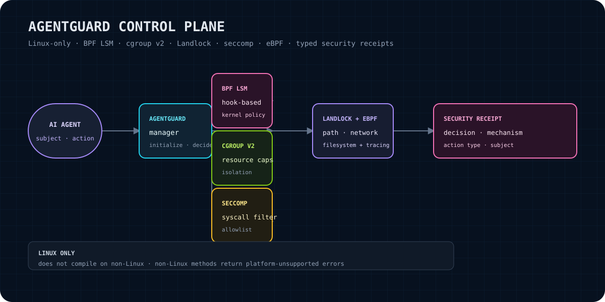

# agent-guard

**Linux-native security control-plane types for AI-agent runtimes.**

`agent-guard` is a Rust crate for representing and organizing security control-plane decisions around agent actions. It exposes a unified `AgentGuard` entry point, a `ControlPlane` integration trait, typed subjects and actions, structured security decisions, and error variants for Linux security mechanisms such as BPF LSM, cgroup v2, Landlock, seccomp, and eBPF.

The crate lives in the private **RecursiveIntell Libraries monorepo**. It is Linux-only and targets Rust 1.75 or newer.

> **No cloud dependencies.** This crate is designed as a local security boundary and receipt/data model. The manifest contains Rust libraries only; it does not configure a cloud service, hosted policy engine, or remote control plane.

<p align="center"></p>

## What problem does it solve?

Agent runtimes need a consistent vocabulary for questions such as:

- Which process or agent is the subject of an attempted operation?
- What kind of action is being attempted?
- Which resource is involved?
- Was the action allowed or denied?
- Why was that decision made?
- Which Linux security mechanisms were associated with the decision?
- When was the decision recorded?

`agent-guard` supplies the public Rust types and control-plane seam for those questions. It keeps the subject, action, decision, and mechanism information explicit and serializable rather than requiring each integrating runtime to invent its own shape.

## What you get

- `AgentGuard`: construct a guard, initialize it on Linux, and inspect initialization state.
- `ControlPlane`: a trait for initialization, readiness checks, evaluation, enforcement, and shutdown.
- `Subject`: a named agent/process identity with optional PID and cgroup path.
- `Action` and `ActionType`: a typed description of a requested operation and resource.
- `SecurityDecision`: a serializable decision containing subject, action, outcome, reason, timestamp, and mechanisms.
- `SecurityMechanism`: typed references to BPF LSM, cgroup v2, Landlock, seccomp, and eBPF mechanisms.
- `Error` / `Result`: explicit error categories for unavailable mechanisms, invalid configuration, initialization state, security operations, and MCP broker failures.

## Claim boundary

This crate currently provides the public API and data model described above. It does **not** claim to provide a complete production sandbox, a policy language, a kernel loader, a verified security policy, or a security guarantee.

In particular:

- The current `AgentGuard::initialize` implementation on Linux marks the instance initialized; its source contains a placeholder comment stating that Linux-specific setup would go there.
- The current source does not contain a concrete `ControlPlane` implementation. `ControlPlane` is an integration trait.
- The current source does not expose public methods on `AgentGuard` for evaluating or enforcing actions.
- The source does not demonstrate loading BPF LSM, cgroup v2, Landlock, seccomp, or eBPF programs.
- A `SecurityDecision` is a typed record; constructing one is not itself proof that a kernel mechanism enforced it.
- No benchmark, compliance, isolation-strength, or production-readiness claim is made here.
- The crate is Linux-only in intent. On non-Linux targets, `initialize` returns an `InvalidConfig` error stating that AgentGuard is only available on Linux. The manifest/source combination should be validated on each supported build target before relying on cross-compilation behavior.

## Installation

This crate is currently maintained inside the RecursiveIntell Libraries monorepo. For a workspace integration, add the local dependency using the path appropriate to your checkout:

```toml
[dependencies]
agent-guard = { path = "../agent-guard" }
```

The manifest declares:

- package version `0.1.0`;
- Rust edition 2021;
- MSRV `1.75`;
- no default features;
- optional `mcp` feature, which enables the optional `tokio` dependency on the target configuration where it is declared.

The current manifest does not declare a registry-facing `repository`, `documentation`, or `license` field. Treat this crate as a monorepo component unless and until its packaging metadata is completed and verified.

## Quick start

The following is adapted directly from the crate's `src/lib.rs` documentation example and is valid in a function that can return `agent_guard::Result<()>`:

```rust
use agent_guard::AgentGuard;

fn start_guard() -> agent_guard::Result<()> {
    let mut guard = AgentGuard::new();
    guard.initialize()?;

    assert!(guard.is_initialized());
    Ok(())
}
```

The same pattern with an explicit `main` function:

```rust
use agent_guard::AgentGuard;

fn main() -> agent_guard::Result<()> {
    let mut guard = AgentGuard::new();
    guard.initialize()?;
    println!("initialized: {}", guard.is_initialized());
    Ok(())
}
```

`AgentGuard` also implements `Default`:

```rust
use agent_guard::AgentGuard;

let guard = AgentGuard::default();
assert!(!guard.is_initialized());
```

Initialization is explicit and requires mutable access:

```rust
use agent_guard::AgentGuard;

let mut guard = AgentGuard::new();
assert!(!guard.is_initialized());

// On Linux, the current implementation marks the guard initialized.
// On non-Linux targets, this returns an InvalidConfig error.
let result = guard.initialize();
```

## Describing subjects and actions

A `Subject` identifies the agent or process to which a decision applies. PID and cgroup path are optional:

```rust
use agent_guard::Subject;

let process_subject = Subject {
    pid: Some(1234),
    name: "research-agent".to_string(),
    cgroup_path: Some("/sys/fs/cgroup/agents/research".to_string()),
};

let logical_subject = Subject {
    pid: None,
    name: "offline-planner".to_string(),
    cgroup_path: None,
};
```

An `Action` combines an `ActionType`, a resource string, and optional JSON metadata:

```rust
use agent_guard::{Action, ActionType};

let read_action = Action {
    action_type: ActionType::FileRead,
    resource: "/etc/hosts".to_string(),
    metadata: None,
};

let network_action = Action {
    action_type: ActionType::NetworkConnect,
    resource: "example.internal:443".to_string(),
    metadata: Some(serde_json::json!({
        "protocol": "tcp",
        "purpose": "model-fetch"
    })),
};
```

The available action variants are:

```rust
use agent_guard::{Action, ActionType};

let actions = [
    Action { action_type: ActionType::FileRead,      resource: "/tmp/input".into(), metadata: None },
    Action { action_type: ActionType::FileWrite,     resource: "/tmp/output".into(), metadata: None },
    Action { action_type: ActionType::FileExecute,   resource: "/usr/bin/tool".into(), metadata: None },
    Action { action_type: ActionType::NetworkConnect,resource: "127.0.0.1:8080".into(), metadata: None },
    Action { action_type: ActionType::NetworkBind,   resource: "0.0.0.0:9000".into(), metadata: None },
    Action { action_type: ActionType::ProcessSpawn,  resource: "helper".into(), metadata: None },
    Action { action_type: ActionType::SystemCall,    resource: "openat".into(), metadata: None },
    Action { action_type: ActionType::CgroupModify,  resource: "/sys/fs/cgroup/agents".into(), metadata: None },
];
```

## Constructing and serializing decisions

`SecurityDecision` contains the decision identifier, subject, action, boolean outcome, reason, UTC timestamp, and associated mechanisms:

```rust
use agent_guard::{
    Action, ActionType, SecurityDecision, SecurityMechanism, Subject,
};
use chrono::Utc;

let subject = Subject {
    pid: Some(4321),
    name: "build-agent".into(),
    cgroup_path: Some("/agents/build".into()),
};

let action = Action {
    action_type: ActionType::FileWrite,
    resource: "/workspace/artifact.bin".into(),
    metadata: Some(serde_json::json!({ "operation": "artifact-output" })),
};

let decision = SecurityDecision {
    decision_id: "guard-build-agent-001".into(),
    subject,
    action,
    allowed: true,
    reason: "Allowed by the local build policy".into(),
    timestamp: Utc::now(),
    mechanisms: vec![SecurityMechanism::Landlock { ruleset_id: 7 }],
};

let encoded = serde_json::to_string_pretty(&decision)?;
println!("{encoded}");
# Ok::<(), Box<dyn std::error::Error>>(())
```

Mechanism values carry mechanism-specific identifiers:

```rust
use agent_guard::SecurityMechanism;

let mechanisms = vec![
    SecurityMechanism::BpfLsm { program: "agent_file_policy".into() },
    SecurityMechanism::CgroupV2 { path: "/agents/research".into() },
    SecurityMechanism::Landlock { ruleset_id: 11 },
    SecurityMechanism::Seccomp { filter_id: 3 },
    SecurityMechanism::Ebpf { program: "agent_network_policy".into() },
];
```

These values are serializable with Serde because the receipt types derive `Serialize` and `Deserialize`.

## API overview

| Public item | Kind | Purpose | Current source boundary |
|---|---|---|---|
| `AgentGuard::new()` | Constructor | Creates an uninitialized guard | Does not install a kernel policy |
| `AgentGuard::default()` | `Default` | Same initial state as `new()` | Starts uninitialized |
| `AgentGuard::initialize()` | Method | Initializes the guard control-plane entry point | Linux currently sets an atomic flag; non-Linux returns `InvalidConfig` |
| `AgentGuard::is_initialized()` | Method | Reads initialization state | Reports the crate's atomic state |
| `ControlPlane` | Trait | Integration contract for initialize/evaluate/enforce/shutdown | No implementation is included in the current source |
| `Subject` | Struct | PID/name/cgroup identity | Fields are public and serializable |
| `Action` | Struct | Action type/resource/metadata | Metadata is optional `serde_json::Value` |
| `ActionType` | Enum | Eight supported action categories | See the action list above |
| `SecurityDecision` | Struct | Decision/receipt record | Contains outcome, reason, UTC timestamp, and mechanisms |
| `SecurityMechanism` | Enum | Mechanism references | Five variants are currently declared |
| `Error` | Enum | Explicit operation failures | Includes availability and state errors |
| `Result<T>` | Alias | `std::result::Result<T, Error>` | Use for fallible crate operations |

## Control-plane integration path

The `ControlPlane` trait defines the intended integration seam:

```rust
use agent_guard::{Action, ControlPlane, Result, SecurityDecision, Subject};

struct LocalPolicy {
    ready: bool,
}

impl ControlPlane for LocalPolicy {
    fn initialize(&mut self) -> Result<()> {
        self.ready = true;
        Ok(())
    }

    fn is_initialized(&self) -> bool {
        self.ready
    }

    fn evaluate(
        &mut self,
        _subject: &Subject,
        _action: &Action,
    ) -> Result<SecurityDecision> {
        // An integrating crate supplies its own policy and decision construction.
        todo!("connect evaluation to the local policy implementation")
    }

    fn enforce(&mut self, _decision: &SecurityDecision) -> Result<()> {
        todo!("connect enforcement to the local Linux mechanism")
    }

    fn shutdown(&mut self) -> Result<()> {
        self.ready = false;
        Ok(())
    }
}
```

The example intentionally leaves policy evaluation and enforcement unimplemented: the current crate declares the trait but does not provide a concrete implementation. An integrating runtime should:

1. construct a subject from its process/agent context;
2. describe the attempted operation as an `Action`;
3. evaluate that pair through its `ControlPlane` implementation;
4. retain or export the resulting `SecurityDecision`;
5. enforce the decision through the implementation;
6. call `shutdown` when the control-plane owner is finished.

## Errors and edge cases

`Error` has the following variants:

| Error | Meaning in the source |
|---|---|
| `BpfNotAvailable(String)` | BPF LSM is unavailable, with a detail string |
| `CgroupNotAvailable(String)` | cgroup v2 is unavailable, with a detail string |
| `LandlockNotAvailable(String)` | Landlock is unavailable, with a detail string |
| `SeccompNotAvailable(String)` | seccomp is unavailable, with a detail string |
| `EbpfNotAvailable(String)` | eBPF is unavailable, with a detail string |
| `SecurityOperation(String)` | A security operation failed |
| `NotInitialized` | An operation requires initialization |
| `InvalidConfig(String)` | Configuration or platform use is invalid |
| `McpBroker(String)` | An MCP broker operation failed |

Handle initialization failure rather than assuming Linux availability:

```rust
use agent_guard::{AgentGuard, Error};

fn initialize_guard() -> agent_guard::Result<AgentGuard> {
    let mut guard = AgentGuard::new();
    guard.initialize().map_err(|error| {
        match &error {
            Error::InvalidConfig(message) => eprintln!("invalid guard configuration: {message}"),
            other => eprintln!("guard initialization failed: {other}"),
        }
        error
    })?;
    Ok(guard)
}
```

Important edge cases grounded in the current implementation:

- A newly constructed guard reports `false` from `is_initialized()`.
- `initialize` takes `&mut self` and returns the crate `Result` type.
- On Linux, the current implementation stores `true` with sequentially consistent atomic ordering and returns `Ok(())`.
- On non-Linux targets, `initialize` returns `Error::InvalidConfig("AgentGuard is only available on Linux")`.
- The public API does not currently expose a reset method on `AgentGuard`.
- `ControlPlane` methods are fallible, so integrations must propagate or classify failures.
- `SecurityDecision::mechanisms` may be empty; the source does not require a mechanism entry.
- `Action::metadata` may be absent or any JSON value; callers should define and validate their own metadata contract.

## Verification

Run these commands from the crate directory:

```bash
cargo fmt --check
cargo check --all-features
cargo test
```

The source includes tests for construction, Linux initialization, decision construction, and the non-Linux initialization error path. `cargo check --all-features` is important because the manifest declares the optional `mcp` feature.

For a local verification receipt, record the command, target platform, Rust/Cargo versions, exit status, and any warnings or skipped checks. Do not treat a successful compile as proof that a kernel security mechanism was loaded: the current source does not implement that loading path.

## Status and roadmap

### Current status: API/data-model foundation

The current `0.1.0` source provides the public types, `AgentGuard` lifecycle flag, error taxonomy, and `ControlPlane` trait. The Linux `initialize` path is currently a placeholder control-plane state transition rather than a mechanism installer.

### Roadmap direction

The source's declared control-plane shape points toward future work in these areas, but no completion claim is made for them here:

- concrete Linux `ControlPlane` implementations;
- real availability detection and setup for BPF LSM, cgroup v2, Landlock, seccomp, and eBPF;
- policy evaluation that returns meaningful allow/deny decisions;
- enforcement and shutdown behavior tied to installed resources;
- integration tests for supported Linux environments and unavailable mechanisms;
- stronger documentation of permissions, kernel prerequisites, and rollback behavior.

These are roadmap items, not current capabilities of `agent-guard` v0.1.0.

## License

The requested project license is **MIT**. However, the current `Cargo.toml` inspected for this README does not contain a `license = "MIT"` field, and no license file was verified in the crate directory during this documentation pass. Confirm and add the canonical MIT license metadata/file before treating this as a complete distributable package.

## Repository and contribution context

This crate is maintained as part of the private RecursiveIntell **Libraries** monorepo. Use the monorepo's source, workspace instructions, and validation gates as the authoritative integration context. This README intentionally does not link to a nonexistent standalone `github.com/RecursiveIntell/agent-guard` repository.
