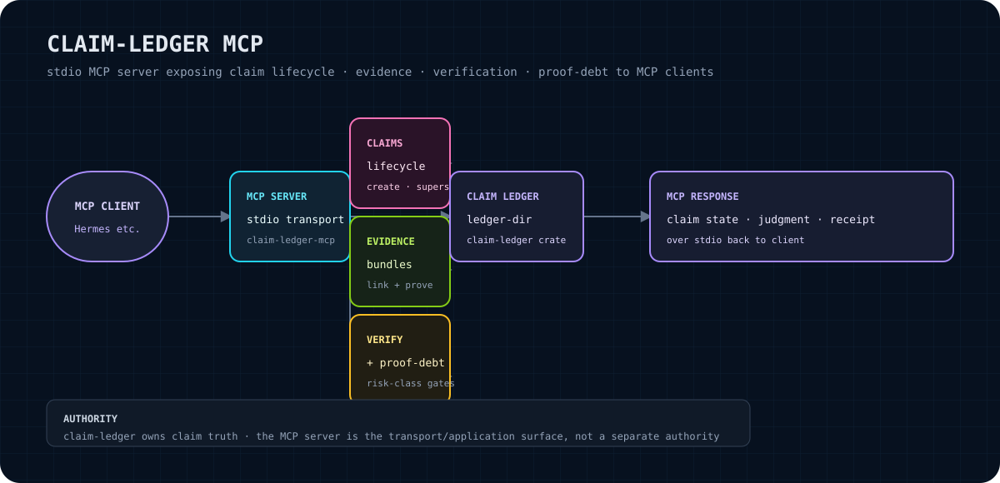

# claim-ledger-mcp

`claim-ledger-mcp` is a local MCP (Model Context Protocol) server that exposes the claim-ledger through stdio. It is a narrow transport and query surface for applications that need to inspect claim records, verify ledger integrity, evaluate proof-debt budgets, and produce export receipts.

> **No cloud dependencies.** This server does not call OpenAI, Anthropic, Pinecone, Weaviate, Supabase, or any hosted service. It reads the ledger from the local filesystem and communicates with its MCP client over stdin/stdout.

<p align="center"></p>

The diagram is a high-level orientation aid. The executable behavior is defined by `src/main.rs`, `src/server.rs`, `src/tools.rs`, and the `claim-ledger` dependency.

## Purpose and boundary

This crate gives a local MCP-capable client a stable process boundary around claim-ledger operations:

- start a server with a ledger directory;
- communicate using MCP over stdio;
- inspect claim rows and related ledger events;
- check the current ledger head and hash-chain integrity;
- evaluate the configured proof-debt gate for selected claims; and
- create a binding export receipt for a set of claim IDs.

**Authority boundary:** `claim-ledger-mcp` is the transport surface and adapter. It does not become a second claim database or a second claim-truth authority. `claim-ledger` owns claim truth, ledger parsing, verification semantics, identifiers, digests, and receipt types. This server loads the canonical `claim_ledger.jsonl` file from the requested directory and returns MCP results derived from that source.

## Current status

Version `0.1.0`. The server builds from the Libraries workspace and provides a focused stdio MCP surface. It is a private monorepo crate rather than a standalone public repository. No production-readiness, hosted-service, benchmark, or external-adoption claim is made here.

## Build and install from source

This crate currently has a workspace-local path dependency on `claim-ledger`, so build it from the Libraries workspace:

```bash
cd /home/sikmindz/Coding/Libraries
cargo build -p claim-ledger-mcp
```

The resulting binary is available under the workspace target directory, normally:

```text
target/debug/claim-ledger-mcp
```

A release build can be produced with the same workspace package selector:

```bash
cargo build --release -p claim-ledger-mcp
```

No separate installer or published-package workflow is declared by this crate.

## Usage

Start the server by pointing it at a directory containing (or intended to contain) `claim_ledger.jsonl`:

```bash
claim-ledger-mcp --ledger-dir <path>
```

For a build-from-source invocation:

```bash
/home/sikmindz/Coding/Libraries/target/debug/claim-ledger-mcp \
  --ledger-dir <path>
```

The process uses MCP stdio transport. Protocol traffic is carried on stdin/stdout; tracing output is configured for stderr. `RUST_LOG` may be used to configure the `tracing_subscriber` environment filter, for example:

```bash
RUST_LOG=info claim-ledger-mcp --ledger-dir <path>
```

The server derives the ledger file path as `<path>/claim_ledger.jsonl`.

## Verified MCP tools

The following names are verified directly in `src/server.rs` and are registered through the rmcp tool router:

| Tool | Inputs | Behavior |
|---|---|---|
| `claim_ledger_status` | none | Returns the ledger path, entry count, snapshot marker, and the current verification status. |
| `claim_ledger_verify` | none | Verifies the ledger hash chain against the current last entry (or the empty head) and reports the result. |
| `claim_ledger_query` | `text`, `state`, `namespace`, `limit` (all optional) | Lists claim rows, optionally filtering by claim text, support state, source/namespace text, and a capped result limit. |
| `claim_ledger_get` | `claim_id` | Returns ledger events containing the requested claim ID, or `found: false` when none are present. |
| `claim_ledger_evaluate_proof_debt` | `claim_ids`, `budget_micros` (optional/defaulted) | Computes the proof-debt weight for selected claims and returns an `allow`, `warn`, or `block` gate decision. |
| `claim_ledger_export_receipt` | `claim_ids`, `operation`, `attempt_id` (optional/defaulted) | Creates and marks successful a binding export receipt whose output binding is the digest of the selected claim IDs. |

Tool argument schemas and defaults are generated from the parameter structs in `src/tools.rs`. Clients should use MCP `tools/list` as the authoritative runtime enumeration if the implementation changes.

## Ledger and error behavior

- The server reads `<ledger-dir>/claim_ledger.jsonl` for each operation. A missing file is treated as an empty ledger by the current loader.
- Other filesystem read failures are returned as MCP internal errors.
- Ledger parse failures are returned as MCP internal errors rather than being silently repaired.
- Verification returns a structured successful tool result with `ok: false` when the loaded ledger fails verification; a transport-level MCP failure is not used to disguise an invalid chain.
- Query results are limited to 200 rows even when a larger `limit` is requested. The default limit is 50.
- Query support-state filtering compares the supplied string to the returned support-state string; callers should use the values emitted by the ledger implementation rather than assuming an undocumented enum list.
- `claim_ledger_get` matches a claim ID in the serialized event representation. It reports `found: false` when no matching event is present.
- Proof-debt evaluation uses the current claim rows and the supplied budget. Claims without a supported or partially-supported state contribute to the returned debt weight according to the implementation in `src/server.rs`.
- The server does not write claim entries through these tools. The export-receipt tool constructs a receipt in memory and returns it; it does not append a claim to the ledger.
- The CLI requires `--ledger-dir`; an omitted or invalid path fails during argument parsing or filesystem access.

These behaviors are implementation facts for version `0.1.0`, not a promise that future versions will preserve every response field.

## Verify the MCP surface over stdio

After building, exercise MCP initialization and tool discovery with a JSON-RPC client. The exact protocol framing is owned by the installed rmcp version; use a standards-compliant MCP client rather than assuming a custom wire format. At minimum, send:

1. an MCP `initialize` request with the client's protocol version and capabilities;
2. an `initialized` notification; and
3. a `tools/list` request.

A successful verification should show an initialize response followed by a tool list containing the six verified names above. For example, an MCP inspector or client configured to launch the command should use:

```text
command: /home/sikmindz/Coding/Libraries/target/debug/claim-ledger-mcp
args:    --ledger-dir <path>
```

The following build and protocol gates were verified in this workspace:

```bash
cd /home/sikmindz/Coding/Libraries
cargo build -p claim-ledger-mcp
```

A local stdio smoke test sent `initialize`, `notifications/initialized`, and `tools/list` to the built binary. The server returned protocol version `2025-06-18` and advertised exactly the six tools listed above. The smoke test used a temporary empty ledger directory; it did not exercise populated-ledger queries or invalid-ledger handling. If a future rmcp upgrade changes the advertised surface, use MCP `tools/list` to enumerate the runtime truth.

## Hermes integration path

Hermes can integrate this server as a local stdio MCP server. Configure the Hermes MCP client to launch the built binary and pass the ledger directory as an argument. The integration boundary is:

```text
Hermes MCP client
    -> stdio process launch
claim-ledger-mcp --ledger-dir <path>
    -> local claim_ledger.jsonl
claim-ledger
```

Keep the ledger directory explicit and local. Hermes should treat the tool schemas returned by MCP discovery as the runtime contract and should not duplicate claim-ledger semantics in a second memory or cache. Before enabling an integration, verify `initialize` and `tools/list`, then run a read-only status or verification call against a test ledger.

This README intentionally does not prescribe a Hermes configuration key or file location because those are owned by the active Hermes configuration and MCP documentation, not by this crate.

## Roadmap

The roadmap is intentionally conservative until additional behavior is admitted and verified:

- preserve the claim-ledger ownership boundary while evolving the MCP adapter;
- keep stdio initialization and tool discovery compatible with the selected rmcp release;
- add protocol-level integration fixtures for `initialize`, `initialized`, and `tools/list`;
- document any newly admitted tools only from the live router and parameter schemas; and
- expand operational documentation only when the underlying claim-ledger API and persistence behavior are stable.

No unimplemented feature is presented as available today.

## License

The `claim-ledger-mcp` package manifest does not declare a license field, and this crate directory does not contain a standalone `LICENSE` file. Licensing therefore remains governed by the surrounding Libraries monorepo's canonical licensing decision. Do not infer a license from dependencies or from this README; consult the repository owner and the workspace's legal metadata before redistribution.

## Source map

- `src/main.rs` — CLI parsing, logging setup, stdio transport, and service lifetime.
- `src/server.rs` — server construction, ledger loading, MCP tool registration, and tool behavior.
- `src/tools.rs` — MCP argument schemas and defaults.
- `docs/architecture.svg` — architecture orientation diagram.
- `Cargo.toml` — package metadata and workspace-local dependencies.
