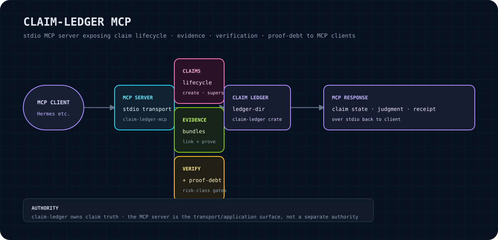

# claim-ledger-mcp

<!-- source-reviewed: 2026-10-01; anchored/unanchored API review, not a fresh runtime or release certification -->

`claim-ledger-mcp` is a local MCP (Model Context Protocol) server that exposes claim-ledger records through stdio. It defaults to **unanchored** reads. Supplying both `--trust-root` and `--expected-head` enables projection against an independently provisioned expected head and matching recorded native admission. A self-consistent ledger alone does not authenticate its head.

> **No cloud dependencies.** This server does not call OpenAI, Anthropic, Pinecone, Weaviate, Supabase, or any hosted service. It reads the ledger from the local filesystem and communicates with its MCP client over stdin/stdout.

<p align="center"></p>

The diagram is a high-level orientation aid. The executable behavior is defined by `src/main.rs`, `src/server.rs`, `src/tools.rs`, and the `claim-ledger` dependency.

## Purpose and boundary

This crate gives a local MCP-capable client a stable process boundary around claim-ledger operations:

- start a server with a ledger directory;
- communicate using MCP over stdio;
- inspect claim rows and related ledger events;
- check internal chain consistency by default, or verify the exact ledger against independently provisioned head/anchor inputs;
- inspect a fail-closed proof-debt result (the MCP budget instrument is not provisioned, including in anchored mode); and
- create a binding export receipt for a set of claim IDs.

**Authority boundary:** `claim-ledger-mcp` is the transport surface and adapter. It does not become a second claim database or a second claim-truth authority. `claim-ledger` owns claim truth, ledger parsing, verification semantics, identifiers, digests, and receipt types. This server loads the canonical `claim_ledger.jsonl` file from the requested directory and returns MCP results derived from that source.

## Current status

Version `0.1.0`. The server builds from the Libraries workspace and provides a focused stdio MCP surface. It is a Libraries monorepo crate rather than a standalone public repository. No production-readiness, hosted-service, benchmark, or external-adoption claim is made here.

## Build and install from source

This crate currently has a workspace-local path dependency on `claim-ledger`, so build it from the Libraries workspace:

```bash
cd /home/sikmindz/Coding/Libraries
cargo build -p claim-ledger-mcp
```

The resulting binary is available under the workspace target directory, normally:

```text
target/debug/claim-ledger-mcp
```

A release build can be produced with the same workspace package selector:

```bash
cargo build --release -p claim-ledger-mcp
```

No separate installer or published-package workflow is declared by this crate.

## Usage

Start the server by pointing it at a directory containing (or intended to contain) `claim_ledger.jsonl`:

```bash
claim-ledger-mcp --ledger-dir <path>
```

For a build-from-source invocation:

```bash
/home/sikmindz/Coding/Libraries/target/debug/claim-ledger-mcp \
  --ledger-dir <path>
```

The process uses MCP stdio transport. Protocol traffic is carried on stdin/stdout; tracing output is configured for stderr. `RUST_LOG` may be used to configure the `tracing_subscriber` environment filter, for example:

```bash
RUST_LOG=info claim-ledger-mcp --ledger-dir <path>
```

The server derives the ledger file path as `<path>/claim_ledger.jsonl`.

### Optional trusted-head projection

```bash
claim-ledger-mcp --ledger-dir <path> \
  --trust-root <operator-provisioned-public-trust-root.json> \
  --expected-head <independently-provisioned-head.json>
```

The flags must be supplied together. Startup reads and parses both files;
ledger/head/anchor consistency is checked on each tool call. The trusted-head
schema is `ClaimLedgerMcpTrustedHeadV1`, with `expected_sequence`,
`ledger_entry_digest`, `anchor_admission_id`, and `anchor_envelope_digest`.
Provision these independently of the untrusted ledger. The server checks the
exact chain/head and finds a matching recorded `AdmissionEvent` whose signer
matches the root and whose stored stage is `fully_verified`.

The projection does not re-verify original artifact bytes/signatures at query
time; its trust depends on the independently provisioned head. Root/head text
is captured at startup, so replace it and restart explicitly when advancing
the admitted head. Invalid anchored input fails with an error rather than
falling back to unanchored support. Keep both files operator-controlled: the
CLI reads/parses them directly and does not invoke the library file loader's
Unix-permission check.

## Verified MCP tools

The following names are verified directly in `src/server.rs` and are registered through the rmcp tool router:

| Tool | Inputs | Behavior |
|---|---|---|
| `claim_ledger_status` | none | Unanchored: `ok: false` plus internal chain consistency. Anchored: `ok: true` and recorded anchor metadata after successful per-call projection. |
| `claim_ledger_verify` | none | Unanchored: consistency-only, `ok: false`. Anchored: verifies the exact expected chain/head and anchor, returning `ok: true` and `verification_status: anchored`. |
| `claim_ledger_query` | `text`, `state`, `namespace`, `limit` (all optional) | Unanchored support stays `unknown`; a `supported` filter returns no claims. Anchored support comes from the canonical fold; absent projected states remain `unknown`. Legacy admission events alone do not promote support. |
| `claim_ledger_get` | `claim_id` | Returns matching raw events or `found: false`, with the current verification mode. `raw_untrusted: true` remains set even in anchored mode; matching uses serialized-event substring presence. |
| `claim_ledger_evaluate_proof_debt` | `claim_ids`, `budget_micros` (optional/defaulted) | Always returns `block` and null debt weight because the MCP budget instrument is not provisioned. Anchored mode adds anchor identity; it does not enable the gate. |
| `claim_ledger_export_receipt` | `claim_ids`, `operation`, `attempt_id` (optional/defaulted) | Constructs an in-memory receipt for the **caller-provided IDs only** and labels the verification mode. Success does not authenticate those IDs or export claim content; `receipt_scope` stays `provided_claim_ids_only`. |

Tool argument schemas and defaults are generated from the parameter structs in `src/tools.rs`. Clients should use MCP `tools/list` as the authoritative runtime enumeration if the implementation changes.

## Ledger and error behavior

- The server reads `<ledger-dir>/claim_ledger.jsonl` for each operation. A missing file is treated as an empty ledger by the current loader.
- Other filesystem read failures are returned as MCP internal errors.
- Ledger parse failures are returned as MCP internal errors rather than being silently repaired.
- Without trust-root/head inputs, chain checking returns `digest_chain_valid` but keeps `ok: false`; the file's own head is not an independent anchor. With both inputs, the exact expected head and matching recorded admission must verify before anchored results are returned.
- Query results are limited to 200 rows even when a larger `limit` is requested. The default limit is 50.
- Query support-state filtering compares the supplied string to the returned support-state string; callers should use the values emitted by the ledger implementation rather than assuming an undocumented enum list.
- `claim_ledger_get` uses substring matching in serialized events, not an exact semantic claim join. It reports the current verification mode but keeps raw-event output explicitly untrusted; a matching event is not a standalone proof of the requested claim.
- Proof-debt evaluation stays fail-closed in both modes. Its debt weight is unknown (`null`), not zero, regardless of the supplied budget, anchor, or reported support.
- The server does not write claim entries through these tools. The export-receipt tool constructs a receipt in memory and returns it; it does not append a claim to the ledger.
- The CLI requires `--ledger-dir`; an omitted or invalid path fails during argument parsing or filesystem access.

These behaviors are implementation facts for version `0.1.0`, not a promise that future versions will preserve every response field.

## Verify the MCP surface over stdio

After building, exercise MCP initialization and tool discovery with a JSON-RPC client. The exact protocol framing is owned by the installed rmcp version; use a standards-compliant MCP client rather than assuming a custom wire format. At minimum, send:

1. an MCP `initialize` request with the client's protocol version and capabilities;
2. an `initialized` notification; and
3. a `tools/list` request.

A successful verification should show an initialize response followed by a tool list containing the six verified names above. For example, an MCP inspector or client configured to launch the command should use:

```text
command: /home/sikmindz/Coding/Libraries/target/debug/claim-ledger-mcp
args:    --ledger-dir <path>
```

The following build and protocol gates were verified in this workspace:

```bash
cd /home/sikmindz/Coding/Libraries
cargo build -p claim-ledger-mcp
```

A local stdio smoke test sent `initialize`, `notifications/initialized`, and `tools/list` to the built binary. The server returned protocol version `2025-06-18` and advertised exactly the six tools listed above. The smoke test used a temporary empty ledger directory; it did not exercise populated-ledger queries or invalid-ledger handling. If a future rmcp upgrade changes the advertised surface, use MCP `tools/list` to enumerate the runtime truth.

## Hermes integration path

Hermes can integrate this server as a local stdio MCP server. Configure the Hermes MCP client to launch the built binary and pass the ledger directory as an argument. The integration boundary is:

```text
Hermes MCP client
    -> stdio process launch
claim-ledger-mcp --ledger-dir <path>
    -> local claim_ledger.jsonl
claim-ledger
```

Keep the ledger directory explicit and local. Hermes should treat the tool schemas returned by MCP discovery as the runtime contract and should not duplicate claim-ledger semantics in a second memory or cache. Before enabling an integration, verify `initialize` and `tools/list`, then run a read-only status or verification call against a test ledger.

This README intentionally does not prescribe a Hermes configuration key or file location because those are owned by the active Hermes configuration and MCP documentation, not by this crate.

## Roadmap

The roadmap is intentionally conservative until additional behavior is admitted and verified:

- preserve the claim-ledger ownership boundary while evolving the MCP adapter;
- keep stdio initialization and tool discovery compatible with the selected rmcp release;
- add protocol-level integration fixtures for `initialize`, `initialized`, and `tools/list`;
- document any newly admitted tools only from the live router and parameter schemas; and
- expand operational documentation only when the underlying claim-ledger API and persistence behavior are stable.

No unimplemented feature is presented as available today.

## License

The `claim-ledger-mcp` package manifest does not declare a license field, and this crate directory does not contain a standalone `LICENSE` file. Licensing therefore remains governed by the surrounding Libraries monorepo's canonical licensing decision. Do not infer a license from dependencies or from this README; consult the repository owner and the workspace's legal metadata before redistribution.

## Source map

- `src/main.rs` — CLI parsing, logging setup, stdio transport, and service lifetime.
- `src/server.rs` — server construction, ledger loading, MCP tool registration, and tool behavior.
- `src/tools.rs` — MCP argument schemas and defaults.
- `docs/architecture.svg` — architecture orientation diagram.
- `Cargo.toml` — package metadata and workspace-local dependencies.
