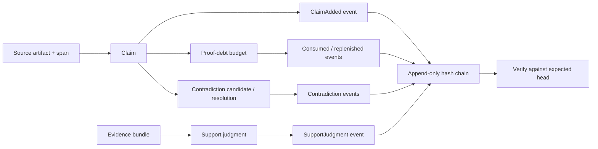
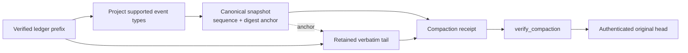

# claim-ledger

`claim-ledger` is a deterministic, local-first Rust library for recording
claim, evidence, provenance, contradiction, export, and proof-debt events. It
creates hash-chained entries and verifiable compaction checkpoints; it does not
perform I/O, operate a search index, or make trust decisions by itself.

**Current crate metadata:** version `0.2.1`, license [MIT](#license), Rust 2021
edition. An MSRV is **not declared**: `Cargo.toml` has no `rust-version` field.

## Purpose and authority boundary

When it is used by `semantic-memory-mcp`, this crate is the **sole durable
claim/trust event store**. Durable changes to claim or trust state are recorded
as ledger events and are authenticated by the chain (or by a verified snapshot
plus retained tail).

It is deliberately not:

- a search engine, vector index, or candidate-ranking system;
- an independent cache of trust/support state; or
- an authorization engine. For example, an `operator_ref` is provenance, and
  the caller must supply the authorization check for a proof-debt waiver.

Candidate discovery is explicitly non-authoritative. `SimilarClaimCandidateV1`
requires `candidate_only: true`, exact reranking, and
`mutates_verification_state: false`; a proof packet also needs verified evidence
references before it passes its verification-gate validation.

The library returns values and verification results. The MCP store layer owns
durable-file/database publication, concurrency control, recovery, and atomic
replacement of a compacted snapshot and tail. Likewise, an operator-facing
`--dry-run` workflow belongs to the MCP layer; this crate only computes an
in-memory `CompactedLedger` plan.

## Lifecycle



## Data model

### Claims, sources, and evidence

- `SourceArtifact` describes a loaded source; `SourceSpan` identifies text
  within it; `SourceIndex` groups both.
- `Claim` binds an atomic assertion to a source and span. `Claim::new` creates
  a deterministic claim ID from the source ID, span ID, and normalized text. A
  new claim starts `pending`, with `MissingSourceBasis` proof debt and no
  support/evidence references.
- `EvidenceLink` relates evidence to a claim using `EvidenceRelation`
  (`mentions`, `supports`, `partially_supports`, `contradicts`,
  `source_span_anchor_only`, or `retrieved_with`). `EvidenceBundle` is the
  claim-scoped collection of links, including considered-but-omitted references.

### Support and admissions

A `SupportJudgment` is scoped to a claim and an evidence bundle. Its
`SupportState` is one of `supported`, `partially_supported`, `unsupported`,
`contradicted`, `heuristic_only`, or `unknown`. Only `supported` and
`partially_supported` are strong states according to `is_strong()`.

`unsupported` is bundle-scoped: it means that bundle contained no supporting
evidence; it is not a universal verdict on the claim. `SupportAdmission` records
an upgrade from one judgment reference to another, with an
`operator_admitted`, `test_fixture_admitted`, or `external_receipt_admitted`
method. `SupportProofPayload` can carry the method-specific provenance fields.

### Contradictions and proof debt

`ContradictionRecord` records a candidate conflict among claims and progresses
through `ContradictionStatus`; `ContradictionResolutionRecord` records a
`confirmed`, `rejected`, or `superseded` result. `Supersession` links replaced
references to their replacements.

`ProofDebt` expresses an outstanding proof obligation: missing source basis,
benchmark, reproduction, or external validation (or `none`).
`ProofDebtBudgetV1` tracks that debt in micros (`1_000_000` is one proof unit),
returns debit/credit receipts, and is evaluated by a gate. With the default
configuration, the gate is `proceed` below 80%, `warn` at 80%, `degrade` at
100%, and `retract` at 120% consumed. A verified waiver can return `waived`,
but it never reduces the outstanding debt.

## Ledger events and hash-chain verification

Every `LedgerEntry` has a 1-based sequence, prior-entry digest, event payload,
and SHA-256 entry digest. The digest uses a documented, domain-separated binary
preimage (`claim-ledger.entry-digest.v1`), not JSON, so JSON map ordering cannot
change it. Recorded timestamps and the entry's own digest are not in that
preimage.

| `LedgerEvent` variant | What it records |
| --- | --- |
| `ClaimAdded` | Claim ID, source/span IDs, normalized text |
| `SupportJudgment` | Bundle-scoped support state and method |
| `SupportAdmission` | Admission receipt and judgment transition |
| `ContradictionCandidate` | Candidate claim set, pattern, and rationale |
| `ContradictionResolved` | Resolution receipt, outcome, and affected claims |
| `EvidenceAttached` | Evidence-bundle attachment and link count |
| `BundleExported` | Export receipt and output binding |
| `ProofDebtConsumed` | Budget debit, amount, source, and overdraw flag |
| `ProofDebtReplenished` | Budget credit, amount, and source |

`LedgerEntryBuilder` builds claim, support-judgment, support-admission,
contradiction, and proof-debt events. `EvidenceAttached` and `BundleExported`
are still valid public `LedgerEvent` variants, but callers construct them
directly and use `compute_entry_digest` when needed.

`verify_ledger(entries, expected_head)` is fail-closed. It rejects sequence
gaps, an incorrect previous digest, a recomputed-digest mismatch, an empty/non-
empty expectation mismatch, and a final head that does not match the supplied
`ExpectedLedgerHead`. Successful verification reports the authenticated final
sequence and digest. Use `ExpectedLedgerHead::empty()` only to authenticate an
intentionally empty ledger; otherwise use `ExpectedLedgerHead::new(sequence,
digest)` from trusted state outside the untrusted ledger file.

`parse_ledger_entries` accepts JSONL while ignoring blank lines, but rejects a
malformed nonblank line with its one-based line number. Serde rejects an unknown
event tag during parsing, so an event type from a future schema fails before
compaction rather than being silently discarded.

### Append and verify

```rust
use claim_ledger::{ExpectedLedgerHead, LedgerEntryBuilder, verify_ledger};

fn main() -> Result<(), Box<dyn std::error::Error>> {
    let first = LedgerEntryBuilder::new(1, None)
        .add_claim("clm_1", "source_1", "span_1", "the sky is blue")?;
    let second = LedgerEntryBuilder::new(2, Some(first.entry_digest.clone()))
        .add_claim("clm_2", "source_1", "span_2", "water is wet")?;

    let verified = verify_ledger(
        &[first, second.clone()],
        &ExpectedLedgerHead::new(second.sequence, second.entry_digest.clone()),
    )?;
    assert_eq!(verified.last_sequence, 2);
    assert_eq!(verified.last_entry_digest.as_deref(), Some(second.entry_digest.as_str()));
    Ok(())
}
```

## Proof-debt example

```rust
use claim_ledger::{
    evaluate_proof_debt_gate, ProofDebt, ProofDebtBudgetV1, ProofDebtGateDecision,
};

fn main() {
    let mut budget = ProofDebtBudgetV1::new("claim:clm_1", 500_000);
    let debit = budget
        .consume_debt(
            &ProofDebt::MissingSourceBasis,
            "claim:clm_1",
            "source artifact has not been verified",
            false,
        )
        .expect("non-strict consumption records a debit");

    assert_eq!(debit.amount_micros, 250_000);
    assert_eq!(evaluate_proof_debt_gate(&budget).decision, ProofDebtGateDecision::Proceed);
}
```

For a waiver, create `ProofDebtWaiverReceipt`, then call
`verify_proof_debt_waiver(&budget, receipt, authorize_operator)`. The callback
must make the authorization decision. Only the resulting
`VerifiedProofDebtWaiver` can be passed to the waiver-aware gate APIs.

## Snapshot + retained-tail compaction

Compaction produces three bound values:

1. a `LedgerSnapshot`, which projects a compacted prefix;
2. a verbatim `retained_tail`, whose first entry continues from the snapshot
   sequence/digest anchor; and
3. a `CompactionReceipt`, which binds the snapshot, retained-tail metadata, and
   original pre-compaction head.

`verify_compaction` verifies the snapshot's format, canonical ordering and
digest; verifies the tail from the snapshot anchor; verifies the receipt digest;
and requires that the tail reaches the original pre-compaction head.

The snapshot digest is SHA-256 over a domain-separated JSON encoding
(`claim-ledger.snapshot-digest.v1`) with `snapshot_digest` cleared. The snapshot
has no JSON maps or floating-point fields; compaction emits its vectors in
stable-key order, and `verify_snapshot` requires that canonical order. Its
projection preserves claims; semantic-memory fact-to-claim links for source IDs
prefixed `semantic-memory:fact:`; last-writer-wins
normalized-content links; latest support judgments and support states; and
contradiction lifecycle state.



The v1 projector understands `ClaimAdded`, `SupportJudgment`,
`ContradictionCandidate`, and `ContradictionResolved`. Other known event
variants are unprojectable in v1. `CompactionPolicy` has two controls:

- `retain_tail_entries` keeps at least that many recent entries verbatim
  (default: 256).
- `UnprojectableEventPolicy::Retain` stops compaction before the first
  unprojectable event, retaining it and all later entries. `FailClosed` returns
  an error instead.

For repeated compaction, pass the verified previous snapshot and its anchored
retained tail to `compact_ledger_from_snapshot`. The projection starts from the
prior snapshot and the new receipt records `previous_snapshot_digest`. The
compaction tests demonstrate that fully compacting a ledger and compacting it in
two passes preserve the same projected claims, links, support state, and
contradiction state.

`compact_ledger` and `compact_ledger_from_snapshot` do not write anything. An
MCP store must verify the result and atomically publish the snapshot, retained
tail, receipt, and trusted head as one durable update. Its dry-run mode should
call these functions and report the plan without publishing it.

### Compact and verify in memory

```rust
use claim_ledger::{
    compact_ledger, verify_compaction, CompactionPolicy, LedgerEntryBuilder,
    UnprojectableEventPolicy,
};

fn main() -> Result<(), Box<dyn std::error::Error>> {
    let entry = LedgerEntryBuilder::new(1, None)
        .add_claim("clm_1", "semantic-memory:fact:fact_1", "span_1", "a claim")?;
    let compacted = compact_ledger(
        &[entry],
        &CompactionPolicy {
            retain_tail_entries: 0,
            unprojectable_events: UnprojectableEventPolicy::FailClosed,
        },
    )?;

    verify_compaction(
        &compacted.snapshot,
        &compacted.retained_tail,
        &compacted.receipt,
    )?;
    assert_eq!(compacted.snapshot.claims.len(), 1);
    Ok(())
}
```

## Public API

All items below are public in `0.2.1`. The crate root re-exports the common
surface; the public modules (`budget`, `candidate`, `envelope`, `error`, `ids`, `ledger`,
`receipt`, and `types`) also expose their module-level public items.

| Area | Crate-root exports | Use |
| --- | --- | --- |
| Ledger integrity | `LedgerEntry`, `LedgerEvent`, `LedgerEntryBuilder`, `ExpectedLedgerHead`, `LedgerVerification`, `entry_digest_preimage`, `compute_entry_digest`, `verify_ledger`, `verify_ledger_tail`, `parse_ledger_entries`, `serialize_entry` | Build, serialize, and authenticate chain entries. |
| Compaction | `LedgerSnapshot`, `SnapshotClaim`, `SnapshotFactClaimLink`, `SnapshotContentClaimLink`, `SnapshotSupportJudgment`, `SnapshotClaimSupport`, `SnapshotContradictionState`, `CompactionPolicy`, `UnprojectableEventPolicy`, `CompactedLedger`, `CompactionReceipt`, `compute_snapshot_digest`, `verify_snapshot`, `compact_ledger`, `compact_ledger_from_snapshot`, `verify_compaction` | Make and verify checkpoints plus tails. |
| Claim/evidence types | `Claim`, `SourceArtifact`, `SourceSpan`, `SourceIndex`, `EvidenceLink`, `EvidenceBundle`, `EvidenceRelation` | Model source-grounded claims and evidence. |
| Support/contradiction types | `SupportState`, `SupportJudgment`, `SupportProofPayload`, `SupportAdmission`, `SupportAdmissionMethod`, `ContradictionRecord`, `ContradictionStatus`, `ContradictionResolution`, `ContradictionResolutionRecord`, `Supersession` | Model scoped support, admissions, conflicts, and replacement. |
| Receipts | `ExportReceipt`, `LedgerAppendReceipt`, `SupportAdmissionReceipt`, `ContradictionResolutionReceipt`, `SupersessionReceipt` | Bind material operations to stable receipt records. |
| Proof debt | `ProofDebt`, `ProofDebtBudgetConfig`, `ProofDebtBudgetV1`, `ProofDebtDebitV1`, `ProofDebtCreditV1`, `ProofDebtGateDecision`, `ProofDebtGateResult`, `ProofDebtSummaryV1`, `ProofDebtWaiverReceipt`, `VerifiedProofDebtWaiver`, `ProofDebtWaiverValidationError` | Track, gate, summarize, and authorize bounded proof debt. |
| Proof-debt functions/constants | `proof_debt_weight`, `total_proof_debt_weight`, `total_proof_debt_weight_with_config`, `budget_for_claim`, `evaluate_proof_debt_gate`, `evaluate_proof_debt_gate_with_config`, `evaluate_proof_debt_gate_with_waiver`, `evaluate_proof_debt_gate_with_waiver_and_config`, `verify_proof_debt_waiver`, `PROOF_DEBT_WAIVER_SCHEMA_VERSION`, `PROOF_DEBT_WAIVER_AUTHORIZATION_DOMAIN` | Calculate debt and evaluate gates/waivers. |
| Candidate boundary | `SimilarClaimCandidateV1`, `ProofPacketCandidateProvenanceV1`, `SIMILAR_CLAIM_CANDIDATE_V1_SCHEMA`, `PROOF_PACKET_CANDIDATE_PROVENANCE_V1_SCHEMA` | Carry non-authoritative candidate provenance and validate the boundary. |
| Artifact envelopes | `ArtifactEnvelopeV1`, `PolicyAdmission`, `EnvelopeVerificationContext`, `EnvelopeVerificationReport`, `EnvelopeVerificationStatus`, `EnvelopeError` | Bind artifact bytes to an optional Ed25519 signature and report each trust stage without upgrading trust implicitly. |
| IDs and errors | `normalize_text`, `stable_id`, `ulid`, `sha256_text`, `sha256_bytes`, `ClaimLedgerError` | Normalize text, make IDs/digests, and inspect errors (`ClaimLedgerError::kind`). |

For specialized deterministic ID helpers (claim, evidence, receipt, proof-debt,
and waiver IDs), use the public `claim_ledger::ids` module. For constructors and
methods such as `Claim::new`, `EvidenceBundle::new`, budget mutation,
`SupportProofPayload` checks, receipt constructors, and candidate validation,
use their exported types directly.

## Verification

From the workspace root, run the focused crate checks:

```bash
cargo test -p claim-ledger
cargo test -p claim-ledger --doc
```

The integration suite includes chain tampering and strict JSONL parsing
(`ledger_tests.rs`), compaction/tamper/repeated-compaction/unknown-event cases
(`compaction.rs`), proof-debt and waiver behavior (`proof_debt_budget.rs`), and
candidate-provenance boundary tests.

## Scope, limits, security, and privacy

- SHA-256 hash chaining detects modification when verification is anchored to a
  trusted expected head. It is not a signature scheme, access-control system,
  consensus protocol, or substitute for securely storing that trusted head.
- The library provides deterministic values and validation, not durable storage
  transactions. Callers must handle locking, atomic publish, backups, recovery,
  and authorization policy.
- Event fields, source paths, source spans, quotes, rationales, operator
  references, output references, and metadata may contain sensitive data. The
  ledger hashes bind those values but does not encrypt or redact them. Apply
  storage permissions, retention, and redaction before persistence or export.
- A verified waiver is tightly bound to one budget/debt snapshot and requires
  caller-provided operator authorization. It authorizes bounded proceeding only;
  it does not erase, replenish, or conceal proof debt.
- Snapshot v1 intentionally has a limited projector. Preserve unsupported
  events in the tail or fail closed; do not treat a snapshot as an excuse to
  discard them.

## Source map

This README is grounded in the crate's implemented public surface and tests:

- [`src/lib.rs`](src/lib.rs) — public modules and crate-root re-exports.
- [`src/ledger.rs`](src/ledger.rs) — event hashing, verification, snapshots, and compaction.
- [`src/budget.rs`](src/budget.rs) — proof-debt budgets, gates, and waivers.
- [`src/types.rs`](src/types.rs) — claim, evidence, support, and contradiction types.
- [`tests/compaction.rs`](tests/compaction.rs) — checkpoint, tamper, repeated-compaction, and unknown-event behavior.

## License

MIT
