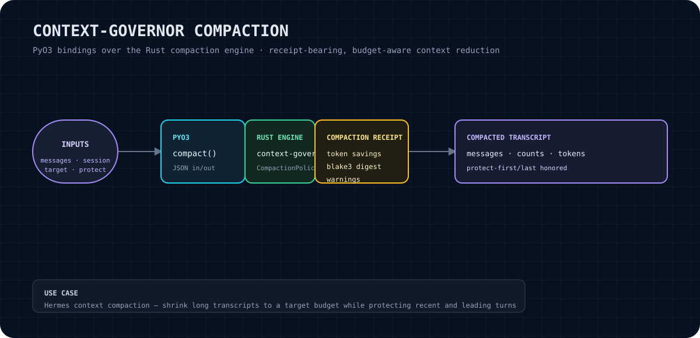

# context-governor Python bindings

PyO3 bindings that expose the private monorepo's Rust `context-governor` compaction engine to Python. The binding accepts a JSON message transcript and returns a JSON compaction result containing the compacted messages and a receipt with counts, approximate token measurements, a BLAKE3 digest, and warnings.

> **No cloud dependencies.** This package is a local Python extension around the Rust compaction engine. The binding itself does not configure or call a cloud provider.

<p align="center"></p>

## What this gives you

- A Python-callable `compact` function implemented in Rust with PyO3.
- JSON-in/JSON-out integration suitable for a Python context-management or orchestration layer.
- Configurable target token budget through `target_tokens`.
- Optional protection counts for the beginning and end of a transcript.
- A receipt containing approximate before/after token counts, an estimated saving, a compacted-transcript BLAKE3 digest, and warnings.

This is a narrow binding, not a complete Python conversation framework. It does not expose the Rust engine's other types or policies, provide a tokenizer API, or add a network service.

## Claim boundary

The public behavior documented here is grounded in `src/lib.rs`, `pyproject.toml`, and `Cargo.toml` in this repository. The binding delegates compaction to the sibling local Rust crate `context-governor`; the exact compaction algorithm, token approximation method, warning conditions, and policy semantics are owned by that crate and are not reimplemented or expanded here. The returned token values are explicitly approximate/estimated fields, not a claim of tokenizer-equivalent counts.

This repository is a private monorepo crate. No standalone public repository URL is provided here.

## Quick start

### Prerequisites

- Python 3.9 or newer, as declared by `pyproject.toml`.
- Rust and Cargo.
- `maturin` 1.7 or newer (the build-system requirement).
- The sibling local crate at `../context-governor`, because `Cargo.toml` uses a path dependency.

### Build and install locally

From this directory, create or activate a virtual environment and install the extension in editable/development mode:

```bash
python -m venv .venv
. .venv/bin/activate
python -m pip install --upgrade maturin
maturin develop
```

For a wheel instead:

```bash
maturin build --release
python -m pip install target/wheels/<built-wheel>.whl
```

The package metadata names the Python distribution `context-governor` and the import package `context_governor`; the native module is `context_governor._native`.

### First compaction

This example follows the binding signature in `src/lib.rs`. `compact` receives a JSON array of objects with `role` and `content`, and returns a JSON string:

```python
import json
from context_governor._native import compact

result_json = compact(
    messages_json=json.dumps([
        {"role": "system", "content": "You are a concise assistant."},
        {"role": "user", "content": "Summarize the project status."},
        {"role": "assistant", "content": "The project is under active development."},
    ]),
    session_id="session-1",
    target_tokens=4096,
    protect_first_n=2,
    protect_last_n=1,
)

result = json.loads(result_json)
print(result["compacted_messages"])
print(result["receipt_id"])
```

`session_id` is passed to the Rust compaction request and is required by the binding. `protect_first_n` and `protect_last_n` are optional; omit them or pass `None` to use the Rust policy defaults.

## API overview

### `context_governor._native.compact`

```python
compact(
    messages_json: str,
    session_id: str,
    target_tokens: int,
    protect_first_n: int | None = None,
    protect_last_n: int | None = None,
) -> str
```

Parameters:

| Parameter | Meaning |
|---|---|
| `messages_json` | JSON text decoding to an array of message objects. Each message must provide string `role` and `content` fields understood by the binding. |
| `session_id` | Session identifier forwarded into the Rust `CompactRequest`. |
| `target_tokens` | Target token budget assigned to the Rust `CompactionPolicy`. |
| `protect_first_n` | Optional number assigned to `CompactionPolicy.protect_first_n`. |
| `protect_last_n` | Optional number assigned to `CompactionPolicy.protect_last_n`. |

The function returns a JSON-encoded string. It does not return a Python dictionary directly.

## Return-value JSON

A successful call returns an object with these fields:

| Field | JSON type | Meaning |
|---|---:|---|
| `receipt_id` | string | Receipt identifier from the Rust compaction receipt. |
| `original_message_count` | integer | Number of messages in the input transcript. |
| `compacted_message_count` | integer | Number of messages in the returned compacted transcript. |
| `original_approx_tokens` | integer | Approximate token count for the original transcript. |
| `compacted_approx_tokens` | integer | Approximate token count for the compacted transcript. |
| `token_savings_estimate` | integer | Estimated token savings reported by the Rust receipt; it may be signed. |
| `compacted_transcript_blake3` | string | BLAKE3 digest of the compacted transcript, as supplied by the Rust receipt. |
| `compacted_messages` | array | The compacted transcript. Each item contains `role` (string) and `content` (string). |
| `warnings` | array of strings | Warnings copied from the Rust receipt. An empty array means no warnings were returned by that receipt; it is not a general guarantee about every input condition. |

Example shape (values are illustrative output shape, not a promised result for a particular transcript):

```json
{
  "receipt_id": "...",
  "original_message_count": 3,
  "compacted_message_count": 3,
  "original_approx_tokens": 28,
  "compacted_approx_tokens": 28,
  "token_savings_estimate": 0,
  "compacted_transcript_blake3": "...",
  "compacted_messages": [
    {"role": "system", "content": "You are a concise assistant."}
  ],
  "warnings": []
}
```

## Errors and edge cases

- Malformed `messages_json` raises a Python `RuntimeError` with the prefix `invalid messages JSON:`.
- Rust compaction failures are converted to Python `RuntimeError` values containing the underlying error text.
- Failure to serialize the result is also returned as a Python `RuntimeError`.
- The binding parses the entire input as `Vec<PyMessage>`; the documented input is therefore a JSON array of message objects, not a single object or an arbitrary JSON value.
- `target_tokens` is a Rust `usize`; Python values must be representable by the extension's integer conversion.
- The binding constructs each Rust `Message` with the supplied role and content and default values for other Rust message fields.
- The binding does not expose a separate validation, dry-run, streaming, async, or file-based API.

The underlying Rust crate owns any additional policy-specific behavior. Consult that crate's source when you need guarantees beyond this adapter contract.

## Verification

The repository contains a Rust extension crate and a maturin package configuration. From the repository directory, the source-grounded checks are:

```bash
cargo check
cargo test
python -m pip install --upgrade maturin
maturin develop
python -c 'from context_governor._native import compact; print(compact("[{\\"role\\":\\"user\\",\\"content\\":\\"hello\\"}]", "verification", 4096))'
```

The final command is a smoke test of import and JSON output after installation. For a clean wheel path, use `maturin build --release` followed by installation of the wheel produced under `target/wheels/`.

## Hermes integration path

The intended integration path is a local Hermes context-compaction adapter:

1. Hermes provides the current message transcript as JSON and a session identifier.
2. The adapter calls `context_governor._native.compact(...)` with the active target budget and any explicit protected-prefix/suffix counts.
3. The adapter parses the returned JSON string.
4. Hermes uses `compacted_messages` as the compacted transcript and retains the receipt fields (`receipt_id`, counts, estimates, digest, and warnings) alongside the compaction event.
5. The adapter should treat the Rust receipt and digest as evidence for what was returned, while keeping the original transcript according to Hermes' own retention and rollback policy.

This README documents the binding seam; it does not claim that Hermes wiring is already present in this repository.

## Status and roadmap

**Status:** version `0.1.0` package metadata; the currently implemented surface is the single synchronous `compact` function exposed by the native module.

**Roadmap boundary:** Hermes adapter wiring, richer Python-native types, additional exposed Rust APIs, tokenizer-specific accounting, and expanded test coverage are not implemented or declared by the current source shown here. They may be considered separately, but are not capabilities of this release.

## License

No `LICENSE` file is present in this repository at the time of writing. The package and underlying crate should be licensed according to the monorepo's governing license; verify that canonical license before redistribution. This README intentionally does not assert a specific license without a repository license artifact.
