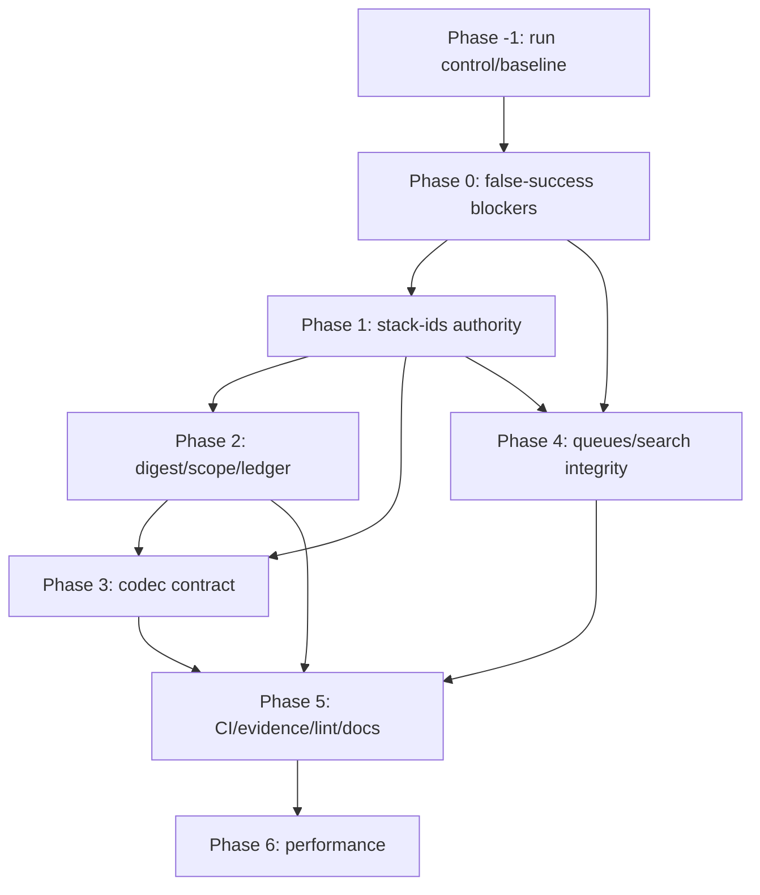

# Execution plan

## Dependency graph

## Phase -1 — Control and baseline

Close `CTRL-001`. Install immutable pack, active-run pointer, actual source/toolchain baseline,
workspace inventory, clean integration branch, worktrees/path locks, and baseline receipts.
No semantic repair begins before this state is recorded.

## Phase 0 — False-success blockers

Issues: `AG-001`, `GOV-001`, `CMP-001`.

They may run concurrently in nonoverlapping scopes. Integration review is mandatory before Phase 1.
Temporary feature disablement is acceptable; false success is not.

Exit: graph errors cannot look complete; missing/corrupt governance cannot allow; unavailable codec
decode cannot return encoded data as exact output.

## Phase 1 — ID authority

Issues: `ID-001`, `ID-002`.

1. Inventory every ID reader/writer/wire/storage field and classify lifecycle.
2. Freeze stack-ids V2 design.
3. Implement private validated types and named legacy adapters.
4. Migrate bounded crate families.
5. Add repository enforcement.
6. Prove wire/storage compatibility using dual-read/single-write.

No mass textual replacement and no generic ArtifactId substitution.

## Phase 2 — Digest, scope, ledger

Issues: `DIG-001`, `SCP-001`, `LED-001`.

Freeze digest V2 before ledger deterministic-ID migration. Inventory every scope-loss caller.
Add adversarial corpus and anchored ledger head.

## Phase 3 — Codec interchangeability

Issue: `INT-001`, final closure of `CMP-001`.

1. Freeze canonical contract/profile/wire in quant-codec-core.
2. Add common conformance suite.
3. Implement Turbo and Fib in parallel only after core freeze.
4. Migrate semantic-memory to registry/trait.
5. Reduce scr-runtime-compression to truthful routing/validation.
6. Migrate or rebuild derived sidecars from raw authority.

## Phase 4 — Runtime state machines

Issues: `QUE-001`, `QUE-002`, `SEM-001`.

Queue tasks can run concurrently. Search corruption policy merges after codec/receipt semantics settle.

## Phase 5 — Release proof

Issues: `CI-001`, `LINT-001`, `EVD-001`, `DOC-001`.

Inventory workspaces/features; enforce lints; separate read-only verify from recording; establish
source-bound receipts; install CI matrix/required checks; bind claims; run final hostile audit.

## Phase 6 — Performance

Issue: `PERF-001`.

No performance merge while any P0/P1 is open. Every optimization is isolated, reversible, and
benchmarked before/after on a source-independent workload.

## Commit strategy

- One semantic issue per commit where practical.
- Migration commits name old/new versions and rollback boundary.
- Phase integration commits list included tasks.
- Evidence is generated after a fixed source commit; never amended backward into a verified commit.
