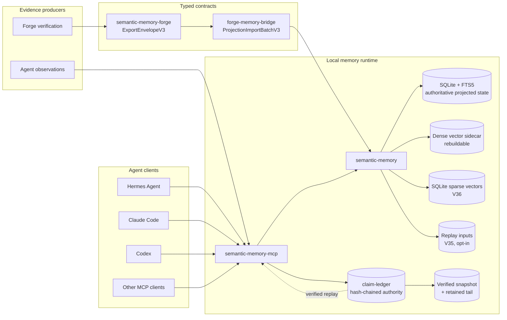
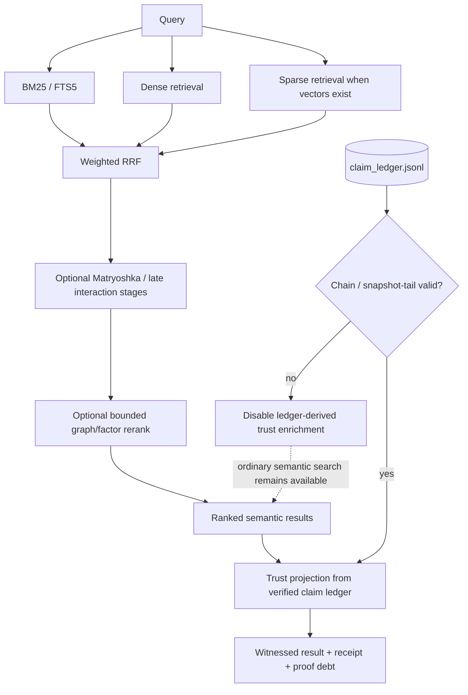

# Semantic-memory ecosystem

This document describes the active authority and data-flow boundaries across the RecursiveIntell semantic-memory crates. Historical `_salvage_*`, archived Codex packets, generated benchmark stores, and prior release receipts are not active architecture.

## Responsibility map

| Crate | Owns | Does not own |
|---|---|---|
| `semantic-memory-forge` | Raw verification evidence and export envelopes | Search, storage, projection transformation |
| `forge-memory-bridge` | Deterministic export-to-import transformation | Source truth, storage, ranking, policy |
| `semantic-memory` | Authoritative queryable SQLite state, indexes, retrieval, replay inputs | Claim-ledger authority or cross-agent packaging |
| `claim-ledger` | Append-only claim/evidence/judgment/contradiction events, chain verification, proof debt, snapshots | Semantic retrieval or an independently writable trust cache |
| `semantic-memory-mcp` | Agent-facing MCP/HTTP integration, governed tool profiles, trust projection, replay and compaction operations | A second durable trust store |

## End-to-end architecture



## Retrieval and trust boundary

`semantic-memory` ranks content. `claim-ledger` records durable claim support and contradiction events. `semantic-memory-mcp` joins those systems without making either lower-level crate depend on the other.



## Durable-state rules

1. SQLite is authoritative for semantic records and persisted embeddings.
2. Dense ANN indexes are acceleration sidecars and must be rebuildable.
3. Sparse vectors are durable SQLite state introduced by migration V36.
4. Replay inputs are opt-in because query text may be sensitive; migration V35 stores them only when requested.
5. `claim_ledger.jsonl`, or its verified snapshot plus retained tail, is authoritative for claim trust events.
6. An in-memory trust index is a derived projection, never a second writable source of truth.
7. Ledger corruption fails closed for trust enrichment without taking ordinary semantic retrieval offline.
8. Compaction must preserve snapshot digest, prior-head binding, retained-tail anchor, and projected state.

## Agent integrations

The canonical agent packages live under `semantic-memory-mcp/integrations/`:

- `hermes/` — Hermes plugin/skill and MCP setup workflow.
- `claude-plugin/` — Claude Code plugin with project MCP configuration and semantic-memory skill.
- `codex/` — Codex skill and MCP configuration example.

All three clients connect to the same `semantic-memory-mcp` stdio server. They do not implement separate memory semantics.

## Verification entry points

```bash
cargo test -p claim-ledger
cargo test -p semantic-memory --all-features
cargo test --manifest-path semantic-memory-mcp/Cargo.toml --features full
python3 semantic-memory/tools/scifact_eval/validate_receipt.py --self-test
```

See:

- `semantic-memory/README.md`
- `semantic-memory/docs/evaluation/scifact/README.md`
- `claim-ledger/README.md`
- `semantic-memory-mcp/README.md`
- `semantic-memory-mcp/integrations/README.md`
- `semantic-memory-forge/README.md`
- `forge-memory-bridge/README.md`
