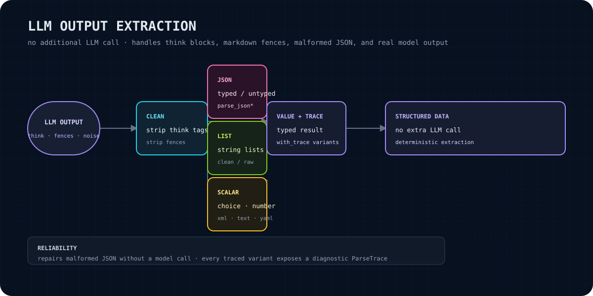

# llm-output-parser

A Rust library for extracting structured values from real-world large-language-model responses **without making an additional LLM call**. It preprocesses model output, removes reasoning blocks, finds structured content inside prose or Markdown fences, and applies bounded deterministic JSON repair before deserialization.

<p align="center"></p>

> **No cloud dependencies.** This crate parses strings locally. It does not call OpenAI, Anthropic, Pinecone, Weaviate, Supabase, or any hosted service.

## What it solves

LLM output is often almost structured rather than strictly structured. A response may contain `<think>...</think>` or `<thinking>...</thinking>` blocks, explanatory prose, fenced JSON, a numbered list, or JSON-like syntax with trailing commas and Python literals. `llm-output-parser` provides deterministic extraction paths for those cases so the application can decide whether to accept, inspect, or reject the result.

The library gives you:

- typed JSON extraction through `serde::Deserialize`;
- untyped JSON extraction through `serde_json::Value`;
- cleaned or raw string-list extraction;
- lightweight XML-style tag extraction;
- case-insensitive choice extraction from an allow-list;
- numeric extraction, including score/fraction patterns and inclusive range checking;
- plain-text cleanup;
- optional typed YAML extraction behind the `yaml` feature;
- traced variants that expose attempted strategies, repairs, spans, and warnings;
- input-size, nesting-depth, and repair-attempt limits.

## Claim boundary

This is a defensive parser, not a schema-constrained generation system, validator for arbitrary XML, or semantic correctness checker. It does not determine whether an LLM answer is true, safe, complete, or faithful to a prompt. Heuristic extraction can select the wrong candidate when a response contains multiple plausible values; callers should validate the resulting domain object and treat parse traces and errors as operational evidence. `parse_xml_tag` and `parse_xml_tags` match XML-style delimiters and explicitly do **not** use a full XML parser.

## Install

Add the crate to a Rust project:

```bash
cargo add llm-output-parser
```

YAML support is optional:

```bash
cargo add llm-output-parser --features yaml
```

The crate currently declares Rust edition 2021, version `0.2.0`, and a default feature set with YAML disabled.

## Quick start

This is the typed JSON example from the library documentation, with model-style reasoning text before the value:

```rust
use serde::Deserialize;
use llm_output_parser::parse_json;

#[derive(Deserialize, Debug, PartialEq)]
struct Analysis {
    sentiment: String,
    confidence: f64,
}

let response = r#"<think>analyzing...</think>{"sentiment": "positive", "confidence": 0.92}"#;
let result: Analysis = parse_json(response)?;

assert_eq!(result.sentiment, "positive");
assert_eq!(result.confidence, 0.92);
```

For a complete runnable example, place the snippet in a function returning `Result<(), llm_output_parser::ParseError>` (and map the `serde`/application errors as appropriate), or use the equivalent `unwrap()` form in a small test.

## Parser API

All functions below are re-exported at the crate root. The ordinary functions use `ParseOptions::default()` internally. Traced variants accept `&ParseOptions` and return `(value, ParseTrace)`.

| Function | Result | Behavior and source-grounded edge behavior |
|---|---|---|
| `parse_json<T>` | `Result<T, ParseError>` | Extracts typed JSON using direct parse, language-specific or bare code fences, bracket matching, and bounded repair; then deserializes with `serde_json`. |
| `parse_json_with_trace<T>` | `Result<(T, ParseTrace), ParseError>` | Configurable typed JSON parse with strategy, repair, span, and limit diagnostics. |
| `parse_json_value` | `Result<serde_json::Value, ParseError>` | Untyped JSON using the same JSON pipeline. |
| `parse_json_value_with_trace` | `Result<(serde_json::Value, ParseTrace), ParseError>` | Traced untyped JSON parse. |
| `parse_string_list` | `Result<Vec<String>, ParseError>` | Extracts arrays, common object keys (`tags`, `items`, `results`, `list`), fenced JSON, bullet/numbered lists, or comma-separated text; lowercases, trims, deduplicates, drops empty items, and filters items of 50 or more characters. |
| `parse_string_list_with_trace` | `Result<(Vec<String>, ParseTrace), ParseError>` | Configurable cleaned-list parse with diagnostics. |
| `parse_string_list_raw` | `Result<Vec<String>, ParseError>` | General list extraction without forced lowercase, length filtering, or deduplication; trims and removes empty results. There is no raw-list traced variant in the current public API. |
| `parse_xml_tag` | `Result<String, ParseError>` | Extracts one exact, case-sensitive `<tag>...</tag>` pair; if the closing tag is absent, consumes to the end. |
| `parse_xml_tag_with_trace` | `Result<(String, ParseTrace), ParseError>` | Traced single-tag extraction. |
| `parse_xml_tags` | `Result<HashMap<String, String>, ParseError>` | Extracts requested tags; missing requested tags are absent, but at least one tag must be found. |
| `parse_xml_tags_with_trace` | `Result<(HashMap<String, String>, ParseTrace), ParseError>` | Traced multi-tag extraction, including warnings for requested tags not found. |
| `parse_choice` | `Result<&str, ParseError>` | Finds the first matching valid choice using exact, prefix, and word-boundary matching; matching is case-insensitive and returns the caller-provided choice slice. |
| `parse_choice_with_trace` | `Result<(&str, ParseTrace), ParseError>` | Traced allow-list choice extraction. |
| `parse_number<T>` | `Result<T, ParseError>` | Parses direct numbers, labeled values (`Score:`, `Rating:`, `Result:`), fractions such as `8/10` (numerator), and numbers found in prose. |
| `parse_number_with_trace<T>` | `Result<(T, ParseTrace), ParseError>` | Traced numeric extraction. |
| `parse_number_in_range<T>` | `Result<T, ParseError>` | Numeric extraction followed by inclusive `[min, max]` checking. Out-of-range values return `ParseError::NoNumber`. |
| `parse_number_in_range_with_trace<T>` | `Result<(T, ParseTrace), ParseError>` | Traced bounded numeric extraction. |
| `parse_text` | `Result<String, ParseError>` | Strips think blocks, trims, and removes the documented common boilerplate prefixes such as `Sure!`, `Of course,`, `Certainly!`, `Absolutely!`, `Here's`, and `Here is`. |
| `parse_text_with_trace` | `Result<(String, ParseTrace), ParseError>` | Traced text cleanup. |
| `parse_yaml<T>` | `Result<T, ParseError>` | Feature-gated (`yaml`) typed YAML parsing from preprocessed text, a `yaml` fence, or any code fence. There is no YAML traced variant in the current public API. |

### Shared utilities and diagnostics

- `strip_think_tags(text)` removes complete or incomplete `<think>` and `<thinking>` blocks, including multiple blocks.
- `preprocess(text)` applies think-block stripping and trimming. It is publicly available through the `extract` module.
- `extract::extract_code_block`, `extract::extract_code_block_for`, and `extract::find_bracketed` expose reusable extraction helpers.
- `try_repair_json(broken)` returns `Some(valid_json)` only when it changed the input and the result validates with `serde_json`; otherwise it returns `None`.
- `ParseOptions` controls `max_input_bytes` (default 2 MiB), `max_nesting_depth` (64), `max_repair_attempts` (3), `strip_think_tags` (true), and `allow_code_fences` (true).
- `ParseTrace` records `strategies_tried`, whether `repaired`, `repair_actions`, an optional byte `extracted_span`, and non-fatal `warnings`.

## JSON repair scope

`try_repair_json` applies deterministic string repairs for the cases implemented in `src/repair.rs`: `//` and `/* */` comments, Python `True`/`False`/`None`, trailing commas, selected single-quoted strings, unquoted object keys, missing closing brackets/braces, and raw newlines inside string values. The repaired text is accepted only after `serde_json` validation. Repair is deliberately bounded by `ParseOptions::max_repair_attempts` in the parser pipelines; it is not a general JavaScript or Python parser.

## Errors and edge cases

`ParseError` provides a stable `kind()` discriminant and these variants:

- `EmptyResponse` — input is empty, whitespace-only, or becomes empty after preprocessing;
- `Unparseable` — no strategy produced the requested format;
- `DeserializationFailed` — JSON was found but does not match the requested Rust type;
- `NoMatchingChoice` — none of the supplied choices was found;
- `NoNumber` — no usable number was found, or a bounded number was outside the requested range;
- `TooLarge` — input exceeds `ParseOptions::max_input_bytes`;
- `TooDeep` — bracket matching exceeds `ParseOptions::max_nesting_depth`.

Important behavior to account for:

- Think-block stripping treats an unclosed think block as running to the end of the input.
- JSON bracket matching is nesting-aware, ignores brackets inside double-quoted strings, and prefers a later top-level candidate.
- Code-fence parsing handles the first matching closed fence; malformed or unclosed fences may fall through to other strategies.
- XML-style tag matching is exact and case-sensitive, not namespace-aware, and not a full XML grammar.
- `parse_string_list` intentionally changes values during cleaning; use `parse_string_list_raw` when case, length, or duplicates matter.
- Traces are diagnostic output, not a proof that the extracted value is semantically correct.

## Integration path: Hermes LLM output parsing

The intended integration boundary is after a provider returns an LLM response and before application code promotes that response into a typed payload:

1. Hermes or an upstream LLM client obtains the response string.
2. Select the narrowest parser for the expected output (`parse_json`, `parse_choice`, `parse_number_in_range`, and so on).
3. For local diagnostics or governed execution, call the corresponding `*_with_trace` function with explicit `ParseOptions`.
4. Validate the parsed domain value in the owning application; a successful parse is not a semantic or policy decision.
5. On failure, retain `ParseError::kind()` and, where appropriate, `ParseTrace` for observability rather than making another implicit model call.

This README documents the crate's integration boundary. It does not claim that a particular Hermes binary or runtime is already wired to this crate; that wiring must be verified in the consuming Hermes source and configuration.

## Verification

From this crate directory:

```bash
cargo test
cargo clippy -- -D warnings
```

The source currently enforces `#![deny(missing_docs)]` and `#![deny(clippy::all)]`. YAML-specific tests can be exercised with:

```bash
cargo test --features yaml
```

## Status and roadmap

**Current status:** version `0.2.0`; MIT-licensed Rust library; default features are empty; YAML is opt-in. The current source tree contains unit tests for the core parser modules and documentation tests for the public examples.

**Roadmap (proposed, not a promise of current capability):**

- keep parser behavior and repair rules explicit through focused tests and traces;
- evaluate additional structured formats only when their ownership and failure semantics are clear;
- improve consumer-facing documentation as Hermes integration points are verified;
- avoid silently widening heuristics or presenting successful extraction as semantic validation.

No release schedule or compatibility guarantee beyond the checked-in manifest and source is asserted here.

## License

Licensed under the [MIT License](LICENSE).
