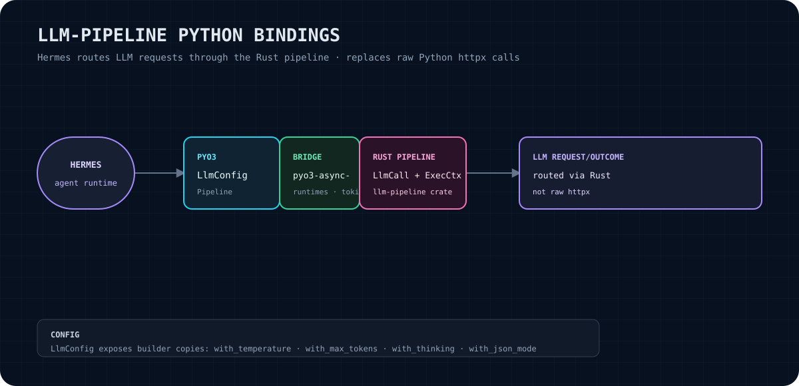

# llm-pipeline-python

Python bindings for [`llm-pipeline`](https://github.com/RecursiveIntell/llm-pipeline). This crate exposes a small PyO3 surface for configuring and invoking the Rust LLM pipeline from Python.

> **No cloud dependencies.** This binding does not add a cloud SDK or a second Python HTTP client. It delegates request execution to the Rust `llm-pipeline` dependency and its configured endpoint. Network access may still be required by the endpoint you provide.

<p align="center"></p>

## Purpose

`llm-pipeline-python` is the Python-facing adapter for the Rust pipeline. The native extension wraps `llm_pipeline::LlmCall` and `llm_pipeline::ExecCtx`, allowing a caller to send prompts through the Rust transport path rather than constructing raw Python `httpx` calls.

The binding uses PyO3 and `pyo3-async-runtimes` to bridge the Rust Tokio runtime safely. It is intentionally narrow: configuration, a pipeline object, plain-text calls, and JSON-schema-constrained calls are the capabilities implemented in `src/lib.rs`.

## What it gives you

- A `LlmConfig` Python class with explicit generation settings.
- Immutable, builder-style configuration copies through `with_*` methods.
- A `Pipeline` configured with an endpoint URL, model name, and optional default configuration.
- `Pipeline.call()` for raw response text.
- `Pipeline.call_structured()` for raw response text requested with a JSON Schema constraint.
- Rust-side execution through `LlmCall` + `ExecCtx`, with Rust errors surfaced as Python `RuntimeError` values.

## Claim boundary

This README describes the current binding implementation, not capabilities that are merely planned or present in the underlying crate. The binding does **not** claim to:

- parse, validate, or deserialize model responses into Python objects;
- guarantee that a provider or endpoint honors temperature, thinking, JSON mode, or a supplied schema;
- provide retries, authentication management, streaming, batching, caching, tracing, or cancellation;
- make the endpoint local, offline, or cloud-free;
- provide a production-readiness, security, latency, or benchmark guarantee.

The endpoint URL, model behavior, provider protocol, and transport semantics remain properties of the underlying `llm-pipeline` implementation and its runtime configuration.

## Installation and build

This repository is a Rust `cdylib` packaged for Python with [maturin](https://maturin.rs/). Python `>=3.9` and maturin `>=1.7` are declared in `pyproject.toml`.

From this repository:

```bash
python -m venv .venv
. .venv/bin/activate
python -m pip install --upgrade pip maturin
maturin develop
```

For a wheel build:

```bash
maturin build --release
python -m pip install target/wheels/<wheel-file>.whl
```

The Rust dependency is currently referenced as a sibling checkout (`../llm-pipeline`), so that crate must be available at the expected path when building this repository.

> **Packaging note:** `src/lib.rs` declares the native PyO3 module as `_native` and the examples below use the requested `llm_pipeline_python` import surface. Before publishing a wheel, verify the package/module mapping in `pyproject.toml` against the generated artifact; the current manifest also contains the project name `llm-pipeline` and `llm_pipeline._native` module mapping.

## Quick start

The configuration and pipeline objects are created from the native extension. `LlmConfig` builder methods return a modified copy; they do not mutate the original object.

```python
from llm_pipeline_python import LlmConfig, Pipeline

config = LlmConfig(temperature=0.7, max_tokens=2048)
config = config.with_temperature(0.3)

pipeline = Pipeline(
    "http://127.0.0.1:8000/v1",
    "your-model",
    config=config,
)

text = pipeline.call(
    "Explain why a typed boundary is useful.",
    system="You are a concise technical assistant.",
)
print(text)
```

The constructor defaults are `temperature=0.7`, `max_tokens=2048`, `thinking=False`, and `json_mode=False`. `Pipeline` requires `url` and `model`; `config` is optional and becomes the default for calls made without a per-call configuration.

## API overview

### `LlmConfig`

Constructor:

```python
LlmConfig(
    temperature=0.7,
    max_tokens=2048,
    thinking=False,
    json_mode=False,
)
```

Fields represented by the binding:

| Field | Python type | Default | Meaning in the binding |
|---|---:|---:|---|
| `temperature` | `float` | `0.7` | Generation temperature value passed into the Rust config. |
| `max_tokens` | `int` | `2048` | Maximum-token value passed into the Rust config. |
| `thinking` | `bool` | `False` | Thinking flag passed into the Rust config. |
| `json_mode` | `bool` | `False` | JSON-mode flag passed into the Rust config. |

Builder-style methods return a cloned configuration:

```python
config = (
    LlmConfig()
    .with_temperature(0.2)
    .with_max_tokens(512)
    .with_thinking(True)
    .with_json_mode(True)
)
```

Available methods are `with_temperature(temp)`, `with_max_tokens(tokens)`, `with_thinking(enabled)`, and `with_json_mode(enabled)`.

### `Pipeline`

Constructor:

```python
Pipeline(url, model, *, config=None)
```

Methods:

```python
pipeline.call(prompt, *, system=None, config=None) -> str
pipeline.call_structured(prompt, json_schema, *, system=None, config=None) -> str
```

Both methods return `out.raw_response` as a Python string. A per-call `config` overrides the pipeline default. `system`, when supplied, is attached as the system message. `call_structured` parses `json_schema` as JSON and attaches it as the Rust configuration's JSON Schema constraint; it still returns raw response text rather than a parsed Python value.

## Errors and edge cases

- `call_structured` raises Python `RuntimeError` when `json_schema` is not valid JSON. The error is prefixed with `invalid JSON schema:`.
- Rust invocation failures are mapped to Python `RuntimeError` using the underlying error text.
- Empty prompts, empty URLs, empty model names, and provider-specific configuration values are not rejected by this binding itself. Their behavior is determined downstream; validate them at the application boundary if required.
- The builder methods return new objects. Keep the returned value (`config = config.with_...`) when changing settings.
- A schema string can be valid JSON without being a valid schema for the target provider. Schema acceptance and enforcement are outside this binding's claim boundary.
- The native implementation blocks on the Tokio runtime through `pyo3_async_runtimes::tokio::get_runtime()`. Callers should verify behavior in their own synchronous or asynchronous host integration rather than assuming a particular event-loop policy.

## Verification

Run the repository's Rust checks from the crate directory:

```bash
cargo fmt --check
cargo check
cargo test
```

Build the Python extension and run an import/API smoke check after `maturin develop`:

```bash
maturin develop
python - <<'PY'
from llm_pipeline_python import LlmConfig, Pipeline

config = LlmConfig(temperature=0.7, max_tokens=2048)
config = config.with_temperature(0.3)
assert "LlmConfig" in repr(config)
pipeline = Pipeline("http://127.0.0.1:8000/v1", "your-model", config=config)
assert "Pipeline" in repr(pipeline)
print(config)
print(pipeline)
PY
```

A live `Pipeline.call` verification requires a reachable endpoint compatible with the underlying `llm-pipeline` transport. No endpoint or model server is started by this crate, so a live request is not part of the local build-only verification above.

## Integration path: Hermes transport

The intended integration path is to let Hermes call this native adapter instead of issuing raw Python `httpx` requests. `Pipeline` creates an `ExecCtx` from its URL, builds an `LlmCall` with the selected model and configuration, optionally attaches a system prompt, and invokes it through the Rust runtime. The returned `raw_response` crosses the PyO3 boundary as a Python string.

The binding does not itself implement Hermes registration, routing policy, authentication, provider discovery, or response parsing. Those remain integration responsibilities of the Hermes host and the underlying `llm-pipeline` crate.

## Status and roadmap

### Current status

Version `0.1.0` is a narrow, source-backed PyO3 binding. The implemented surface is the `LlmConfig` and `Pipeline` API described above.

### Roadmap

Potential follow-up work, subject to an explicit design and implementation change, includes:

- reconciling the package/module mapping in `pyproject.toml` with the native module and intended import name;
- adding binding-level tests that exercise the actual exported classes after a maturin build;
- defining a supported async-facing API instead of relying only on the current blocking bridge;
- adding typed response helpers only if the underlying contract and ownership are specified.

These are roadmap items, not current capabilities.

## License

No license file or explicit license declaration was found in the crate files inspected for this README. Treat the license as **unverified** until the repository owner adds or confirms a license. The underlying `llm-pipeline` repository may have separate licensing terms; those terms do not automatically establish this crate's license.

## Related project

- [`llm-pipeline`](https://github.com/RecursiveIntell/llm-pipeline) — the Rust pipeline dependency and transport implementation.
