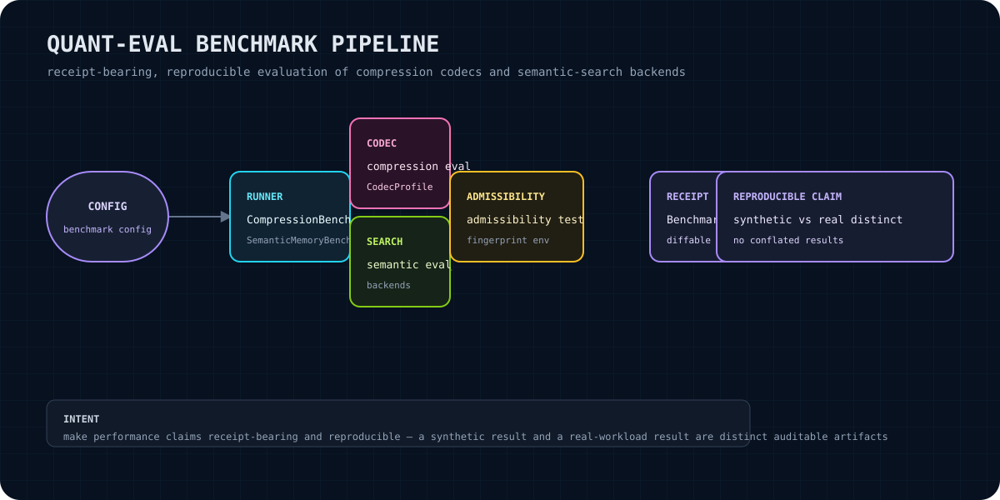

# quant-eval

`quant-eval` is a Rust benchmark and admissibility harness for compression and semantic-search evaluation. It provides deterministic synthetic benchmark runs, standard codec-profile test vectors, machine fingerprints, and JSON-serializable benchmark receipts that make evaluation artifacts easier to compare and audit.

<p align="center"></p>

> **No cloud dependencies.** The crate has no network client and makes no calls to OpenAI, Anthropic, Pinecone, Weaviate, Supabase, or any hosted service. Its runtime dependencies are local Rust libraries declared in `Cargo.toml`.

## Purpose and user value

Use this crate when you need a small, local Rust surface for:

- running repeatable, seeded synthetic compression and semantic-search evaluations;
- exercising codec profiles against standard test vectors;
- recording benchmark context, commit identifiers, machine fingerprints, and timing results;
- serializing receipts to JSON and comparing matching benchmark names across two receipts;
- keeping synthetic smoke results separate from real-workload evidence.

The crate is a measurement and artifact layer. It does not select a codec, fetch a corpus, publish results, or establish that one implementation is superior to another.

## Claim boundary

A result should be treated as a public or engineering claim only together with the evidence that produced it. A `BenchmarkReceipt` records a UTC timestamp, caller-supplied commit hash, machine fingerprint, benchmark results, and an optional note; its short hash covers the commit, fingerprint, result names, and `ns_per_iter` values.

The current benchmark implementations are explicitly limited:

- `CompressionBenchmark::run` generates synthetic vectors and computes exact neighbors, then uses a simulated compression path that currently returns the exact results.
- `SemanticMemoryBenchmark::run` generates a synthetic index and queries; its compressed search currently delegates to raw search.
- `AdmissibilityTest` simulates compression/decompression behavior from profile quality targets rather than invoking a codec implementation.

Therefore, outputs from these paths are synthetic or simulated harness artifacts. They are useful for exercising the evaluation and receipt flow, but they are **not** real-workload benchmark evidence and must not be presented as proof of benchmark superiority, production quality, or generalization. Real corpus integration and real codec execution belong in a downstream integration path and require their own receipt-bearing evidence.

## Install

Add the crate from the local workspace or a published package source selected by your project:

```toml
[dependencies]
quant-eval = "0.1.0"
```

For a source checkout, build from the crate directory:

```bash
cargo build --manifest-path /home/sikmindz/Coding/Libraries/quant-eval/Cargo.toml
```

The package declares Rust 2021 and MSRV 1.75. Runtime dependencies are `thiserror`, `serde`, `serde_json`, `chrono`, `sha2`, and `blake3`.

## Quick start

This example uses the public API exported by `src/lib.rs`, runs a small seeded synthetic benchmark, and creates a JSON receipt around the observed result:

```rust
use quant_eval::{
    BenchmarkReceipt, BenchmarkResult, CompressionBenchmark, CompressionBenchmarkConfig,
    MachineFingerprint,
};

fn main() -> Result<(), Box<dyn std::error::Error>> {
    let config = CompressionBenchmarkConfig {
        dim: 64,
        db_size: 100,
        queries: 10,
        seed: 42,
        top_k: 5,
        iterations: 10,
    };

    let benchmark = CompressionBenchmark::with_config(config);
    let result = benchmark.run()?;
    println!("recall@k = {}, mrr = {}", result.recall_at_k, result.mrr);

    let fingerprint = MachineFingerprint::new();
    let mut receipt = BenchmarkReceipt::with_fingerprint(
        "<commit-sha>".to_owned(),
        &fingerprint,
    );
    receipt.set_note("Synthetic compression harness run");
    receipt.add_result(BenchmarkResult {
        name: "compression_synthetic".to_owned(),
        iterations: 1,
        elapsed_ns: 0,
        ns_per_iter: 0,
        throughput: None,
        error: None,
    });

    let json = receipt.to_json()?;
    std::fs::write("compression.receipt.json", json)?;
    Ok(())
}
```

The benchmark result type returned by `run` contains the computed metrics and run dimensions. The example deliberately uses a placeholder commit identifier: callers should supply the commit actually being evaluated.

## API overview

These are the public re-exports in `src/lib.rs`:

| Type | Role | Main operations |
|---|---|---|
| `CompressionBenchmark` | Runs seeded synthetic compression metrics | `new`, `with_config`, `config`, `run` |
| `CompressionBenchmarkConfig` | Sets vector dimension, database size, query count, seed, top-k, and timing iterations | `Default` |
| `SemanticMemoryBenchmark` | Compares raw and simulated compressed semantic-search quality | `new`, `with_config`, `config`, `run` |
| `SemanticMemoryConfig` | Sets embedding dimension, index size, query count, top-k, and seed | `Default` |
| `AdmissibilityTest` | Runs supplied test-set entries across profiles | `new`, `with_profiles`, `run`, `standard_test_vectors`, `profiles` |
| `CodecProfile` | Names compression parameters and quality targets | `fast`, `balanced`, `high_compression`, `standard_profiles` |
| `QuantEvalError` | Error enum for I/O, serialization, execution, corpus, codec, profile, and Git failures | `Display`/`Error` via `thiserror` |
| `MachineFingerprint` | Hashes selected local environment identity into a hex string | `new`, `from_hex`, `as_str`; `Display` |
| `BenchmarkReceipt` | Captures timestamp, commit, fingerprint, results, and note | `new`, `with_fingerprint`, `add_result`, `receipt_hash`, `set_note`, `to_json`, `from_json` |
| `BenchmarkResult` | Stores one benchmark name and timing/throughput/error values | Construct with its public fields |
| `ReceiptDiff` | Compares matching named results in two receipts | `compare`, `to_json`, `from_json` |

`BenchmarkResult` values are caller-supplied receipt fields; the receipt type does not run or time a benchmark automatically. The benchmark result structures returned by the benchmark modules expose metric fields through the return value, even though they are not separately re-exported at the crate root.

## Benchmark and receipt flow

1. Choose a benchmark configuration or use its defaults.
2. Run the benchmark and retain the returned metrics with the exact configuration and corpus classification.
3. Create a `MachineFingerprint` for the local environment.
4. Create a `BenchmarkReceipt` with the evaluated commit hash and fingerprint.
5. Add one or more `BenchmarkResult` records, including timing values measured by the caller.
6. Add a note identifying synthetic, simulated, or real-workload status.
7. Serialize with `to_json` and store the receipt as an auditable artifact.
8. Rehydrate with `from_json`; compare corresponding named results with `ReceiptDiff::compare`.

`ReceiptDiff` reports `target - baseline` nanoseconds per iteration and percentage change. It only emits differences for result names present in both receipts; unmatched results are omitted. A positive percentage means the target is slower according to the source implementation's convention.

## Errors and edge cases

- `QuantEvalError::Serialization` is returned when receipt JSON cannot be serialized or parsed.
- `QuantEvalError::Io` represents filesystem I/O failures where an I/O operation is used by an integration.
- `Execution`, `InvalidCorpus`, `Codec`, `ProfileNotFound`, `Git`, and `NoGitRepo` model failure categories available to integrations; the current synthetic benchmark paths mostly return successful results and do not invoke Git or external codecs.
- A zero `top_k`, empty result set, mismatched result lengths, or no comparable items produces zero-valued metrics in the relevant calculation paths rather than a panic.
- A fingerprint includes hostname/user values when available, OS, architecture, CPU count, and a machine ID when readable. It is an environment identifier, not a guarantee that two runs are otherwise identical.
- Receipt hashes intentionally exclude timestamps, but include the commit hash, machine fingerprint, result names, and `ns_per_iter` values. They do not authenticate a receipt or prove that the caller supplied truthful metadata.
- `ReceiptDiff::compare` compares only names shared by the target and baseline; it does not align or validate configurations, commits, corpus identity, or machine conditions.

## Verification

Run the crate's checks from the crate directory:

```bash
cd /home/sikmindz/Coding/Libraries/quant-eval
cargo fmt --check
cargo check
cargo test
cargo test --test integration
cargo doc --no-deps
```

These commands verify formatting, compilation, unit and integration tests, and documentation generation. Passing them does not turn the synthetic or simulated benchmark paths into real-workload evidence.

## Integration path

To evaluate a real codec or semantic-memory backend, keep the crate as the evaluation boundary:

1. define the real corpus, query set, relevance policy, codec profile, and run metadata in the integrating project;
2. replace the current simulated search/compression step in the integration layer with the actual implementation under test;
3. measure elapsed time and throughput around the real operation;
4. preserve separate synthetic and real-workload labels;
5. populate `BenchmarkReceipt` with the actual commit hash, fingerprint, configuration note, and measured `BenchmarkResult` values;
6. retain the serialized receipt and compare only like-for-like baselines.

Do not treat a synthetic result as a proxy for a real corpus, and do not publish a cross-machine timing comparison without preserving the receipt context.

## Status and roadmap

### Current status

Version `0.1.0` is a local Rust library benchmark suite with public benchmark, profile, fingerprint, error, and receipt types. The source currently contains synthetic vector generation, simulated compression/search paths, admissibility test scaffolding, JSON receipt round-tripping, and receipt comparison.

### Roadmap

The following are integration directions, not current capabilities:

- connect benchmark execution to real codec implementations;
- add real-corpus and real-query adapters with explicit corpus identity;
- make benchmark configuration and measurement metadata first-class in receipts;
- add validation that prevents incomparable receipt diffs when configuration or corpus metadata differs;
- expand verification around reproducibility, timing methodology, and receipt integrity.

No roadmap item should be read as an availability or performance claim until implemented and verified in source and tests.

## License

MIT. See [`Cargo.toml`](Cargo.toml) for the package license declaration.
