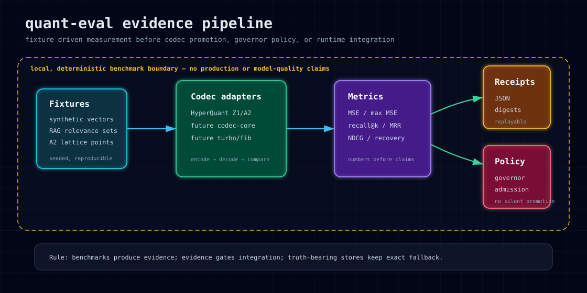

# quant-eval

`quant-eval` is a Rust crate for evidence-first compression and retrieval evaluation. It provides deterministic benchmark scaffolds, typed result shapes, benchmark receipts, RAG fixture metrics, and HyperQuant primitive evaluation before any codec is promoted into a governor or runtime path.

Current status: prototype-to-evidence benchmark substrate. It contains real metric code and deterministic fixtures, but some harnesses still use synthetic data or simulated compression paths. It should not be described as proving workload-level codec quality, production readiness, or model performance until real codec adapters and corpus receipts exist.



## What this gives you

`quant-eval` gives compression and retrieval crates a place to produce evidence before integration:

- **Compression benchmark scaffolding** — deterministic synthetic vector corpus, exact nearest-neighbor baseline, recall@K, MRR, and overlap-derived similarity summaries.
- **Semantic-memory search scaffolding** — synthetic index/query generation, precision@K, recall@K, NDCG@K, MAP, and degradation-ratio calculations.
- **Admissibility harness** — profile-oriented checks over deterministic standard vectors.
- **Benchmark receipts** — timestamped receipt structures with machine fingerprint, result list, JSON serialization, hashes, and diffs.
- **RAG fixture metrics** — local recall@K, NDCG@K, and exact-rerank recovery over caller-supplied query/retrieval fixtures.
- **HyperQuant primitive evaluation** — deterministic Z1/A2 evaluation through the published `hyperquant` crate, with mean/max MSE, estimated bytes, rejected-vector counts, receipt counts, and explicit claim boundaries.
- **HyperQuant real-corpus retrieval gate** — caller-supplied document/query embeddings and qrels compared across exact f32 retrieval and HyperQuant-reconstructed retrieval, with recall@1/5/10/K, NDCG@K, top-K overlap, exact-rerank recovery, rank drift, score error, compression ratio, timing, and pass/fail blockers. A BEIR/Scifact all-minilm receipt is stored under `docs/codex-runs/P2/`.
- **compressed-scorer real-corpus gate** — evaluates true compressed-domain candidate scoring through `compressed-scorer::PerDimScorer`, emits `compressed-scorer-real-corpus-eval-v1`, records zero document decodes during candidate scoring, and keeps exact f32 rerank mandatory. PerDim now uses query-prepared lookup-table contribution scoring.
- **compressed attention fixture gate** — compares exact top-k attention aggregation against `compressed-scorer::AttentionCache`, emits `compressed-attention-eval-v1`, records top-k value decodes, and keeps the claim boundary at fixture evidence only.
- **Conservative public surface** — measurement APIs first; no silent production claims.

## Evidence pipeline

```text
fixtures / synthetic corpora
        ↓
codec or retrieval harness
        ↓
metrics: MSE, recall@K, MRR, NDCG, MAP, recovery
        ↓
benchmark receipts + diffs
        ↓
policy/admission decisions in downstream crates
```

The crate is intentionally upstream of runtime policy. It measures and records; it does not decide that a codec is admissible for a truth-bearing system.

## Installation

```toml
[dependencies]
quant-eval = "0.1.1"
```

From the RecursiveIntell Libraries workspace:

```toml
[dependencies]
quant-eval = { path = "../quant-eval" }
```

## Quick start: compression benchmark scaffold

```rust
use quant_eval::{CompressionBenchmark, CompressionBenchmarkConfig};

fn main() -> Result<(), Box<dyn std::error::Error>> {
    let benchmark = CompressionBenchmark::with_config(CompressionBenchmarkConfig {
        dim: 64,
        db_size: 100,
        queries: 10,
        seed: 42,
        top_k: 5,
        iterations: 10,
    });

    let report = benchmark.run()?;
    println!("recall@{} = {}", report.top_k, report.recall_at_k);
    println!("mrr = {}", report.mrr);
    Ok(())
}
```

## Quick start: HyperQuant primitive evaluation

```rust
use quant_eval::{run_hyperquant_eval, HyperQuantEvalConfig};

fn main() -> Result<(), Box<dyn std::error::Error>> {
    let result = run_hyperquant_eval(&HyperQuantEvalConfig {
        dim: 16,
        vectors: 64,
        seed: 42,
        scale: 8.0,
    })?;

    for profile in &result.profiles {
        println!(
            "{:?}: mean_mse={} max_mse={} receipts={}",
            profile.kind,
            profile.mean_mse,
            profile.max_mse,
            profile.receipt_count
        );
    }

    println!("claim boundary: {}", result.claim_boundary);
    Ok(())
}
```

## Public API

The crate re-exports:

- `AdmissibilityTest`
- `CodecProfile`
- `CompressionBenchmark`
- `CompressionBenchmarkConfig`
- `SemanticMemoryBenchmark`
- `SemanticMemoryConfig`
- `QuantEvalError`
- `MachineFingerprint`
- `BenchmarkReceipt`
- `BenchmarkResult`
- `ReceiptDiff`
- `evaluate_rag_fixture`
- `RagEvalResult`
- `RagQueryFixture`
- `RagRetrievedDoc`
- `run_compressed_attention_eval`
- `CompressedAttentionConfig`
- `CompressedAttentionReceipt`
- `run_compressed_scorer_real_corpus_eval`
- `CompressedScorerRealCorpusConfig`
- `CompressedScorerRealCorpusProfile`
- `CompressedScorerRealCorpusReceipt`
- `run_hyperquant_eval`
- `HyperQuantEvalConfig`
- `HyperQuantEvalResult`
- `HyperQuantProfileEval`
- `run_hyperquant_real_corpus_eval`
- `HyperQuantRealCorpus`
- `HyperQuantRealCorpusConfig`
- `HyperQuantRealCorpusProfile`
- `HyperQuantRealCorpusReceipt`
- `RealCorpusDocument`
- `RealCorpusQuery`

## Implemented modules

### Admissibility harness

File: `src/benchmarks/admissibility.rs`

Implemented:

- `CodecProfile` presets: `fast`, `balanced`, and `high_compression`.
- `AdmissibilityTest` over caller-provided `TestSetEntry` values.
- Standard synthetic test vectors for zero, unit, and deterministic pseudo-random vectors.
- Summary counts per profile.

Important limitation:

- This harness still simulates codec behavior from `should_succeed` and profile quality targets. It does not yet call a shared `quant-codec-core` trait.

### Compression benchmark scaffold

File: `src/benchmarks/compression.rs`

Implemented:

- Deterministic synthetic corpus and query generation.
- Raw nearest-neighbor computation with cosine similarity.
- Recall@K and MRR calculations over exact-vs-estimated result sets.
- Similarity-style summary statistics over top-K overlap.

Important limitations:

- Compression is currently simulated by returning exact result sets.
- It does not yet measure real encoded byte size, compression ratio, per-block ratios, wire formats, or codec theoretical ratios.
- The reported cosine-similarity statistics are derived from top-K overlap, not raw-vs-decoded vector cosine.

### Semantic-memory benchmark scaffold

File: `src/benchmarks/semantic.rs`

Implemented:

- Deterministic synthetic index and query generation.
- Raw search baseline using cosine similarity.
- Synthetic relevance judgments from raw top-K results.
- Precision@K, Recall@K, NDCG@K, MAP, and degradation-ratio calculations.

Important limitation:

- Compressed search currently delegates to raw search, so degradation is simulated/minimal by construction. It is not evidence of real codec preservation quality.

### RAG fixture harness

File: `src/rag.rs`

Implemented:

- Query fixtures with explicit relevant document IDs.
- Retrieved document list with scores.
- Recall@K.
- NDCG@K.
- Exact-rerank recovery for top-ranked relevant result.
- Duplicate retrieved-doc suppression.

### HyperQuant primitive harness

File: `src/hyperquant_eval.rs`

Implemented:

- `HyperQuantEvalConfig`
- `HyperQuantProfileEval`
- `HyperQuantEvalResult`
- `run_compressed_scorer_real_corpus_eval`
- `CompressedScorerRealCorpusConfig`
- `CompressedScorerRealCorpusProfile`
- `CompressedScorerRealCorpusReceipt`
- `run_hyperquant_eval`
- deterministic synthetic fixture generation;
- triangular A2 fixture where A2 should match or beat Z1;
- Z1/A2 metrics through the published `hyperquant` crate;
- conservative claim-boundary string on every result.

Important limitation:

- This is primitive-level evidence only. It is not HyperQuant paper parity, model-quality evidence, or production admissibility.


### compressed-scorer real-corpus candidate gate

Files: `src/compressed_scorer_real_corpus.rs`, `tests/compressed_scorer_real_corpus.rs`

Implemented:

- caller-supplied document/query embeddings plus explicit qrels;
- exact f32 retrieval baseline;
- candidate retrieval through `compressed-scorer::PerDimScorer` without decoding documents during candidate scoring;
- query-prepared lookup-table contribution scoring for PerDim, so query-dependent reconstruction math is paid once per query instead of per candidate;
- exact-rerank recovery against authoritative f32 vectors;
- recall@1/5/10/K, NDCG@K, top-K overlap, rank drift, score error, timing, byte accounting, decoded-doc count, exact-rerank count, and pass/fail blockers;
- conservative receipt schema `compressed-scorer-real-corpus-eval-v1`.

Important limitation:

- This is candidate-gate evidence only. It does not prove model-quality preservation, KV-cache behavior, or production admissibility.

Stored Scifact receipt:

- `docs/codex-runs/P2/COMPRESSED_SCORER_SCIFACT_PERDIM_RECEIPT.json`
- `docs/codex-runs/P2/COMPRESSED_SCORER_SCIFACT_PERDIM_SUMMARY.md`

Reproduce:

```bash
CS_TOP_K=10 CS_CANDIDATE_K=40 CS_BITS=8 \
CS_MIN_TOP_K_OVERLAP=0.30 CS_MIN_EXACT_RERANK_RECOVERY_AT_1=0.80 \
cargo run -p quant-eval --example compressed_scorer_scifact_eval -- \
  quant-eval/target/hyperquant-scifact/scifact-all-minilm-corpus.json \
  quant-eval/docs/codex-runs/P2/COMPRESSED_SCORER_SCIFACT_PERDIM_RECEIPT.json
```

Current stored Scifact/all-minilm result:

| Profile | Compression | R@10 | Top-K overlap | Exact-rerank recovery@1 | Decoded docs during candidate scoring | Verdict |
|---|---:|---:|---:|---:|---:|---|
| per_dim_8bit | 3.9588x | 0.7767 | 0.9891 | 0.8767 | 0 | strongest current compressed-scorer product lane |

### compressed attention fixture gate

Files: `src/compressed_attention.rs`, `tests/compressed_attention.rs`

Implemented:

- exact top-k attention aggregation reference over caller-supplied keys, values, and queries;
- compressed key logits through `compressed-scorer::AttentionCache`;
- top-k compressed value decode accounting;
- mean output cosine, mean output MSE, mean top-K overlap, decompressed value count, and pass/fail blockers;
- conservative receipt schema `compressed-attention-eval-v1`.

Important limitation:

- This is attention fixture evidence only. It does not prove model-quality preservation, perplexity, latency, or production KV-cache behavior.

Stored fixture receipt:

- `docs/codex-runs/P2/COMPRESSED_ATTENTION_FIXTURE_RECEIPT.json`
- `docs/codex-runs/P2/COMPRESSED_ATTENTION_FIXTURE_SUMMARY.md`

Reproduce:

```bash
cargo run -p quant-eval --example compressed_attention_receipt -- \
  quant-eval/docs/codex-runs/P2/COMPRESSED_ATTENTION_FIXTURE_RECEIPT.json
```

### HyperQuant real-corpus retrieval gate

Files: `src/hyperquant_real_corpus.rs`, `tests/hyperquant_real_corpus.rs`

Implemented:

- caller-supplied document/query embeddings plus explicit qrels;
- exact f32 retrieval baseline;
- retrieval over HyperQuant-reconstructed document vectors for Z1 and A2;
- recall@K, NDCG@K, top-K overlap, exact-rerank recovery-at-1, rank-drift mean/p95/max, score-error mean/p95/max, search timing, byte accounting, compression ratio, pass/fail blockers;
- conservative receipt schema `hyperquant-real-corpus-eval-v1`.

Important limitation:

- The in-tree test fixture is hand-authored and small. It proves the real-corpus API/gate path, not BEIR/Scifact quality. External corpus builders should feed this API and preserve the emitted receipt.

Stored fixture receipt:

- `docs/codex-runs/P1/HYPERQUANT_REAL_CORPUS_FIXTURE_RECEIPT.json`
- `docs/codex-runs/P1/HYPERQUANT_REAL_CORPUS_FIXTURE_SUMMARY.md`
- `docs/codex-runs/P2/HYPERQUANT_SCIFACT_ALL_MINILM_RECEIPT.json`
- `docs/codex-runs/P2/HYPERQUANT_SCIFACT_ALL_MINILM_SUMMARY.md`
- `docs/codex-runs/P2/HYPERQUANT_SCIFACT_CODEC_COMPARISON_RECEIPT.json`
- `docs/codex-runs/P2/HYPERQUANT_SCIFACT_CODEC_COMPARISON_SUMMARY.md`
- `docs/codex-runs/P2/COMPRESSED_SCORER_SCIFACT_PERDIM_RECEIPT.json`
- `docs/codex-runs/P2/COMPRESSED_SCORER_SCIFACT_PERDIM_SUMMARY.md`

Reproduce the BEIR/Scifact receipt:

```bash
python3 -u quant-eval/tools/hyperquant_scifact/build_scifact_ollama.py \
  --out quant-eval/target/hyperquant-scifact/scifact-all-minilm-corpus.json \
  --work-dir quant-eval/target/hyperquant-scifact \
  --model all-minilm:latest

HQ_TOP_K=10 HQ_CANDIDATE_K=40 HQ_SCALE=8.0 \
HQ_MIN_TOP_K_OVERLAP=0.30 HQ_MIN_EXACT_RERANK_RECOVERY_AT_1=0.80 \
cargo run -p quant-eval --example hyperquant_scifact_eval -- \
  quant-eval/target/hyperquant-scifact/scifact-all-minilm-corpus.json \
  quant-eval/docs/codex-runs/P2/HYPERQUANT_SCIFACT_ALL_MINILM_RECEIPT.json

cargo run -p quant-eval --example hyperquant_scifact_compare -- \
  quant-eval/target/hyperquant-scifact/scifact-all-minilm-corpus.json \
  quant-eval/docs/codex-runs/P2/HYPERQUANT_SCIFACT_CODEC_COMPARISON_RECEIPT.json
```

Comparison result on the stored Scifact/all-minilm receipt:

| Profile | Compression | R@10 | Top-K overlap | Exact-rerank recovery@1 | Verdict |
|---|---:|---:|---:|---:|---|
| scalar_i8_per_vector_scale | 3.9588x | 0.7800 | 0.9933 | 0.8767 | strongest current embedding baseline |
| scalar_i8_global_symmetric | 4.0000x | 0.7733 | 0.9595 | 0.8767 | strongest simple baseline |
| hyperquant_A2_scale_8 | 2.0000x | 0.7582 | 0.5910 | 0.8733 | passes; worth research, not best current product codec |
| hyperquant_Z1_scale_8 | 2.0000x | 0.7549 | 0.5514 | 0.8667 | passes; weaker than A2 |
| sign_binary_1bit | 32.0000x | 0.7238 | 0.5652 | 0.8567 | negative/high-compression control |

### Benchmark receipts

Files: `src/receipt.rs`, `src/fingerprint.rs`

Implemented:

- `BenchmarkReceipt` with timestamp, commit hash, machine fingerprint string, result list, and optional note.
- `BenchmarkResult` timing fields.
- Receipt JSON serialization/deserialization.
- Receipt hash and receipt diff helpers.
- `MachineFingerprint` derived from available host/user/arch/OS/CPU-count/machine-id inputs.

## Claim boundary

Safe to claim today:

- `quant-eval` provides deterministic Rust benchmark scaffolds and fixture metrics.
- `quant-eval` can evaluate current HyperQuant Z1/A2 primitive behavior.
- `quant-eval` can run a caller-supplied real-corpus/qrels HyperQuant retrieval gate and emit pass/fail blocker receipts.
- `quant-eval` has a BEIR/Scifact all-minilm receipt where both current HyperQuant profiles pass the declared candidate-gate thresholds: Z1 exact-rerank recovery@1 0.8667 / top-K overlap 0.5514, A2 exact-rerank recovery@1 0.8733 / top-K overlap 0.5910.
- `quant-eval` has a Scifact codec-comparison receipt showing simple int8 baselines outperform current HyperQuant Z1/A2 for embedding retrieval quality and compression ratio, while HyperQuant still beats the 1-bit sign control and passes the candidate gate.
- `quant-eval` has a compressed-scorer Scifact receipt where PerDim 8-bit compressed-domain candidate scoring reaches R@10 0.7767, top-K overlap 0.9891, exact-rerank recovery@1 0.8767, 3.9588x compression, and zero document decodes during candidate scoring.
- `quant-eval` emits typed metrics and benchmark receipt structures.
- `quant-eval` has local tests, clippy, and publish dry-run receipts for this release.

Not safe to claim today:

- BEIR/Scifact or other external corpus quality beyond the stored all-minilm candidate-gate receipt;
- real codec admissibility across production workloads;
- broad compression-ratio measurements beyond the stored Scifact comparison baselines;
- model-quality preservation;
- superiority of any codec;
- production readiness;
- integrated policy enforcement for `poly-kv`, `fib-quant`, `turbo-quant`, `semantic-memory`, or `quant-governor`;
- `quant_codec_core::EvalReport` emission.

Those are reasonable next targets, but they need implementation evidence before becoming public claims.

## Verification

Release gate for v0.1.1:

```bash
cargo fmt -p quant-eval
cargo test -p quant-eval -- --nocapture
cargo test -p hyperquant -- --nocapture
cargo check -p quant-eval --all-targets
cargo clippy -p quant-eval --all-targets -- -D warnings
cargo publish -p quant-eval --dry-run --allow-dirty
```

Expected current test surface:

- 21 unit tests in `quant-eval` library modules.
- 4 HyperQuant primitive integration tests.
- 2 HyperQuant real-corpus gate integration tests.
- 2 compressed-scorer real-corpus gate integration tests.
- 5 general integration tests.
- 5 RAG fixture tests.
- 39 `quant-eval` tests total.
- 18 `hyperquant` tests for the dependency surface.

## Development

Run focused HyperQuant evaluation tests:

```bash
cargo test -p quant-eval hyperquant_eval -- --nocapture
```

Run all quant-eval tests:

```bash
cargo test -p quant-eval -- --nocapture
```

Run lint gate:

```bash
cargo clippy -p quant-eval --all-targets -- -D warnings
```

## Integration path

Recommended adoption order:

```text
quant-eval fixture metrics
  -> quant-codec-core adapter reports
  -> quant-governor policy/admissibility
  -> turbo-quant / fib-quant comparative benchmarks
  -> poly-kv or semantic-memory only with exact fallback and disclosure
```

`quant-eval` should remain evidence infrastructure. Policy decisions belong in governor/runtime crates.

## Dependencies

Runtime dependencies:

- `serde`
- `serde_json`
- `thiserror`
- `chrono`
- `sha2`
- `blake3`
- `hyperquant`

Dev dependency:

- `tempfile`

The crate currently contains no platform-specific code, FFI, async runtime dependency, CUDA, or HuggingFace integration.

## Roadmap

Near-term:

1. Feed BEIR/Scifact or semantic-memory embeddings into `run_hyperquant_real_corpus_eval` and store the emitted receipt.
2. Add a codec evaluation trait or adapter layer so harnesses can call real encode/decode implementations across crates.
3. Replace remaining simulated compression paths with actual compressed/decompressed vector comparisons.
4. Add encoded-byte accounting and compression-ratio reports for every codec path.
5. Emit or convert into `quant-codec-core` report shapes when that boundary is ready.
6. Add cross-crate integration tests for `hyperquant`, `fib-quant`, and `turbo-quant` adapters.

Medium-term:

1. Add before/after receipt diffs for codec promotion reviews.
3. Add admissibility gates that can be consumed by `quant-governor`.
4. Add visual report export for benchmark receipts.

## License

MIT. See `LICENSE-MIT` for details.
