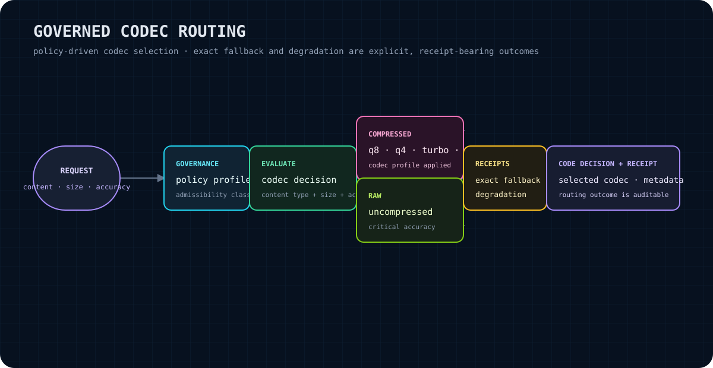

# quant-governor

Policy-driven codec routing for governed compression.

`quant-governor` evaluates a content request against a `GovernancePolicy` and returns a typed `CodecDecision`. The decision records the selected codec profile, degradation budget, and receipt variant so an integration can preserve an explicit routing outcome.

> **No cloud dependencies.** This crate is a local Rust library. Its manifest declares Rust-library dependencies only; policy evaluation does not require a network service, hosted model, or cloud account.

<p align="center"></p>

The diagram summarizes the boundary of this crate: it routes requests and represents outcomes; it does not perform the underlying encoding or decoding.

## What it gives you

- A single public entry point, [`evaluate`], for policy-driven codec selection.
- Request fields for content type, byte size, accuracy requirement, latency tolerance, and admissibility class.
- Five named codec profiles: `raw`, `q8`, `q4`, `turbo`, and `fib`.
- Built-in policy presets for default, storage-efficient, low-latency, and accuracy-oriented routing.
- Serializable decision and receipt types for carrying routing metadata across an integration boundary.
- Exact-fallback and degradation receipt structures that make those outcomes representable and inspectable.

## Claim boundary

`quant-governor` is a governance and routing layer. The current source implements policy evaluation and typed metadata; it does **not** contain codec implementations, quantization kernels, byte-level encoders/decoders, accuracy measurement, benchmarking, persistence, or a cloud service. The compression ratios and degradation thresholds in the API are estimates/default metadata exposed by `CodecProfile`, not measurements performed on user data.

The current evaluator constructs direct decisions for its built-in routing paths. `ExactFallbackReceipt` and `DegradationReceipt` are public constructors for integrations and decision representations; the policy evaluator does not currently synthesize either receipt variant during its built-in selection paths.

## Install

This crate is a private monorepo package and does not advertise a public repository URL. From a Cargo project with access to the package source or registry, add it with:

```bash
cargo add quant-governor
```

The package manifest declares Rust 1.75 as its minimum Rust version and uses the 2021 edition. For a local checkout, use a path dependency instead:

```toml
[dependencies]
quant-governor = { path = "../quant-governor" }
```

## Quick start

The smallest policy evaluation follows the crate's `lib.rs` example:

```rust
use quant_governor::{GovernancePolicy, CodecDecision, GovernanceRequest, evaluate};

let policy = GovernancePolicy::default();
let request = GovernanceRequest::default();
let decision = evaluate(request, &policy);
```

`decision` is a `Result<CodecDecision, GovernorError>`, so an application can handle evaluation failure explicitly:

```rust
use quant_governor::{evaluate, ContentType, GovernancePolicy, GovernanceRequest};

fn choose_codec() -> Result<String, Box<dyn std::error::Error>> {
    let policy = GovernancePolicy::default();
    let request = GovernanceRequest {
        content_type: ContentType::Image,
        size_bytes: 10_000_000,
        accuracy_requirement: 0.85,
        ..Default::default()
    };

    let decision = evaluate(request, &policy)?;
    Ok(decision.codec.to_string())
}
```

The repository also contains a longer executable example covering critical model content, large images, low-latency audio, small-text bypass, and policy presets:

```bash
cargo run --example basic_policy
```

## Codec profiles

`CodecProfile` is the complete set of profiles currently defined by the crate. The threshold and ratio columns are values returned by the source implementation; they are routing metadata, not empirical guarantees.

| Profile | Source description | Default degradation threshold | High fidelity? | Estimated compression ratio | Typical source routing |
| --- | --- | ---: | :---: | ---: | --- |
| `raw` | Uncompressed representation | `0.00` | Yes | `1.0x` | Critical or very high-accuracy content; small-content bypass |
| `q8` | 8-bit quantization | `0.05` | No | `2.0x` | General-purpose, image, audio, structured, model, or unknown content |
| `q4` | 4-bit quantization | `0.10` | No | `4.0x` | Large lower-accuracy images, ordinary video, or very large models |
| `turbo` | Turbo-quant accelerated codec | `0.08` | No | `3.0x` | Large text, low-latency audio/video |
| `fib` | Fibonacci-weighted precision codec | `0.03` | Yes | `2.5x` | Higher-accuracy audio or model content below raw thresholds |

Routing is evaluated in this order: small non-critical content bypasses compression; critical or sufficiently accurate requests select `raw`; otherwise content type and request requirements select a profile. Policy thresholds can cause an earlier branch to win—for example, a small request may select `raw` before content-specific routing is reached.

## Core concepts

### `GovernancePolicy`

A policy owns the routing settings: maximum degradation, small-content bypass threshold, minimum accuracy for `raw`, and a policy name. Construct one with `new` or use one of the built-in presets:

- `GovernancePolicy::default()` — balanced defaults (`256`-byte bypass, `0.99` raw accuracy threshold, `0.10` maximum degradation).
- `GovernancePolicy::storage_efficient()` — larger bypass and higher permitted degradation.
- `GovernancePolicy::low_latency()` — larger bypass and latency-oriented routing.
- `GovernancePolicy::accuracy_oriented()` — smaller bypass and stricter accuracy threshold.

### `CodecDecision`

The evaluation result contains the selected `codec`, an `exact_fallback` flag, a `degradation_budget`, and a `CodecReceipt`. Constructors are available for direct decisions, exact fallback, and degradation. `had_fallback()` reports either an exact fallback or a degradation receipt; `effective_profile()` returns the selected profile.

### `ExactFallbackReceipt`

Represents a compressed-to-raw fallback using a raw digest, compressed digest, retention flag, and optional reason. Digests can be represented as SHA-256 or BLAKE3 values through `Digest`. `bytes_saved()` currently returns `None` because the receipt has no size metadata.

### `DegradationReceipt`

Represents a quality trade-off between non-raw profiles. It carries a degradation type, degradation amount, estimated bytes saved, estimated accuracy impact, and optional source/target profile names. `is_acceptable()` compares the accuracy impact with a caller-supplied limit; `benefit_cost_ratio()` derives a simple bytes-saved-to-impact ratio.

## API overview

The crate re-exports the primary API from its root:

| Item | Role |
| --- | --- |
| `evaluate(request, &policy)` | Evaluate a request and return `Result<CodecDecision, GovernorError>` |
| `GovernancePolicy` | Policy construction, presets, evaluation, name, and maximum degradation accessors |
| `GovernanceRequest` | Content type, size, accuracy, latency, and admissibility inputs |
| `CodecDecision` | Selected profile and decision metadata |
| `CodecProfile` | Profile identity, display form, fidelity classification, threshold, and estimated ratio |
| `ContentType` | `Text`, `Image`, `Audio`, `Video`, `Structured`, `Model`, or `Other` |
| `AdmissibilityClass` | `Critical`, `HighPriority`, `Standard`, `Compressible`, or `BestEffort` |
| `ExactFallbackReceipt` | Digest-bearing compressed-to-raw fallback metadata |
| `DegradationReceipt` | Quality-degradation metadata and simple acceptance/benefit helpers |
| `GovernorError` | Error variants and recoverability/configuration classification |

The modules `decision`, `degradation`, `error`, `policy`, and `receipt` are also public for callers that need module-qualified paths.

## Errors and edge cases

`evaluate` returns `Result` and exposes `GovernorError` variants for invalid requests, failed evaluation, invalid thresholds, unsupported content types, and internal errors. `GovernorError::is_recoverable()` marks invalid thresholds and unsupported content types as recoverable; `is_configuration_error()` marks invalid thresholds and internal errors as configuration-related.

Current source-level edge cases to account for:

- `size_bytes <= small_content_threshold` selects `raw` unless admissibility is `Critical` (critical content also selects `raw`, through the next branch).
- Critical admissibility selects `raw` regardless of the requested accuracy.
- Requests at or above the policy's raw-accuracy threshold select `raw`.
- `ContentType::Other` routes to `q8` when earlier bypass/raw rules do not apply.
- The request fields are plain public data and the crate does not validate numeric ranges before evaluation; callers should supply meaningful accuracy values in the documented `0.0..=1.0` domain.
- `CodecProfile::Raw` has ratio `1.0` and is classified as high fidelity; `Fib` is also classified as high fidelity by the source.
- Receipt helpers carry caller-provided values. They do not calculate digests, validate hex strings, measure actual bytes, or prove accuracy impact.

## Integration path

1. Add the crate as a Cargo dependency or local path dependency.
2. Define a `GovernanceRequest` at the point where your application knows content type, size, accuracy, latency, and admissibility.
3. Select a preset or construct a `GovernancePolicy`.
4. Call `evaluate` and handle `GovernorError` explicitly.
5. Use `decision.codec` to hand the routing outcome to your separate codec/encoding layer.
6. Persist or forward `decision` and any separately constructed receipt data when your integration needs an auditable decision record.
7. Keep actual encoding, decoding, digest computation, and quality measurement in the owning integration or codec implementation.

## Verification

Run these commands from the crate directory:

```bash
cargo test
cargo clippy -- -D warnings
cargo run --example basic_policy
```

The crate forbids `unsafe_code`, denies missing documentation, and denies broken rustdoc intra-doc links. The workspace lint configuration is inherited through `[lints] workspace = true`; `cargo clippy -- -D warnings` is therefore the strict lint check requested for this package.

## Status and roadmap

**Status:** `0.1.0`, an early policy-routing library. The current implementation provides policy evaluation, profile metadata, presets, serializable decision types, and receipt data structures.

**Not currently provided:** codec implementations, encoding/decoding execution, measured quality evaluation, persistence, network/cloud integration, or a public hosted service.

**Roadmap boundary:** future work may connect these governance decisions to concrete codec implementations and richer validation/measurement, but no such capability is part of this release unless it is added to the source and API. Treat the current public API and tests as the authoritative status surface.

## License

MIT. See [`Cargo.toml`](Cargo.toml) for the package license declaration.
