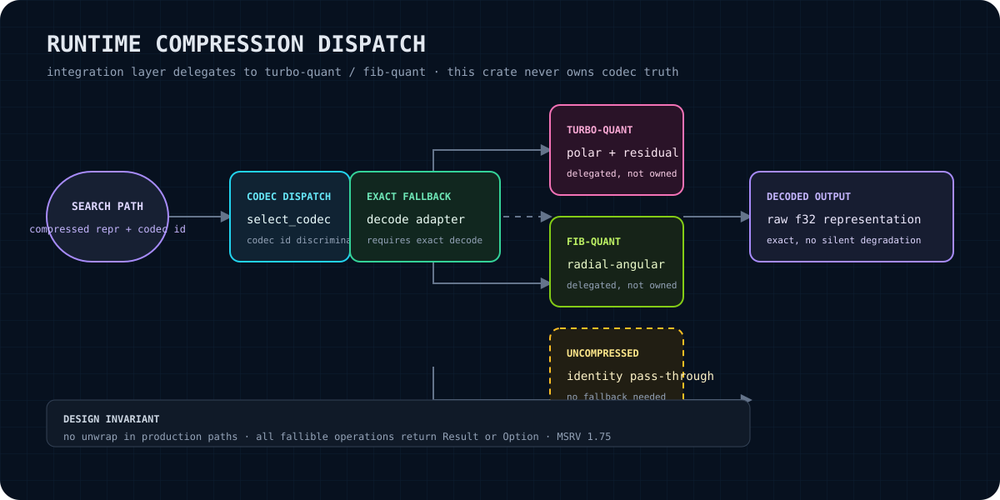

# scr-runtime-compression

Runtime integration adapter for the semantic-memory compression layer. This crate carries compression metadata through a search path, selects a codec through `quant-governor`, and exposes a fail-closed exact-fallback boundary for codec-specific decoders.

<p align="center"></p>

> **No cloud dependencies.** This crate does not call OpenAI, Anthropic, Pinecone, Weaviate, Supabase, or any hosted service. Its runtime dependencies are local Rust crates and caller-provided decode functions.

> **Status: integration layer, v0.1.0.** The public adapter and dispatch contracts are present. The crate deliberately fails closed for TurboQuant and FibQuant when no real decoder has been registered; it does not pretend that an identity closure is decompression.

## Purpose

`scr-runtime-compression` is the boundary between a semantic-memory search path and compression implementations. It gives a caller:

- `CompressedSearchPath<P>`: a typed wrapper around an existing path plus codec identity, optional production timestamp, provenance label, and approximate/exact policy;
- `CodecId`: stable runtime identity for TurboQuant, FibQuant, and uncompressed data;
- `CodecDispatch`, `select_codec`, and `build_adapter`: policy-driven or explicit codec routing through `quant-governor`;
- `ExactFallbackAdapter<T>`: a type-erased, `Send + Sync` decode boundary with strict-mode protection and batch decoding;
- typed `CompressionError` and `DecompressError` values instead of silent passthrough or panic-based failure.

The crate is useful when semantic-memory needs to carry compression context into retrieval and make the exactness decision explicit. It is not a vector index, a codec implementation, a storage engine, or a replacement for raw/full-precision authority.

## Claim boundary and ownership

This crate **never owns codec truth**. TurboQuant and FibQuant remain the owners of their encoded representations and decoding semantics. The adapter only carries the discriminant and delegates through a caller-supplied `FallbackDecoderFn<T>`.

The repository contains optional `turbo-quant` and `fib-quant` feature dependencies, but the current `build_adapter` implementation registers only identity handling for `Uncompressed` and returns an error for compressed codecs without a registered real decoder. The semantic-memory bootstrap or another integration owner must wire actual decoder functions and explicitly attest supported codecs with `with_supported_codecs`.

Related codec projects:

- [turbo-quant](https://github.com/RecursiveIntell/turbo-quant) — TurboQuant / polar and residual-sketch codec family.
- [fib-quant](https://github.com/RecursiveIntell/fib-quant) — FibQuant radial-angular codec family.

Those links are references to sibling codec owners, not claims that this adapter reimplements or supersedes them.

## Installation

This crate is currently a private Libraries monorepo crate. From a workspace that can resolve the sibling path dependencies:

```toml
[dependencies]
scr-runtime-compression = { path = "../scr-runtime-compression" }
```

The package metadata declares Rust 2021, MSRV 1.75, and MIT licensing. Default features are `turbo` and `fib`; these enable the optional sibling dependencies declared in `Cargo.toml`. Disable defaults when only the integration types and uncompressed path are needed:

```toml
scr-runtime-compression = { path = "../scr-runtime-compression", default-features = false }
```

When consuming the crate from the Libraries workspace, use the workspace's normal dependency resolution rather than publishing or cloning this private crate as a standalone repository.

## Quick start

### Carry compression metadata on a search path

```rust
use scr_runtime_compression::{CodecId, CompressedSearchPath};

let path = CompressedSearchPath::new(vec!["facts", "chunks"], CodecId::TurboQuant)
    .provenance_label("turbo-quant:polar:v2")
    .require_exact();

assert_eq!(path.codec_id(), CodecId::TurboQuant);
assert!(path.requires_exact_fallback());
assert!(!path.approximate_allowed());
```

`CompressedSearchPath` also supports `produced_at(timestamp)`, `path()`, `into_path()`, and `map_path(...)`. Its metadata remains attached when the inner path is transformed.

### Register a real decoder at the integration boundary

The adapter is intentionally generic. The caller owns the actual codec calls and converts their output/errors into the adapter's result type:

```rust
use scr_runtime_compression::{CodecId, DecompressError, ExactFallbackAdapter};

let adapter = ExactFallbackAdapter::new(Box::new(|codec, bytes| {
    match codec {
        CodecId::Uncompressed => Ok(bytes.to_vec()),
        CodecId::TurboQuant => {
            // Call the turbo-quant decoder owned by the integration/runtime here.
            Err(DecompressError::UnsupportedCodec("turbo_quant".into()))
        }
        CodecId::FibQuant => {
            // Call the fib-quant decoder owned by the integration/runtime here.
            Err(DecompressError::UnsupportedCodec("fib_quant".into()))
        }
    }
}))
.with_supported_codecs([CodecId::TurboQuant, CodecId::FibQuant]);

let raw = adapter.decode_exact(CodecId::Uncompressed, b"raw bytes")?;
assert_eq!(raw, b"raw bytes");
# Ok::<(), DecompressError>(())
```

The compressed branches above are deliberately placeholders for the owning runtime's real decoder calls; they are not a working TurboQuant or FibQuant decode. Do not register a codec unless the closure truly decodes that representation.

### Use dispatch and governance

```rust
use scr_runtime_compression::{build_adapter, CodecDispatch, CodecId};
use quant_governor::{GovernancePolicy, GovernanceRequest};

let policy = GovernancePolicy::default();
let adapter = build_adapter::<Vec<u8>>(CodecDispatch::Force(CodecId::Uncompressed))?;
let decoded = adapter.decode_exact(CodecId::Uncompressed, b"raw")?;
assert_eq!(decoded, b"raw");

// The governed form evaluates the request through quant-governor. The result
// is never silently substituted with Uncompressed when it selects Q8 or Q4.
let _ = build_adapter::<Vec<u8>>(CodecDispatch::Governed {
    policy: &policy,
    request: GovernanceRequest::default(),
})?;
# Ok::<(), scr_runtime_compression::DecompressError>(())
```

For a compact selection-only path, call `select_codec(&policy, request)`. It returns `CodecId::Uncompressed`, `CodecId::TurboQuant`, or `CodecId::FibQuant`; Q8 and Q4 are rejected because they do not have a `CodecId` or real decoder in this crate.

## `CodecId` reference

| Variant | Serialized/display identity | Meaning | Exact fallback |
|---|---|---|---|
| `TurboQuant` | `turbo_quant` | TurboQuant polar-code plus residual-sketch representation | Required |
| `FibQuant` | `fib_quant` | FibQuant radial-angular representation | Required |
| `Uncompressed` | `uncompressed` | Identity/raw representation | Not required by codec identity |

`CodecId` derives `Serialize` and `Deserialize` with snake-case names. `requires_exact_fallback()` returns `true` for `TurboQuant` and `FibQuant`, and `false` for `Uncompressed`. A path can still require exact handling for uncompressed data when `.require_exact()` is applied.

## Design principles

1. **Codec ownership stays external.** This crate routes and adapts; turbo-quant and fib-quant define codec truth.
2. **Fail closed.** Strict mode rejects unregistered compressed codecs with `StrictModeRejected` rather than returning compressed bytes as if they were exact output.
3. **No hidden substitution.** Unsupported Q8/Q4 governance profiles return errors; they are not silently mapped to `Uncompressed`.
4. **Exactness is explicit.** `with_supported_codecs` is an integration assertion, and `CompressedSearchPath::require_exact()` makes a path-level requirement visible.
5. **Fallibility is typed.** Production paths return `Result`/`Option`; the library source does not use `unwrap` in production code.
6. **Metadata travels with the path.** Codec identity, provenance, timestamp, and approximation policy remain attached to the underlying search path.
7. **Rust 2021 / MSRV 1.75.** The public surface is designed for the workspace minimum toolchain.
8. **Raw data remains the challengeable baseline.** Compressed artifacts are derived runtime inputs, not a replacement for semantic-memory's canonical/full-precision authority.

## API overview

### `CompressedSearchPath<P>`

`P` is the underlying path type and must be `Send + Sync` for the wrapper's constructor and methods. Main methods:

- `new(path, codec_id)`
- `produced_at(timestamp)`
- `provenance_label(label)`
- `require_exact()`
- `codec_id()`, `path()`, `into_path()`
- `approximate_allowed()`, `requires_exact_fallback()`
- `map_path(f)`

The type derives `Debug`, `Clone`, `Serialize`, and `Deserialize` when its path type supports the required serde bounds.

### `ExactFallbackAdapter<T>`

The adapter accepts a `FallbackDecoderFn<T>` with signature `Fn(CodecId, &[u8]) -> Result<T, DecompressError> + Send + Sync`.

- `new(decoder)`: starts in strict mode and registers only `Uncompressed` by default;
- `with_supported_codecs(codecs)`: explicitly attests which codec branches have real decoders;
- `with_strict_mode(bool)`: enable or disable strict rejection;
- `decode_exact(codec_id, bytes)`: decode one item;
- `decode_batch(items)`: decode sequentially and stop at the first error;
- `decode_clone(...)`: convenience method when `T: Clone`;
- `is_strict()`: inspect the mode.

### Dispatch helpers

- `CodecDispatch::Force(codec)`: explicit selection, bypassing governance;
- `CodecDispatch::Governed { policy, request }`: evaluate `quant-governor` policy;
- `select_codec(policy, request)`: return a `CodecId` or governor error;
- `build_adapter(dispatch)`: construct an adapter for the selected codec, rejecting unsupported codec implementations.

## Errors and edge cases

`CompressionError` covers unavailable codecs, encode failures, serialization failures, and policy rejection. `DecompressError` covers:

- `CodecNotAvailable`: the requested codec is absent from the build or dispatch;
- `UnsupportedCodec`: no real decoder is implemented for that codec path;
- `DecodeFailed` / `DeserializationFailed`: the owner-provided decoder or boundary conversion failed;
- `TruncatedData`: the payload length does not meet the decoder's expectation;
- `NoFallbackProvided`: exact fallback was requested without a decoder;
- `StrictModeRejected`: compressed data would otherwise be passed through without an attested decoder.

Important behavior:

- `decode_batch` short-circuits on the first failed item and does not claim an atomic rollback mechanism.
- Codec metadata mismatch is rejected by adapters created with `build_adapter`; a selected codec cannot reinterpret bytes as another codec or raw data.
- `with_strict_mode(false)` allows the supplied closure to run for unregistered compressed codecs. This is an escape hatch for controlled integration behavior, not proof of exactness; callers must own and document the resulting semantics.
- `Uncompressed` is identity pass-through only. It does not validate a vector shape, dimension, checksum, or domain type; the caller owns those checks.

## Integration path: semantic-memory compressed search

The intended flow is:

1. semantic-memory or its integration bootstrap owns the canonical search request and raw/full-precision authority;
2. a `CompressedSearchPath<P>` carries the selected codec and provenance alongside the normal path;
3. `quant-governor` may select a codec through `CodecDispatch::Governed` or the caller may use `Force` for an explicit, already-authorized choice;
4. compressed lookup may produce candidate artifacts, but this crate does not turn them into canonical truth;
5. when exact results are required, the runtime supplies real turbo-quant or fib-quant decoder functions to `ExactFallbackAdapter`;
6. the adapter returns decoded values or a typed error, never silently treating compressed bytes as exact output;
7. semantic-memory remains responsible for search semantics, exact reranking, identity, lineage, and any promotion or persistence decision.

This crate therefore sits on the runtime integration seam. It does not own semantic-memory's index, query planner, storage, receipts, or compressed-search policy beyond the metadata and dispatch contracts shown in its source.

## Verification

Run from the crate directory or provide the manifest path:

```bash
cargo check --manifest-path /home/sikmindz/Coding/Libraries/scr-runtime-compression/Cargo.toml
cargo test --manifest-path /home/sikmindz/Coding/Libraries/scr-runtime-compression/Cargo.toml
cargo fmt --manifest-path /home/sikmindz/Coding/Libraries/scr-runtime-compression/Cargo.toml -- --check
cargo doc --no-deps --manifest-path /home/sikmindz/Coding/Libraries/scr-runtime-compression/Cargo.toml
```

The focused tests cover path metadata, codec identity, strict-mode rejection, uncompressed identity, supported-codec registration, batch behavior, and governance selection. A full workspace check may exercise additional sibling-crate constraints and should be run from the Libraries workspace when changing integration wiring.

## Status and roadmap

### Current status

- v0.1.0 package metadata is present.
- Runtime metadata wrapper, codec identity, dispatch helpers, typed errors, and exact-fallback adapter are implemented.
- Uncompressed identity handling is available.
- Compressed decode is fail-closed until a real decoder is supplied and explicitly registered.
- Q8 and Q4 governance profiles are rejected rather than represented as unsupported local identities.

### Roadmap boundary

Future work should be admitted only with an owning integration contract and verification evidence. Plausible next steps are:

- wire real turbo-quant and fib-quant decoder calls in the semantic-memory integration owner;
- add conformance fixtures proving decoder output and error mapping against each codec owner;
- define payload shape/dimension/integrity validation at the appropriate canonical boundary;
- exercise compressed search plus exact fallback through semantic-memory integration tests;
- document and measure any approximate candidate path separately from exact reranking.

These are roadmap items, not capabilities claimed by the current crate.

## License

Licensed under the MIT License. The package metadata declares `license = "MIT"`; this crate directory does not currently contain a separate `LICENSE` file, so the repository-level legal text is authoritative.
